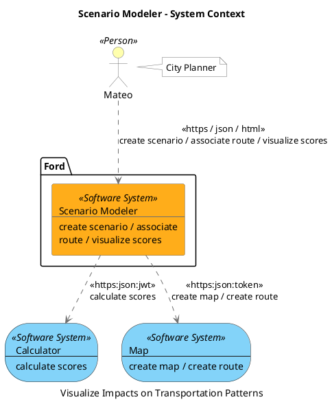
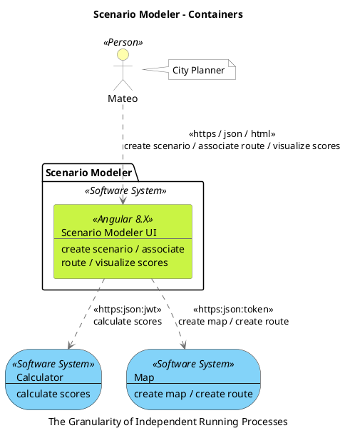

```
@startuml(id=context)
scale max 2000x1409
title Scenario Modeler - System Context
caption Visualize Impacts on Transportation Patterns

skinparam {
  shadowing false
  arrowColor #707070
  actorBorderColor #707070
  componentBorderColor #707070
  rectangleBorderColor #707070
  noteBackgroundColor #ffffff
  noteBorderColor #707070
}
actor "Mateo" <<Person>> as 204 #ffffad
note right of 204
  City Planner
end note
storage 202 <<Software System>> #83d3f9 [
  Calculator
  --
  calculate scores
]
storage 203 <<Software System>> #83d3f9 [
  Map
  --
  create map / create route
]
package "Ford" {
  rectangle 205 <<Software System>> #ffad1a [
    Scenario Modeler
    --
    create scenario / associate
    route / visualize scores
  ]
}
204 .[#707070].> 205 : <<https / json / html>>\ncreate scenario / associate route / visualize scores
205 .[#707070].> 202 : <<https:json:jwt>>\ncalculate scores
205 .[#707070].> 203 : <<https:json:token>>\ncreate map / create route
@enduml

```




```
@startuml(id=container)
scale max 2000x1409
title Scenario Modeler - Containers
caption The Granularity of Independent Running Processes

skinparam {
  shadowing false
  arrowColor #707070
  actorBorderColor #707070
  componentBorderColor #707070
  rectangleBorderColor #707070
  noteBackgroundColor #ffffff
  noteBorderColor #707070
}
storage 202 <<Software System>> #83d3f9 [
  Calculator
  --
  calculate scores
]
storage 203 <<Software System>> #83d3f9 [
  Map
  --
  create map / create route
]
actor "Mateo" <<Person>> as 204 #ffffad
note right of 204
  City Planner
end note
package "Scenario Modeler" <<Software System>> {
  rectangle 209 <<Angular 8.X>> #c9f444 [
    Scenario Modeler UI
    --
    create scenario / associate
    route / visualize scores
  ]
}
204 .[#707070].> 209 : <<https / json / html>>\ncreate scenario / associate route / visualize scores
209 .[#707070].> 202 : <<https:json:jwt>>\ncalculate scores
209 .[#707070].> 203 : <<https:json:token>>\ncreate map / create route
@enduml
```



```
@startuml(id=componentUI)
scale max 2000x1409
title Scenario Modeler - Scenario Modeler UI - Components
caption create scenario — associate route — visualize scores

skinparam {
  shadowing false
  arrowColor #707070
  actorBorderColor #707070
  componentBorderColor #707070
  rectangleBorderColor #707070
  noteBackgroundColor #ffffff
  noteBorderColor #707070
}
storage 202 <<Software System>> #83d3f9 [
  Calculator
  --
  calculate scores
]
storage 203 <<Software System>> #83d3f9 [
  Map
  --
  create map / create route
]
actor "Mateo" <<Person>> as 204 #ffffad
note right of 204
  City Planner
end note
package "Scenario Modeler UI" <<Angular 8.X>> {
  rectangle 216 <<angular service>> #ffad1a [
    calculator
    --
    calculate scores
  ]
  rectangle 215 <<angular service>> #ffad1a [
    map
    --
    create map / create route
  ]
  rectangle 213 <<angular controller>> #ffad1a [
    orchestrator
    --
    create scenario / associate
    route / visualize scores
  ]
  rectangle 217 <<typescript>> #ffad1a [
    scenario-modeler
    --
    create scenario / associate
    route / visualize scores
  ]
}
204 .[#707070].> 213 : <<https / json / html>>\ncreate scenario / associate route / visualize scores
216 .[#707070].> 202 : <<https:json:jwt>>\ncalculate scores
215 .[#707070].> 203 : <<https:json:token>>\ncreate map / create route
213 .[#707070].> 216 : calculate scores
213 .[#707070].> 215 : create map / create route
213 .[#707070].> 217 : create scenario / associate route / visualize scores
@enduml
```

````plantuml format="svg" alt="componentUI"
@startuml(id=componentUI)
scale max 2000x1409
title Scenario Modeler - Scenario Modeler UI - Components
caption create scenario — associate route — visualize scores

skinparam {
  shadowing false
  arrowColor #707070
  actorBorderColor #707070
  componentBorderColor #707070
  rectangleBorderColor #707070
  noteBackgroundColor #ffffff
  noteBorderColor #707070
}
storage 202 <<Software System>> #83d3f9 [
  Calculator
  --
  calculate scores
]
storage 203 <<Software System>> #83d3f9 [
  Map
  --
  create map / create route
]
actor "Mateo" <<Person>> as 204 #ffffad
note right of 204
  City Planner
end note
package "Scenario Modeler UI" <<Angular 8.X>> {
  rectangle 216 <<angular service>> #ffad1a [
    calculator
    --
    calculate scores
  ]
  rectangle 215 <<angular service>> #ffad1a [
    map
    --
    create map / create route
  ]
  rectangle 213 <<angular controller>> #ffad1a [
    orchestrator
    --
    create scenario / associate
    route / visualize scores
  ]
  rectangle 217 <<typescript>> #ffad1a [
    scenario-modeler
    --
    create scenario / associate
    route / visualize scores
  ]
}
204 .[#707070].> 213 : <<https / json / html>>\ncreate scenario / associate route / visualize scores
216 .[#707070].> 202 : <<https:json:jwt>>\ncalculate scores
215 .[#707070].> 203 : <<https:json:token>>\ncreate map / create route
213 .[#707070].> 216 : calculate scores
213 .[#707070].> 215 : create map / create route
213 .[#707070].> 217 : create scenario / associate route / visualize scores
@enduml
```
