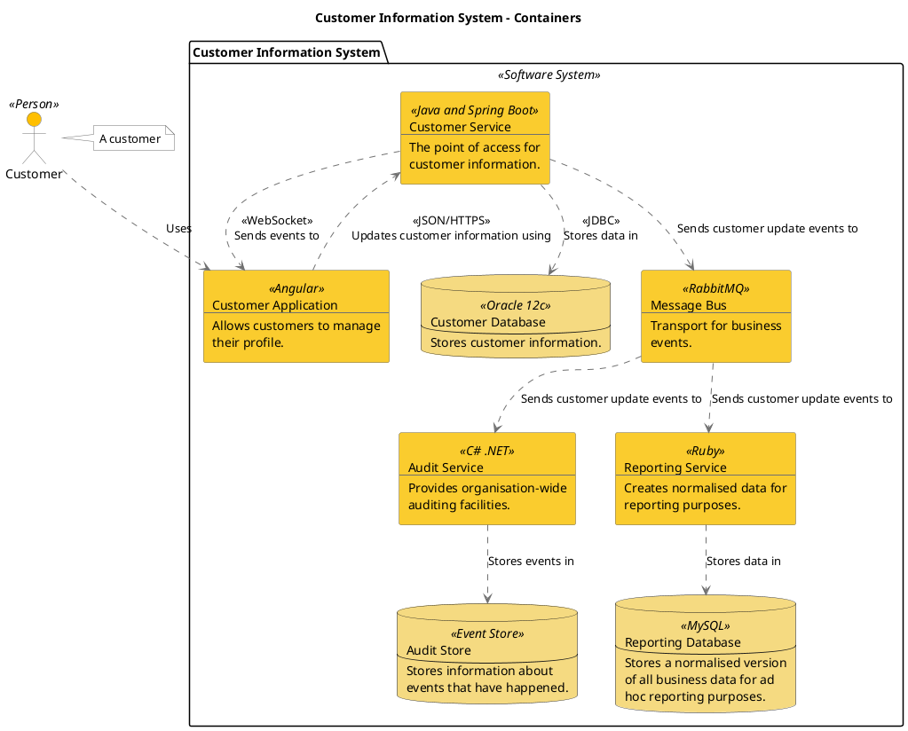
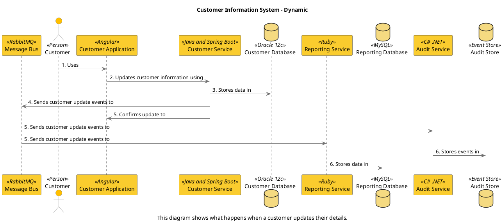

```
@startuml(id=Containers)
scale max 2000x1413
title Customer Information System - Containers

skinparam {
  shadowing false
  arrowColor #707070
  actorBorderColor #707070
  componentBorderColor #707070
  rectangleBorderColor #707070
  noteBackgroundColor #ffffff
  noteBorderColor #707070
}
actor "Customer" <<Person>> as 2 #ffbf00
note right of 2
  A customer
end note
package "Customer Information System" <<Software System>> {
  rectangle 8 <<C# .NET>> #facc2e [
    Audit Service
    --
    Provides organisation-wide
    auditing facilities.
  ]
  database 9 <<Event Store>> #f5da81 [
    Audit Store
    --
    Stores information about
    events that have happened.
  ]
  rectangle 3 <<Angular>> #facc2e [
    Customer Application
    --
    Allows customers to manage
    their profile.
  ]
  database 5 <<Oracle 12c>> #f5da81 [
    Customer Database
    --
    Stores customer information.
  ]
  rectangle 4 <<Java and Spring Boot>> #facc2e [
    Customer Service
    --
    The point of access for
    customer information.
  ]
  rectangle 10 <<RabbitMQ>> #facc2e [
    Message Bus
    --
    Transport for business
    events.
  ]
  database 7 <<MySQL>> #f5da81 [
    Reporting Database
    --
    Stores a normalised version
    of all business data for ad
    hoc reporting purposes.
  ]
  rectangle 6 <<Ruby>> #facc2e [
    Reporting Service
    --
    Creates normalised data for
    reporting purposes.
  ]
}
8 .[#707070].> 9 : Stores events in
3 .[#707070].> 4 : <<JSON/HTTPS>>\nUpdates customer information using
4 .[#707070].> 3 : <<WebSocket>>\nSends events to
4 .[#707070].> 5 : <<JDBC>>\nStores data in
4 .[#707070].> 10 : Sends customer update events to
2 .[#707070].> 3 : Uses
10 .[#707070].> 8 : Sends customer update events to
10 .[#707070].> 6 : Sends customer update events to
6 .[#707070].> 7 : Stores data in
@enduml
```




--

```
@startuml(id=CustomerUpdateEvent)
scale max 2000x1413
title Customer Information System - Dynamic
caption This diagram shows what happens when a customer updates their details.

skinparam {
  shadowing false
  arrowColor #707070
  actorBorderColor #707070
  componentBorderColor #707070
  rectangleBorderColor #707070
  noteBackgroundColor #ffffff
  noteBorderColor #707070
}
participant "Message Bus" as 10 <<RabbitMQ>> #facc2e
actor "Customer" as 2 <<Person>> #ffbf00
participant "Customer Application" as 3 <<Angular>> #facc2e
participant "Customer Service" as 4 <<Java and Spring Boot>> #facc2e
database "Customer Database" as 5 <<Oracle 12c>> #f5da81
participant "Reporting Service" as 6 <<Ruby>> #facc2e
database "Reporting Database" as 7 <<MySQL>> #f5da81
participant "Audit Service" as 8 <<C# .NET>> #facc2e
database "Audit Store" as 9 <<Event Store>> #f5da81
2 -[#707070]> 3 : 1. Uses
3 -[#707070]> 4 : 2. Updates customer information using
4 -[#707070]> 5 : 3. Stores data in
4 -[#707070]> 10 : 4. Sends customer update events to
4 -[#707070]> 3 : 5. Confirms update to
10 -[#707070]> 8 : 5. Sends customer update events to
10 -[#707070]> 6 : 5. Sends customer update events to
8 -[#707070]> 9 : 6. Stores events in
6 -[#707070]> 7 : 6. Stores data in
@enduml

```


