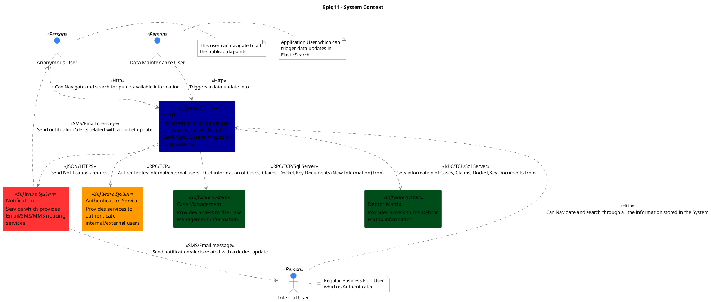
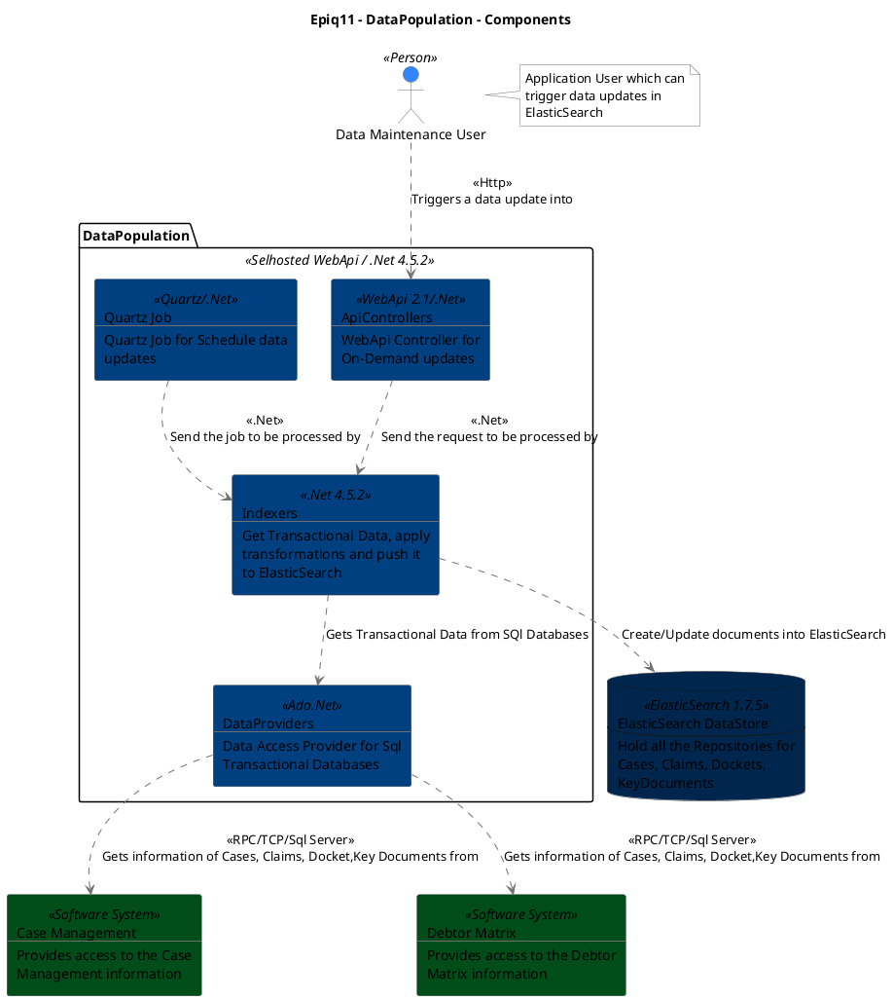
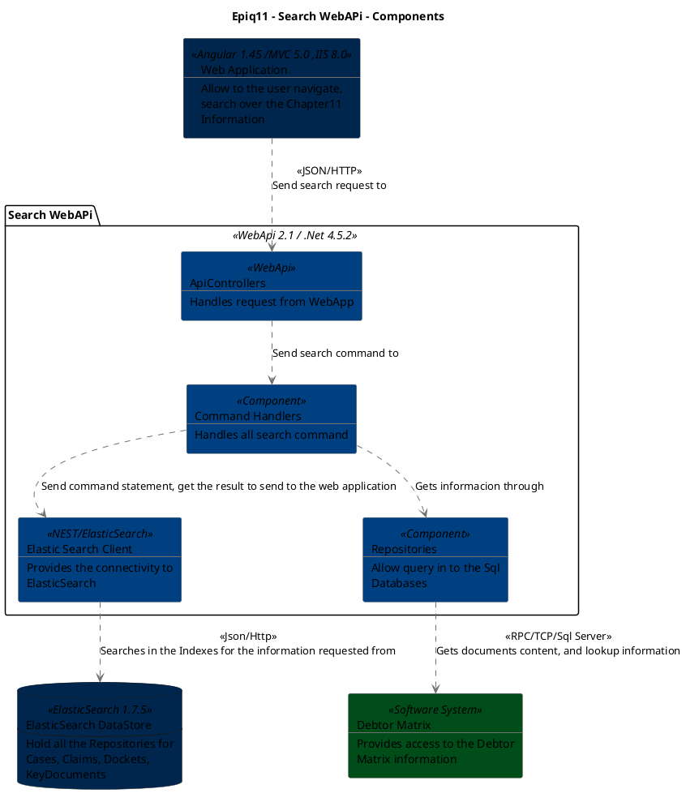

```plantuml
@startuml(id=Containers)
scale max 2000x1414
title Epiq11 - Containers

skinparam {
  shadowing false
  arrowColor #707070
  actorBorderColor #707070
  componentBorderColor #707070
  rectangleBorderColor #707070
  noteBackgroundColor #ffffff
  noteBorderColor #707070
}
actor "Anonymous User" <<Person>> as 1 #3385ff
note right of 1
  This user can navigate to all
  the public datapoints
end note
rectangle 6 <<Software System>> #ff9900 [
  Authentication Service
  --
  Provides services to
  authenticate
  internal/external users
]
rectangle 8 <<Software System>> #004d1a [
  Case Management
  --
  Provides access to the Case
  Management information
]
actor "Data Maintenance User" <<Person>> as 3 #3385ff
note right of 3
  Application User which can
  trigger data updates in
  ElasticSearch
end note
rectangle 7 <<Software System>> #004d1a [
  Debtor Matrix
  --
  Provides access to the Debtor
  Matrix information
]
actor "Internal User" <<Person>> as 2 #3385ff
note right of 2
  Regular Business Epiq User
  which is Authenticated
end note
rectangle 5 <<Software System>> #ff3333 [
  Notification
  --
  Service which provides
  Email/SMS/MMS noticing
  services
]
package "Epiq11" <<Software System>> {
  rectangle 20 <<Selhosted WebApi / .Net 4.5.2>> #00264d [
    DataPopulation
    --
    Get and Updates the
    information in ElasticSearch
    from the DM and CM Databases
  ]
  database 19 <<ElasticSearch 1.7.5>> #00264d [
    ElasticSearch DataStore
    --
    Hold all the Repositories for
    Cases, Claims, Dockets,
    KeyDocuments
  ]
  rectangle 22 <<Selfhost Windows Service, .Net 4.5.2>> #00264d [
    Real Time Notifications Broker
    --
    Send Notifications request
    for Email/SMS noticing
  ]
  rectangle 21 <<WebApi 2.1 / .Net 4.5.2>> #00264d [
    Search WebAPi
    --
    Performs Queries over
    ElasticSearch Data Store
  ]
  rectangle 18 <<Angular 1.45 /MVC 5.0 ,IIS 8.0>> #00264d [
    Web Application
    --
    Allow to the user navigate,
    search over the Chapter11
    Information
  ]
}
1 .[#707070].> 18 : <<Http>>\nCan Navigate and search for public available information
3 .[#707070].> 20 : <<Http>>\nTriggers a data update into
20 .[#707070].> 8 : <<RPC/TCP/Sql Server>>\nGet information of Cases, Claims, Docket,Key Documents (New Information) from
20 .[#707070].> 7 : <<RPC / TCP / Sql Server>>\nGets information of Cases, Claims, Docket, Key Documents from
20 .[#707070].> 19 : <<JSON/HTTP>>\nUpdates the information in the Indexes
2 .[#707070].> 18 : <<Http>>\nCan Navigate and search through all the information stored in the System
5 .[#707070].> 1 : <<SMS/Email message>>\nSend notification/alerts related with a docket update
5 .[#707070].> 2 : <<SMS/Email message>>\nSend notification/alerts related with a docket update
22 .[#707070].> 7 : <<RPC/TCP/Sql Server Service Broker>>\nGets Docket Changes Events from
22 .[#707070].> 5 : <<JSON/HTTPS>>\nSend Email/SMS Notifications Request
21 .[#707070].> 6 : <<RCP/TCP/Sql Server>>\nAuthenticates internal/external users
21 .[#707070].> 7 : <<RPC/TCP/Sql Server>>\nGets documents content, and lookup information
21 .[#707070].> 19 : <<Json/Http>>\nSearches in the Indexes for the information requested 
18 .[#707070].> 5 : <<JSON/Http>>\nSend link Email/SMS notification 
18 .[#707070].> 21 : <<JSON/Http>>\nSend the Request to get Information/Authenticate
@enduml

```

```
@startuml(id=Context)
scale max 2000x1414
title Epiq11 - System Context

skinparam {
  shadowing false
  arrowColor #707070
  actorBorderColor #707070
  componentBorderColor #707070
  rectangleBorderColor #707070
  noteBackgroundColor #ffffff
  noteBorderColor #707070
}
actor "Anonymous User" <<Person>> as 1 #3385ff
note right of 1
  This user can navigate to all
  the public datapoints
end note
actor "Data Maintenance User" <<Person>> as 3 #3385ff
note right of 3
  Application User which can
  trigger data updates in
  ElasticSearch
end note
actor "Internal User" <<Person>> as 2 #3385ff
note right of 2
  Regular Business Epiq User
  which is Authenticated
end note
rectangle 6 <<Software System>> #ff9900 [
  Authentication Service
  --
  Provides services to
  authenticate
  internal/external users
]
rectangle 8 <<Software System>> #004d1a [
  Case Management
  --
  Provides access to the Case
  Management information
]
rectangle 7 <<Software System>> #004d1a [
  Debtor Matrix
  --
  Provides access to the Debtor
  Matrix information
]
rectangle 4 <<Software System>> #000099 [
  Epiq11
  --
  Portal which provide access
  to the information for all
  Bankrupcy Data managed by
  Epiq Systems
]
rectangle 5 <<Software System>> #ff3333 [
  Notification
  --
  Service which provides
  Email/SMS/MMS noticing
  services
]
1 .[#707070].> 4 : <<Http>>\nCan Navigate and search for public available information
3 .[#707070].> 4 : <<Http>>\nTriggers a data update into
4 .[#707070].> 6 : <<RPC/TCP>>\nAuthenticates internal/external users
4 .[#707070].> 8 : <<RPC/TCP/Sql Server>>\nGet information of Cases, Claims, Docket,Key Documents (New Information) from
4 .[#707070].> 7 : <<RPC/TCP/Sql Server>>\nGets information of Cases, Claims, Docket,Key Documents from
4 .[#707070].> 5 : <<JSON/HTTPS>>\nSend Notifications request
2 .[#707070].> 4 : <<Http>>\nCan Navigate and search through all the information stored in the System
5 .[#707070].> 1 : <<SMS/Email message>>\nSend notification/alerts related with a docket update
5 .[#707070].> 2 : <<SMS/Email message>>\nSend notification/alerts related with a docket update
@enduml

```



--

```
@startuml(id=Containers)
scale max 2000x1414
title Epiq11 - Containers

skinparam {
  shadowing false
  arrowColor #707070
  actorBorderColor #707070
  componentBorderColor #707070
  rectangleBorderColor #707070
  noteBackgroundColor #ffffff
  noteBorderColor #707070
}
actor "Anonymous User" <<Person>> as 1 #3385ff
note right of 1
  This user can navigate to all
  the public datapoints
end note
rectangle 6 <<Software System>> #ff9900 [
  Authentication Service
  --
  Provides services to
  authenticate
  internal/external users
]
rectangle 8 <<Software System>> #004d1a [
  Case Management
  --
  Provides access to the Case
  Management information
]
actor "Data Maintenance User" <<Person>> as 3 #3385ff
note right of 3
  Application User which can
  trigger data updates in
  ElasticSearch
end note
rectangle 7 <<Software System>> #004d1a [
  Debtor Matrix
  --
  Provides access to the Debtor
  Matrix information
]
actor "Internal User" <<Person>> as 2 #3385ff
note right of 2
  Regular Business Epiq User
  which is Authenticated
end note
rectangle 5 <<Software System>> #ff3333 [
  Notification
  --
  Service which provides
  Email/SMS/MMS noticing
  services
]
package "Epiq11" <<Software System>> {
  rectangle 20 <<Selhosted WebApi / .Net 4.5.2>> #00264d [
    DataPopulation
    --
    Get and Updates the
    information in ElasticSearch
    from the DM and CM Databases
  ]
  database 19 <<ElasticSearch 1.7.5>> #00264d [
    ElasticSearch DataStore
    --
    Hold all the Repositories for
    Cases, Claims, Dockets,
    KeyDocuments
  ]
  rectangle 22 <<Selfhost Windows Service, .Net 4.5.2>> #00264d [
    Real Time Notifications Broker
    --
    Send Notifications request
    for Email/SMS noticing
  ]
  rectangle 21 <<WebApi 2.1 / .Net 4.5.2>> #00264d [
    Search WebAPi
    --
    Performs Queries over
    ElasticSearch Data Store
  ]
  rectangle 18 <<Angular 1.45 /MVC 5.0 ,IIS 8.0>> #00264d [
    Web Application
    --
    Allow to the user navigate,
    search over the Chapter11
    Information
  ]
}
1 .[#707070].> 18 : <<Http>>\nCan Navigate and search for public available information
3 .[#707070].> 20 : <<Http>>\nTriggers a data update into
20 .[#707070].> 8 : <<RPC/TCP/Sql Server>>\nGet information of Cases, Claims, Docket,Key Documents (New Information) from
20 .[#707070].> 7 : <<RPC / TCP / Sql Server>>\nGets information of Cases, Claims, Docket, Key Documents from
20 .[#707070].> 19 : <<JSON/HTTP>>\nUpdates the information in the Indexes
2 .[#707070].> 18 : <<Http>>\nCan Navigate and search through all the information stored in the System
5 .[#707070].> 1 : <<SMS/Email message>>\nSend notification/alerts related with a docket update
5 .[#707070].> 2 : <<SMS/Email message>>\nSend notification/alerts related with a docket update
22 .[#707070].> 7 : <<RPC/TCP/Sql Server Service Broker>>\nGets Docket Changes Events from
22 .[#707070].> 5 : <<JSON/HTTPS>>\nSend Email/SMS Notifications Request
21 .[#707070].> 6 : <<RCP/TCP/Sql Server>>\nAuthenticates internal/external users
21 .[#707070].> 7 : <<RPC/TCP/Sql Server>>\nGets documents content, and lookup information
21 .[#707070].> 19 : <<Json/Http>>\nSearches in the Indexes for the information requested 
18 .[#707070].> 5 : <<JSON/Http>>\nSend link Email/SMS notification 
18 .[#707070].> 21 : <<JSON/Http>>\nSend the Request to get Information/Authenticate
@enduml

```



--


```
@startuml(id=DataPopulation)
scale max 2000x1414
title Epiq11 - DataPopulation - Components

skinparam {
  shadowing false
  arrowColor #707070
  actorBorderColor #707070
  componentBorderColor #707070
  rectangleBorderColor #707070
  noteBackgroundColor #ffffff
  noteBorderColor #707070
}
rectangle 8 <<Software System>> #004d1a [
  Case Management
  --
  Provides access to the Case
  Management information
]
actor "Data Maintenance User" <<Person>> as 3 #3385ff
note right of 3
  Application User which can
  trigger data updates in
  ElasticSearch
end note
rectangle 7 <<Software System>> #004d1a [
  Debtor Matrix
  --
  Provides access to the Debtor
  Matrix information
]
database 19 <<ElasticSearch 1.7.5>> #00264d [
  ElasticSearch DataStore
  --
  Hold all the Repositories for
  Cases, Claims, Dockets,
  KeyDocuments
]
package "DataPopulation" <<Selhosted WebApi / .Net 4.5.2>> {
  rectangle 46 <<WebApi 2.1/.Net>> #004080 [
    ApiControllers
    --
    WebApi Controller for
    On-Demand updates
  ]
  rectangle 49 <<Ado.Net>> #004080 [
    DataProviders
    --
    Data Access Provider for Sql
    Transactional Databases
  ]
  rectangle 48 <<.Net 4.5.2>> #004080 [
    Indexers
    --
    Get Transactional Data, apply
    transformations and push it
    to ElasticSearch
  ]
  rectangle 47 <<Quartz/.Net>> #004080 [
    Quartz Job
    --
    Quartz Job for Schedule data
    updates
  ]
}
46 .[#707070].> 48 : <<.Net>>\nSend the request to be processed by
3 .[#707070].> 46 : <<Http>>\nTriggers a data update into
49 .[#707070].> 8 : <<RPC/TCP/Sql Server>>\nGets information of Cases, Claims, Docket,Key Documents from
49 .[#707070].> 7 : <<RPC/TCP/Sql Server>>\nGets information of Cases, Claims, Docket,Key Documents from
48 .[#707070].> 49 : Gets Transactional Data from SQl Databases
48 .[#707070].> 19 : Create/Update documents into ElasticSearch
47 .[#707070].> 48 : <<.Net>>\nSend the job to be processed by
@enduml

```





--


```
@startuml(id=SearchWebApi)
scale max 2000x1414
title Epiq11 - Search WebAPi - Components

skinparam {
  shadowing false
  arrowColor #707070
  actorBorderColor #707070
  componentBorderColor #707070
  rectangleBorderColor #707070
  noteBackgroundColor #ffffff
  noteBorderColor #707070
}
rectangle 7 <<Software System>> #004d1a [
  Debtor Matrix
  --
  Provides access to the Debtor
  Matrix information
]
database 19 <<ElasticSearch 1.7.5>> #00264d [
  ElasticSearch DataStore
  --
  Hold all the Repositories for
  Cases, Claims, Dockets,
  KeyDocuments
]
rectangle 18 <<Angular 1.45 /MVC 5.0 ,IIS 8.0>> #00264d [
  Web Application
  --
  Allow to the user navigate,
  search over the Chapter11
  Information
]
package "Search WebAPi" <<WebApi 2.1 / .Net 4.5.2>> {
  rectangle 36 <<WebApi>> #004080 [
    ApiControllers
    --
    Handles request from WebApp
  ]
  rectangle 37 <<Component>> #004080 [
    Command Handlers
    --
    Handles all search command
  ]
  rectangle 39 <<NEST/ElasticSearch>> #004080 [
    Elastic Search Client
    --
    Provides the connectivity to
    ElasticSearch
  ]
  rectangle 38 <<Component>> #004080 [
    Repositories
    --
    Allow query in to the Sql
    Databases
  ]
}
36 .[#707070].> 37 : Send search command to
37 .[#707070].> 39 : Send command statement, get the result to send to the web application
37 .[#707070].> 38 : Gets informacion through
39 .[#707070].> 19 : <<Json/Http>>\nSearches in the Indexes for the information requested from
38 .[#707070].> 7 : <<RPC/TCP/Sql Server>>\nGets documents content, and lookup information
18 .[#707070].> 36 : <<JSON/HTTP>>\nSend search request to
@enduml

```



--

