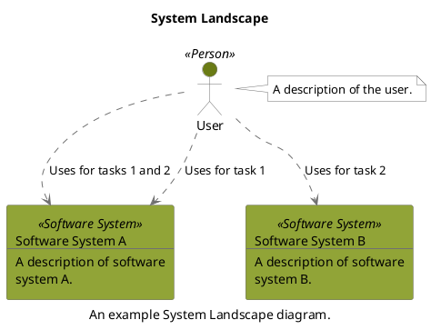

```
@startuml(id=SystemLandscape)
scale max 2000x1409
title System Landscape
caption An example System Landscape diagram.

skinparam {
  shadowing false
  arrowColor #707070
  actorBorderColor #707070
  componentBorderColor #707070
  rectangleBorderColor #707070
  noteBackgroundColor #ffffff
  noteBorderColor #707070
}
actor "User" <<Person>> as 1 #6a7b15
note right of 1
  A description of the user.
end note
rectangle 2 <<Software System>> #91a437 [
  Software System A
  --
  A description of software
  system A.
]
rectangle 3 <<Software System>> #91a437 [
  Software System B
  --
  A description of software
  system B.
]
1 .[#707070].> 2 : Uses for tasks 1 and 2
1 .[#707070].> 2 : Uses for task 1
1 .[#707070].> 3 : Uses for task 2
@enduml
```


