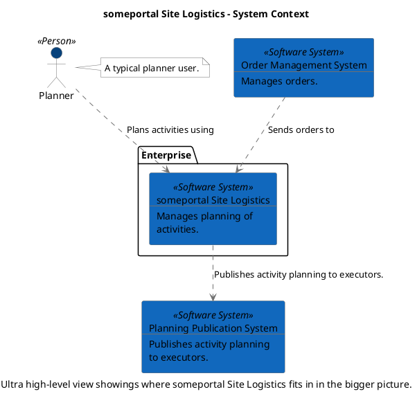
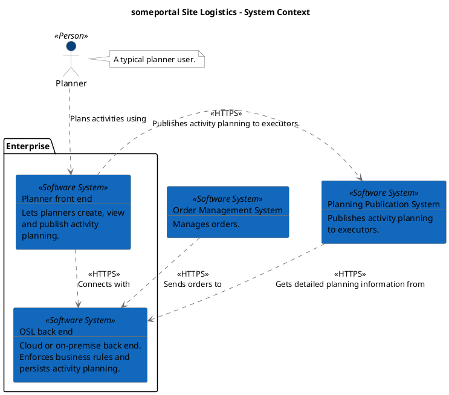
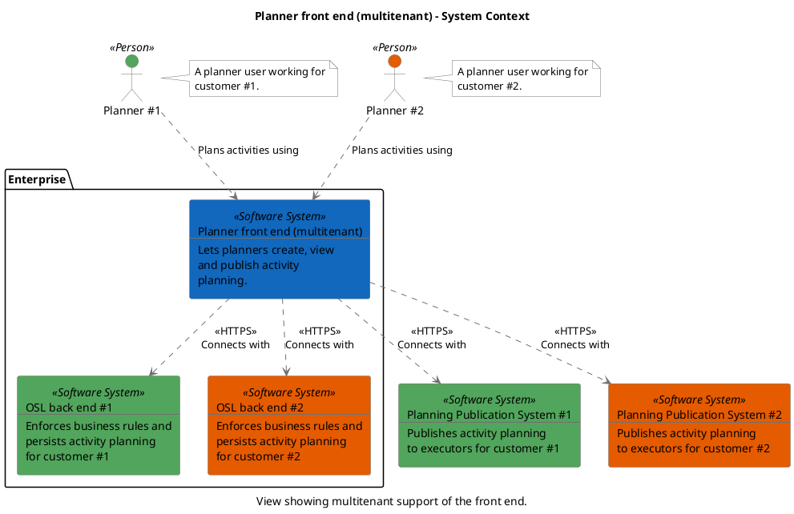
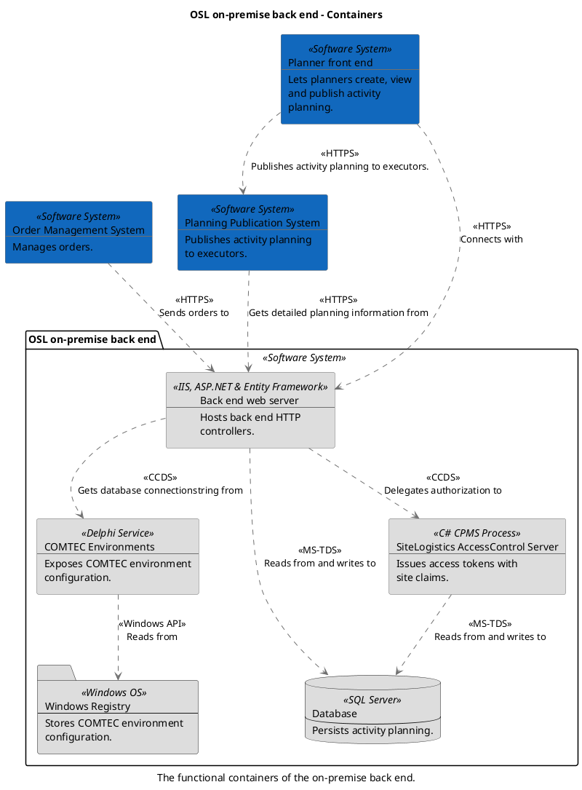
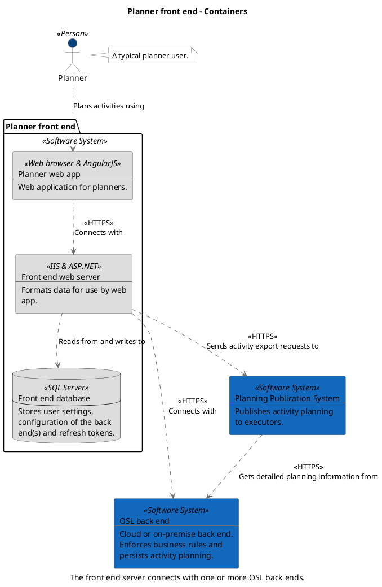
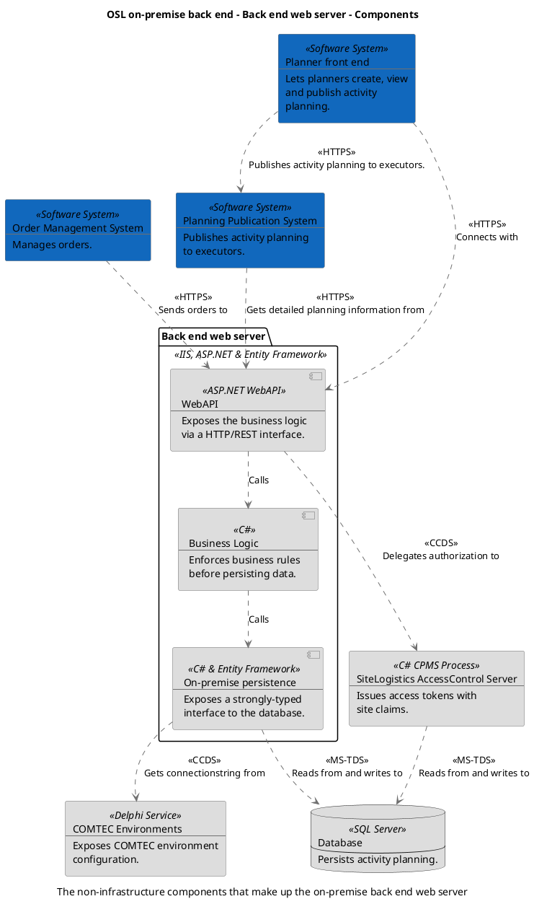

```
@startuml(id=context)
scale max 2000x1409
title someportal Site Logistics - System Context
caption Ultra high-level view showings where someportal Site Logistics fits in in the bigger picture.

skinparam {
  shadowing false
  arrowColor #707070
  actorBorderColor #707070
  componentBorderColor #707070
  rectangleBorderColor #707070
  noteBackgroundColor #ffffff
  noteBorderColor #707070
}
actor "Planner" <<Person>> as 1 #08427b
note right of 1
  A typical planner user.
end note
rectangle 3 <<Software System>> #1168bd [
  Order Management System
  --
  Manages orders.
]
rectangle 4 <<Software System>> #1168bd [
  Planning Publication System
  --
  Publishes activity planning
  to executors.
]
package "Enterprise" {
  rectangle 5 <<Software System>> #1168bd [
    someportal Site Logistics
    --
    Manages planning of
    activities.
  ]
}
5 .[#707070].> 4 : Publishes activity planning to executors.
3 .[#707070].> 5 : Sends orders to
1 .[#707070].> 5 : Plans activities using
@enduml

```



--

```
@startuml(id=system)
scale max 2000x1500
title someportal Site Logistics - System Context

skinparam {
  shadowing false
  arrowColor #707070
  actorBorderColor #707070
  componentBorderColor #707070
  rectangleBorderColor #707070
  noteBackgroundColor #ffffff
  noteBorderColor #707070
}
actor "Planner" <<Person>> as 1 #08427b
note right of 1
  A typical planner user.
end note
rectangle 3 <<Software System>> #1168bd [
  Order Management System
  --
  Manages orders.
]
rectangle 4 <<Software System>> #1168bd [
  Planning Publication System
  --
  Publishes activity planning
  to executors.
]
package "Enterprise" {
  rectangle 10 <<Software System>> #1168bd [
    OSL back end
    --
    Cloud or on-premise back end.
    Enforces business rules and
    persists activity planning.
  ]
  rectangle 6 <<Software System>> #1168bd [
    Planner front end
    --
    Lets planners create, view
    and publish activity
    planning.
  ]
}
3 .[#707070].> 10 : <<HTTPS>>\nSends orders to
6 .[#707070].> 10 : <<HTTPS>>\nConnects with
6 .[#707070].> 4 : <<HTTPS>>\nPublishes activity planning to executors.
1 .[#707070].> 6 : Plans activities using
4 .[#707070].> 10 : <<HTTPS>>\nGets detailed planning information from
@enduml

```



--

```
@startuml(id=multitenant_front_end)
scale max 2000x1124
title Planner front end (multitenant) - System Context
caption View showing multitenant support of the front end.

skinparam {
  shadowing false
  arrowColor #707070
  actorBorderColor #707070
  componentBorderColor #707070
  rectangleBorderColor #707070
  noteBackgroundColor #ffffff
  noteBorderColor #707070
}
actor "Planner #1" <<Person>> as 23 #52a55c
note right of 23
  A planner user working for
  customer #1.
end note
actor "Planner #2" <<Person>> as 24 #e55b00
note right of 24
  A planner user working for
  customer #2.
end note
rectangle 27 <<Software System>> #52a55c [
  Planning Publication System #1
  --
  Publishes activity planning
  to executors for customer #1
]
rectangle 28 <<Software System>> #e55b00 [
  Planning Publication System #2
  --
  Publishes activity planning
  to executors for customer #2
]
package "Enterprise" {
  rectangle 25 <<Software System>> #52a55c [
    OSL back end #1
    --
    Enforces business rules and
    persists activity planning
    for customer #1
  ]
  rectangle 26 <<Software System>> #e55b00 [
    OSL back end #2
    --
    Enforces business rules and
    persists activity planning
    for customer #2
  ]
  rectangle 22 <<Software System>> #1168bd [
    Planner front end (multitenant)
    --
    Lets planners create, view
    and publish activity
    planning.
  ]
}
23 .[#707070].> 22 : Plans activities using
24 .[#707070].> 22 : Plans activities using
22 .[#707070].> 25 : <<HTTPS>>\nConnects with
22 .[#707070].> 26 : <<HTTPS>>\nConnects with
22 .[#707070].> 27 : <<HTTPS>>\nConnects with
22 .[#707070].> 28 : <<HTTPS>>\nConnects with
@enduml

```



--

```
@startuml(id=onPremiseBackEndFunctionalContainers)
scale max 2000x1124
title OSL on-premise back end - Containers
caption The functional containers of the on-premise back end.

skinparam {
  shadowing false
  arrowColor #707070
  actorBorderColor #707070
  componentBorderColor #707070
  rectangleBorderColor #707070
  noteBackgroundColor #ffffff
  noteBorderColor #707070
}
rectangle 3 <<Software System>> #1168bd [
  Order Management System
  --
  Manages orders.
]
rectangle 6 <<Software System>> #1168bd [
  Planner front end
  --
  Lets planners create, view
  and publish activity
  planning.
]
rectangle 4 <<Software System>> #1168bd [
  Planning Publication System
  --
  Publishes activity planning
  to executors.
]
package "OSL on-premise back end" <<Software System>> {
  rectangle 12 <<IIS, ASP.NET & Entity Framework>> #dddddd [
    Back end web server
    --
    Hosts back end HTTP
    controllers.
  ]
  rectangle 16 <<Delphi Service>> #dddddd [
    COMTEC Environments
    --
    Exposes COMTEC environment
    configuration.
  ]
  database 13 <<SQL Server>> #dddddd [
    Database
    --
    Persists activity planning.
  ]
  rectangle 14 <<C# CPMS Process>> #dddddd [
    SiteLogistics AccessControl Server
    --
    Issues access tokens with
    site claims.
  ]
  folder 17 <<Windows OS>> #dddddd [
    Windows Registry
    --
    Stores COMTEC environment
    configuration.
  ]
}
12 .[#707070].> 16 : <<CCDS>>\nGets database connectionstring from
12 .[#707070].> 13 : <<MS-TDS>>\nReads from and writes to
12 .[#707070].> 14 : <<CCDS>>\nDelegates authorization to
16 .[#707070].> 17 : <<Windows API>>\nReads from
3 .[#707070].> 12 : <<HTTPS>>\nSends orders to
6 .[#707070].> 12 : <<HTTPS>>\nConnects with
6 .[#707070].> 4 : <<HTTPS>>\nPublishes activity planning to executors.
4 .[#707070].> 12 : <<HTTPS>>\nGets detailed planning information from
14 .[#707070].> 13 : <<MS-TDS>>\nReads from and writes to
@enduml

```



--


```
@startuml(id=plannerFrontEndContainers)
scale max 2000x1124
title Planner front end - Containers
caption The front end server connects with one or more OSL back ends.

skinparam {
  shadowing false
  arrowColor #707070
  actorBorderColor #707070
  componentBorderColor #707070
  rectangleBorderColor #707070
  noteBackgroundColor #ffffff
  noteBorderColor #707070
}
rectangle 10 <<Software System>> #1168bd [
  OSL back end
  --
  Cloud or on-premise back end.
  Enforces business rules and
  persists activity planning.
]
actor "Planner" <<Person>> as 1 #08427b
note right of 1
  A typical planner user.
end note
rectangle 4 <<Software System>> #1168bd [
  Planning Publication System
  --
  Publishes activity planning
  to executors.
]
package "Planner front end" <<Software System>> {
  database 8 <<SQL Server>> #dddddd [
    Front end database
    --
    Stores user settings,
    configuration of the back
    end(s) and refresh tokens.
  ]
  rectangle 7 <<IIS & ASP.NET>> #dddddd [
    Front end web server
    --
    Formats data for use by web
    app.
  ]
  rectangle 9 <<Web browser & AngularJS>> #dddddd [
    Planner web app
    --
    Web application for planners.
  ]
}
7 .[#707070].> 8 : Reads from and writes to
7 .[#707070].> 10 : <<HTTPS>>\nConnects with
7 .[#707070].> 4 : <<HTTPS>>\nSends activity export requests to
9 .[#707070].> 7 : <<HTTPS>>\nConnects with
1 .[#707070].> 9 : Plans activities using
4 .[#707070].> 10 : <<HTTPS>>\nGets detailed planning information from
@enduml

```




--


```
@startuml(id=onPremiseBackEndComponents)
scale max 1413x2000
title OSL on-premise back end - Back end web server - Components
caption The non-infrastructure components that make up the on-premise back end web server

skinparam {
  shadowing false
  arrowColor #707070
  actorBorderColor #707070
  componentBorderColor #707070
  rectangleBorderColor #707070
  noteBackgroundColor #ffffff
  noteBorderColor #707070
}
rectangle 16 <<Delphi Service>> #dddddd [
  COMTEC Environments
  --
  Exposes COMTEC environment
  configuration.
]
database 13 <<SQL Server>> #dddddd [
  Database
  --
  Persists activity planning.
]
rectangle 3 <<Software System>> #1168bd [
  Order Management System
  --
  Manages orders.
]
rectangle 6 <<Software System>> #1168bd [
  Planner front end
  --
  Lets planners create, view
  and publish activity
  planning.
]
rectangle 4 <<Software System>> #1168bd [
  Planning Publication System
  --
  Publishes activity planning
  to executors.
]
rectangle 14 <<C# CPMS Process>> #dddddd [
  SiteLogistics AccessControl Server
  --
  Issues access tokens with
  site claims.
]
package "Back end web server" <<IIS, ASP.NET & Entity Framework>> {
  component 19 <<C#>> #dddddd [
    Business Logic
    --
    Enforces business rules
    before persisting data.
  ]
  component 20 <<C# & Entity Framework>> #dddddd [
    On-premise persistence
    --
    Exposes a strongly-typed
    interface to the database.
  ]
  component 18 <<ASP.NET WebAPI>> #dddddd [
    WebAPI
    --
    Exposes the business logic
    via a HTTP/REST interface.
  ]
}
19 .[#707070].> 20 : Calls
20 .[#707070].> 16 : <<CCDS>>\nGets connectionstring from
20 .[#707070].> 13 : <<MS-TDS>>\nReads from and writes to
3 .[#707070].> 18 : <<HTTPS>>\nSends orders to
6 .[#707070].> 4 : <<HTTPS>>\nPublishes activity planning to executors.
6 .[#707070].> 18 : <<HTTPS>>\nConnects with
4 .[#707070].> 18 : <<HTTPS>>\nGets detailed planning information from
14 .[#707070].> 13 : <<MS-TDS>>\nReads from and writes to
18 .[#707070].> 19 : Calls
18 .[#707070].> 14 : <<CCDS>>\nDelegates authorization to
@enduml

```


