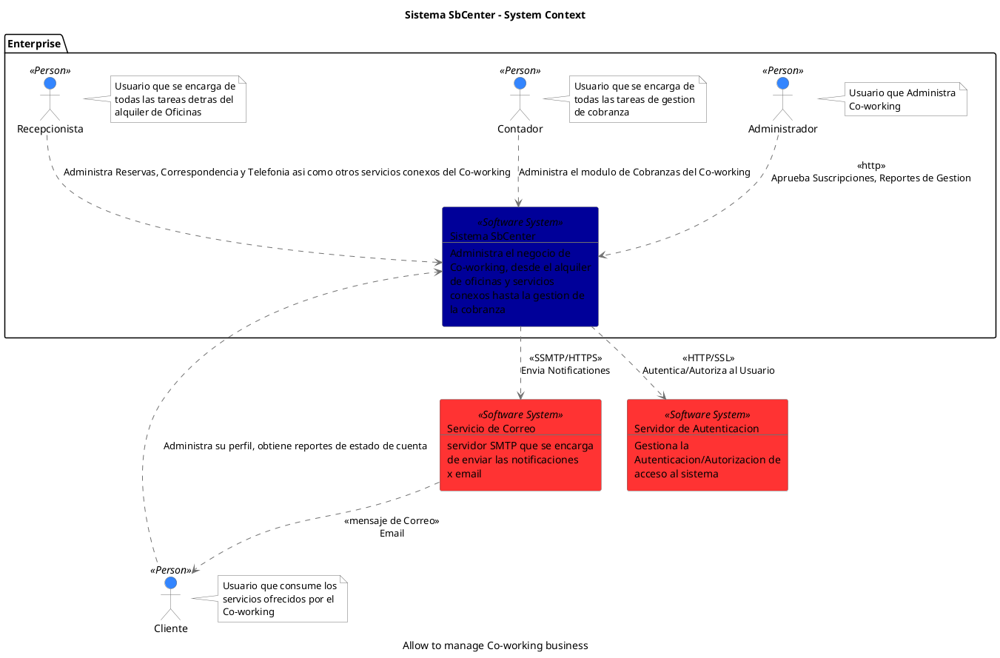
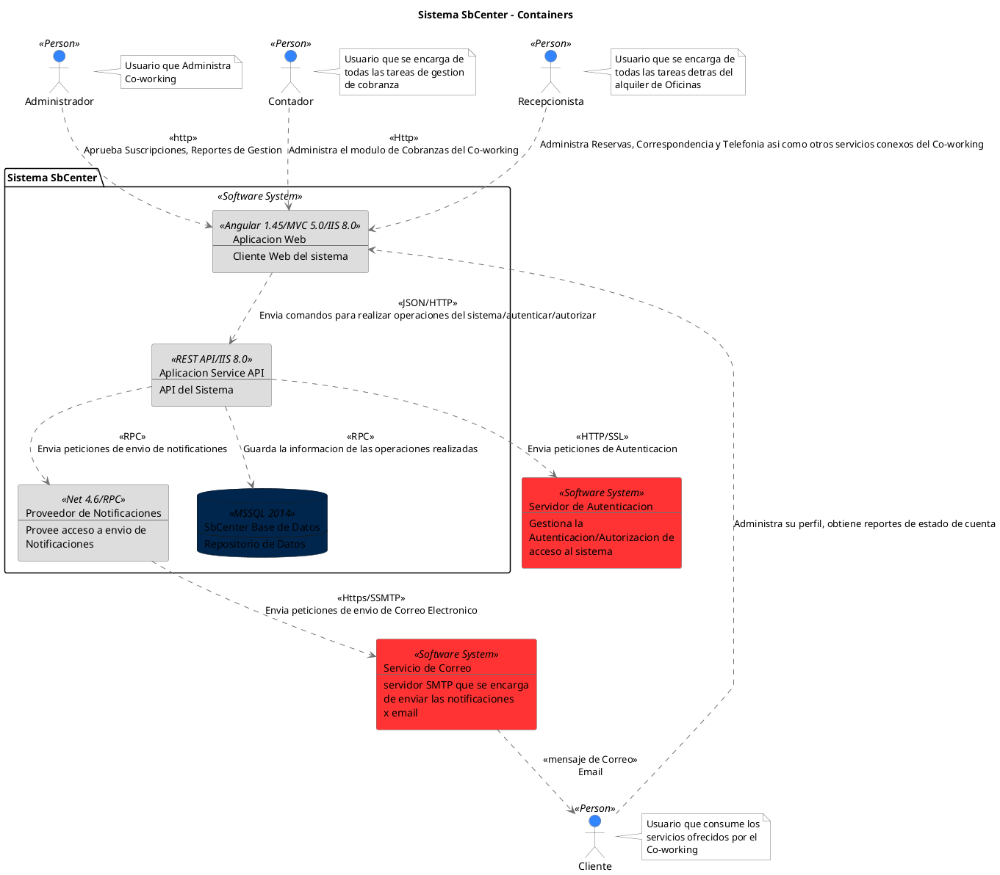

```
@startuml(id=booking)
scale max 2000x1414
title Sistema SbCenter - System Context
caption Allow to manage Co-working business

skinparam {
  shadowing false
  arrowColor #707070
  actorBorderColor #707070
  componentBorderColor #707070
  rectangleBorderColor #707070
  noteBackgroundColor #ffffff
  noteBorderColor #707070
}
actor "Cliente" <<Person>> as 3 #3385ff
note right of 3
  Usuario que consume los
  servicios ofrecidos por el
  Co-working
end note
rectangle 6 <<Software System>> #ff3333 [
  Servicio de Correo
  --
  servidor SMTP que se encarga
  de enviar las notificaciones
  x email
]
rectangle 7 <<Software System>> #ff3333 [
  Servidor de Autenticacion
  --
  Gestiona la
  Autenticacion/Autorizacion de
  acceso al sistema
]
package "Enterprise" {
  actor "Administrador" <<Person>> as 2 #3385ff
  note right of 2
    Usuario que Administra
    Co-working
  end note
  actor "Contador" <<Person>> as 5 #3385ff
  note right of 5
    Usuario que se encarga de
    todas las tareas de gestion
    de cobranza
  end note
  actor "Recepcionista" <<Person>> as 4 #3385ff
  note right of 4
    Usuario que se encarga de
    todas las tareas detras del
    alquiler de Oficinas
  end note
  rectangle 1 <<Software System>> #000099 [
    Sistema SbCenter
    --
    Administra el negocio de
    Co-working, desde el alquiler
    de oficinas y servicios
    conexos hasta la gestion de
    la cobranza
  ]
}
2 .[#707070].> 1 : <<http>>\nAprueba Suscripciones, Reportes de Gestion
3 .[#707070].> 1 : Administra su perfil, obtiene reportes de estado de cuenta
5 .[#707070].> 1 : Administra el modulo de Cobranzas del Co-working
4 .[#707070].> 1 : Administra Reservas, Correspondencia y Telefonia asi como otros servicios conexos del Co-working
6 .[#707070].> 3 : <<mensaje de Correo>>\nEmail
1 .[#707070].> 6 : <<SSMTP/HTTPS>>\nEnvia Notificationes
1 .[#707070].> 7 : <<HTTP/SSL>>\nAutentica/Autoriza al Usuario
@enduml

```



--

```
@startuml(id=Vista_de_Contenedores)
scale max 2000x1414
title Sistema SbCenter - Containers

skinparam {
  shadowing false
  arrowColor #707070
  actorBorderColor #707070
  componentBorderColor #707070
  rectangleBorderColor #707070
  noteBackgroundColor #ffffff
  noteBorderColor #707070
}
actor "Administrador" <<Person>> as 2 #3385ff
note right of 2
  Usuario que Administra
  Co-working
end note
actor "Cliente" <<Person>> as 3 #3385ff
note right of 3
  Usuario que consume los
  servicios ofrecidos por el
  Co-working
end note
actor "Contador" <<Person>> as 5 #3385ff
note right of 5
  Usuario que se encarga de
  todas las tareas de gestion
  de cobranza
end note
actor "Recepcionista" <<Person>> as 4 #3385ff
note right of 4
  Usuario que se encarga de
  todas las tareas detras del
  alquiler de Oficinas
end note
rectangle 6 <<Software System>> #ff3333 [
  Servicio de Correo
  --
  servidor SMTP que se encarga
  de enviar las notificaciones
  x email
]
rectangle 7 <<Software System>> #ff3333 [
  Servidor de Autenticacion
  --
  Gestiona la
  Autenticacion/Autorizacion de
  acceso al sistema
]
package "Sistema SbCenter" <<Software System>> {
  rectangle 16 <<REST API/IIS 8.0>> #dddddd [
    Aplicacion Service API
    --
    API del Sistema
  ]
  rectangle 15 <<Angular 1.45/MVC 5.0/IIS 8.0>> #dddddd [
    Aplicacion Web
    --
    Cliente Web del sistema
  ]
  rectangle 17 <<Net 4.6/RPC>> #dddddd [
    Proveedor de Notificaciones
    --
    Provee acceso a envio de
    Notificaciones
  ]
  database 18 <<MSSQL 2014>> #00264d [
    SbCenter Base de Datos
    --
    Repositorio de Datos
  ]
}
2 .[#707070].> 15 : <<http>>\nAprueba Suscripciones, Reportes de Gestion
16 .[#707070].> 17 : <<RPC>>\nEnvia peticiones de envio de notificationes
16 .[#707070].> 18 : <<RPC>>\nGuarda la informacion de las operaciones realizadas
16 .[#707070].> 7 : <<HTTP/SSL>>\nEnvia peticiones de Autenticacion
15 .[#707070].> 16 : <<JSON/HTTP>>\nEnvia comandos para realizar operaciones del sistema/autenticar/autorizar
3 .[#707070].> 15 : Administra su perfil, obtiene reportes de estado de cuenta
5 .[#707070].> 15 : <<Http>>\nAdministra el modulo de Cobranzas del Co-working
17 .[#707070].> 6 : <<Https/SSMTP>>\nEnvia peticiones de envio de Correo Electronico
4 .[#707070].> 15 : Administra Reservas, Correspondencia y Telefonia asi como otros servicios conexos del Co-working
6 .[#707070].> 3 : <<mensaje de Correo>>\nEmail
@enduml

```



--

