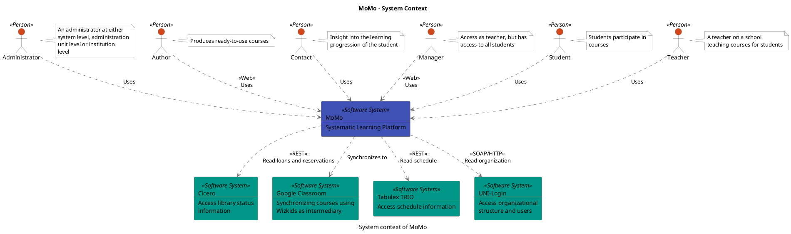

```plantuml
@startuml(id=containers)
scale max 2000x1414
title MoMo - Containers
caption Infrastructure services

skinparam {
  shadowing false
  arrowColor #707070
  actorBorderColor #707070
  componentBorderColor #707070
  rectangleBorderColor #707070
  noteBackgroundColor #ffffff
  noteBorderColor #707070
}
actor "Administrator" <<Person>> as 4 #d0471b
note right of 4
  An administrator at either
  system level, administration
  unit level or institution
  level
end note
actor "Author" <<Person>> as 10 #d0471b
note right of 10
  Produces ready-to-use courses
end note
rectangle 20 <<Software System>> #009788 [
  Cicero
  --
  Access library status
  information
]
actor "Contact" <<Person>> as 8 #d0471b
note right of 8
  Insight into the learning
  progression of the student
end note
rectangle 14 <<Software System>> #009788 [
  Google Classroom
  --
  Synchronizing courses using
  Wizkids as intermediary
]
actor "Manager" <<Person>> as 12 #d0471b
note right of 12
  Access as teacher, but has
  access to all students
end note
actor "Student" <<Person>> as 6 #d0471b
note right of 6
  Students participate in
  courses
end note
rectangle 18 <<Software System>> #009788 [
  Tabulex TRIO
  --
  Access schedule information
]
actor "Teacher" <<Person>> as 2 #d0471b
note right of 2
  A teacher on a school
  teaching courses for students
end note
rectangle 16 <<Software System>> #009788 [
  UNI-Login
  --
  Access organizational
  structure and users
]
package "MoMo" <<Software System>> {
  rectangle 38 <<Zuul>> #1b7bc7 [
    API Gateway
    --
    Exposes services in a uniform
    way
  ]
  rectangle 66 <<Prometheus>> #aa42f4 [
    Alert manager
    --
    Send mails on alerts
  ]
  rectangle 41 <<Keycloak>> #1b7bc7 [
    Authentication
    --
    Authenticates users and
    clients
  ]
  rectangle 60 <<Wordpress>> #1b7bc7 [
    CMS Server
    --
    Help pages
  ]
  database 22 <<PostgreSQL 9.5>> #1b7bc7 [
    Database
    --
    Contains all the state of the
    system
  ]
  rectangle 68 <<Portainer>> #1b7bc7 [
    Docker engine overview
    --
    Displays containers, images
    volumes etc.
  ]
  rectangle 64 <<Private registry>> #1b7bc7 [
    Docker registry
    --
    Stores docker images
  ]
  rectangle 58 <<Cicero Document Repository>> #1b7bc7 [
    Document repository
    --
    Contains metadata about
    external teaching aids
  ]
  rectangle 62 <<ImageProxy>> #1b7bc7 [
    Image optimizer
    --
    Creates cached versions of
    images in the desired
    dimensions
  ]
  rectangle 50 <<Elasticsearch>> #1b7bc7 [
    Log DB
    --
    Stores logs
  ]
  rectangle 46 <<Fluentd>> #1b7bc7 [
    Log aggregator
    --
    Collects logs
  ]
  rectangle 52 <<Kibana>> #1b7bc7 [
    Log viewer
    --
    Query logs and statistics
  ]
  rectangle 44 <<Kafka>> #1b7bc7 [
    Message broker
    --
    Captures events and mediates
    between services
  ]
  rectangle 23 <<Services>> #d6a400 [
    MoMo Services
    --
    The MoMo services
  ]
  rectangle 29 <<Angular>> #1b7bc7 [
    MoMo UI
    --
    The single page frontend
    application
  ]
  rectangle 36 <<Elastic Search>> #1b7bc7 [
    Search engine
    --
    Course and teaching aid
    search engine
  ]
  rectangle 69 <<New Relic adapters>> #1b7bc7 [
    Server statistics collector
    --
    Collects server statistics
    and sends them to New Relic
  ]
  rectangle 65 <<Prometheus>> #1b7bc7 [
    Service monitoring
    --
    Monitor health and statistics
    on services
  ]
  rectangle 54 <<Eureka>> #aa42f4 [
    Service registry
    --
    Maintains links to running
    services
  ]
}
38 .[#707070].> 41 : Routes request
38 .[#707070].> 46 : Send logs to central location
38 .[#707070].> 23 : Routes request
38 .[#707070].> 54 : Looking up and loadbalancing services
4 .[#707070].> 29 : <<Web>>\nUses
41 .[#707070].> 46 : Send logs to central location
41 .[#707070].> 54 : Register service
10 .[#707070].> 29 : <<Web>>\nUses
8 .[#707070].> 29 : <<Web>>\nUses
46 .[#707070].> 50 : Deliver logs
52 .[#707070].> 50 : Querying
12 .[#707070].> 29 : <<Web>>\nUses
23 .[#707070].> 41 : Validates authentication tokens
23 .[#707070].> 60 : Retrieve context relevant help guides
23 .[#707070].> 20 : <<REST>>\nRead loans and reservations
23 .[#707070].> 22 : <<JDBC>>\nUses
23 .[#707070].> 58 : Parse metadata about teaching aids
23 .[#707070].> 14 : <<REST>>\nSynchronizes to
23 .[#707070].> 46 : Send logs to central location
23 .[#707070].> 44 : Produces and consumes events
23 .[#707070].> 36 : Index and search for courses and teaching aids
23 .[#707070].> 54 : Register service
23 .[#707070].> 18 : <<REST>>\nRead schedule
23 .[#707070].> 16 : <<SOAP/HTTP>>\nRead organization
29 .[#707070].> 38 : <<REST>>\nUses
29 .[#707070].> 62 : Fetch optimized images
65 .[#707070].> 66 : Send alerts
6 .[#707070].> 29 : <<Web>>\nUses
2 .[#707070].> 29 : <<Web>>\nUses
@enduml

```

```plantuml
@startuml(id=components)
scale max 2000x1413
title MoMo - MoMo Services - Components
caption MoMo application services

skinparam {
  shadowing false
  arrowColor #707070
  actorBorderColor #707070
  componentBorderColor #707070
  rectangleBorderColor #707070
  noteBackgroundColor #ffffff
  noteBorderColor #707070
}
rectangle 60 <<Wordpress>> #1b7bc7 [
  CMS Server
  --
  Help pages
]
rectangle 20 <<Software System>> #009788 [
  Cicero
  --
  Access library status
  information
]
database 22 <<PostgreSQL 9.5>> #1b7bc7 [
  Database
  --
  Contains all the state of the
  system
]
rectangle 58 <<Cicero Document Repository>> #1b7bc7 [
  Document repository
  --
  Contains metadata about
  external teaching aids
]
rectangle 14 <<Software System>> #009788 [
  Google Classroom
  --
  Synchronizing courses using
  Wizkids as intermediary
]
rectangle 36 <<Elastic Search>> #1b7bc7 [
  Search engine
  --
  Course and teaching aid
  search engine
]
rectangle 18 <<Software System>> #009788 [
  Tabulex TRIO
  --
  Access schedule information
]
rectangle 16 <<Software System>> #009788 [
  UNI-Login
  --
  Access organizational
  structure and users
]
package "MoMo Services" <<Services>> {
  rectangle 70 <<JBoss Wildfly>> #00bcd5 [
    Backend
    --
    Contains the entire backend
    application
  ]
  rectangle 76 <<JBoss Wildlfy>> #00bcd5 [
    Integration server
    --
    Handles batches and
    asynchronous synchronizations
  ]
}
70 .[#707070].> 60 : Retrieve context relevant help guides
70 .[#707070].> 20 : <<REST>>\nFetch library loans and reservations
70 .[#707070].> 22 : <<JDBC>>\nPersistence
70 .[#707070].> 14 : <<REST>>\nCreate classroom
70 .[#707070].> 36 : Search courses and teaching aids
76 .[#707070].> 22 : <<JDBC>>\nPersistence
76 .[#707070].> 58 : <<Kafka events>>\nWrites course and teaching aid metadata and processes changes to these
76 .[#707070].> 14 : <<REST>>\nUpdate classroom and assignments
76 .[#707070].> 18 : <<REST>>\nRead schedule
76 .[#707070].> 16 : <<SOAP/HTTP>>\nRead organization
@enduml

```

```
@startuml(id=context)
scale max 2000x1413
title MoMo - System Context
caption System context of MoMo

skinparam {
  shadowing false
  arrowColor #707070
  actorBorderColor #707070
  componentBorderColor #707070
  rectangleBorderColor #707070
  noteBackgroundColor #ffffff
  noteBorderColor #707070
}
actor "Administrator" <<Person>> as 4 #d0471b
note right of 4
  An administrator at either
  system level, administration
  unit level or institution
  level
end note
actor "Author" <<Person>> as 10 #d0471b
note right of 10
  Produces ready-to-use courses
end note
actor "Contact" <<Person>> as 8 #d0471b
note right of 8
  Insight into the learning
  progression of the student
end note
actor "Manager" <<Person>> as 12 #d0471b
note right of 12
  Access as teacher, but has
  access to all students
end note
actor "Student" <<Person>> as 6 #d0471b
note right of 6
  Students participate in
  courses
end note
actor "Teacher" <<Person>> as 2 #d0471b
note right of 2
  A teacher on a school
  teaching courses for students
end note
rectangle 20 <<Software System>> #009788 [
  Cicero
  --
  Access library status
  information
]
rectangle 14 <<Software System>> #009788 [
  Google Classroom
  --
  Synchronizing courses using
  Wizkids as intermediary
]
rectangle 1 <<Software System>> #3f51b5 [
  MoMo
  --
  Systematic Learning Platform
]
rectangle 18 <<Software System>> #009788 [
  Tabulex TRIO
  --
  Access schedule information
]
rectangle 16 <<Software System>> #009788 [
  UNI-Login
  --
  Access organizational
  structure and users
]
4 .[#707070].> 1 : Uses
10 .[#707070].> 1 : <<Web>>\nUses
8 .[#707070].> 1 : Uses
12 .[#707070].> 1 : <<Web>>\nUses
1 .[#707070].> 20 : <<REST>>\nRead loans and reservations
1 .[#707070].> 14 : Synchronizes to
1 .[#707070].> 18 : <<REST>>\nRead schedule
1 .[#707070].> 16 : <<SOAP/HTTP>>\nRead organization
6 .[#707070].> 1 : Uses
2 .[#707070].> 1 : Uses
@enduml

```



--

```
@startuml(id=containers)
scale max 2000x1414
title MoMo - Containers
caption Infrastructure services

skinparam {
  shadowing false
  arrowColor #707070
  actorBorderColor #707070
  componentBorderColor #707070
  rectangleBorderColor #707070
  noteBackgroundColor #ffffff
  noteBorderColor #707070
}
actor "Administrator" <<Person>> as 4 #d0471b
note right of 4
  An administrator at either
  system level, administration
  unit level or institution
  level
end note
actor "Author" <<Person>> as 10 #d0471b
note right of 10
  Produces ready-to-use courses
end note
rectangle 20 <<Software System>> #009788 [
  Cicero
  --
  Access library status
  information
]
actor "Contact" <<Person>> as 8 #d0471b
note right of 8
  Insight into the learning
  progression of the student
end note
rectangle 14 <<Software System>> #009788 [
  Google Classroom
  --
  Synchronizing courses using
  Wizkids as intermediary
]
actor "Manager" <<Person>> as 12 #d0471b
note right of 12
  Access as teacher, but has
  access to all students
end note
actor "Student" <<Person>> as 6 #d0471b
note right of 6
  Students participate in
  courses
end note
rectangle 18 <<Software System>> #009788 [
  Tabulex TRIO
  --
  Access schedule information
]
actor "Teacher" <<Person>> as 2 #d0471b
note right of 2
  A teacher on a school
  teaching courses for students
end note
rectangle 16 <<Software System>> #009788 [
  UNI-Login
  --
  Access organizational
  structure and users
]
package "MoMo" <<Software System>> {
  rectangle 38 <<Zuul>> #1b7bc7 [
    API Gateway
    --
    Exposes services in a uniform
    way
  ]
  rectangle 66 <<Prometheus>> #aa42f4 [
    Alert manager
    --
    Send mails on alerts
  ]
  rectangle 41 <<Keycloak>> #1b7bc7 [
    Authentication
    --
    Authenticates users and
    clients
  ]
  rectangle 60 <<Wordpress>> #1b7bc7 [
    CMS Server
    --
    Help pages
  ]
  database 22 <<PostgreSQL 9.5>> #1b7bc7 [
    Database
    --
    Contains all the state of the
    system
  ]
  rectangle 68 <<Portainer>> #1b7bc7 [
    Docker engine overview
    --
    Displays containers, images
    volumes etc.
  ]
  rectangle 64 <<Private registry>> #1b7bc7 [
    Docker registry
    --
    Stores docker images
  ]
  rectangle 58 <<Cicero Document Repository>> #1b7bc7 [
    Document repository
    --
    Contains metadata about
    external teaching aids
  ]
  rectangle 62 <<ImageProxy>> #1b7bc7 [
    Image optimizer
    --
    Creates cached versions of
    images in the desired
    dimensions
  ]
  rectangle 50 <<Elasticsearch>> #1b7bc7 [
    Log DB
    --
    Stores logs
  ]
  rectangle 46 <<Fluentd>> #1b7bc7 [
    Log aggregator
    --
    Collects logs
  ]
  rectangle 52 <<Kibana>> #1b7bc7 [
    Log viewer
    --
    Query logs and statistics
  ]
  rectangle 44 <<Kafka>> #1b7bc7 [
    Message broker
    --
    Captures events and mediates
    between services
  ]
  rectangle 23 <<Services>> #d6a400 [
    MoMo Services
    --
    The MoMo services
  ]
  rectangle 29 <<Angular>> #1b7bc7 [
    MoMo UI
    --
    The single page frontend
    application
  ]
  rectangle 36 <<Elastic Search>> #1b7bc7 [
    Search engine
    --
    Course and teaching aid
    search engine
  ]
  rectangle 69 <<New Relic adapters>> #1b7bc7 [
    Server statistics collector
    --
    Collects server statistics
    and sends them to New Relic
  ]
  rectangle 65 <<Prometheus>> #1b7bc7 [
    Service monitoring
    --
    Monitor health and statistics
    on services
  ]
  rectangle 54 <<Eureka>> #aa42f4 [
    Service registry
    --
    Maintains links to running
    services
  ]
}
38 .[#707070].> 41 : Routes request
38 .[#707070].> 46 : Send logs to central location
38 .[#707070].> 23 : Routes request
38 .[#707070].> 54 : Looking up and loadbalancing services
4 .[#707070].> 29 : <<Web>>\nUses
41 .[#707070].> 46 : Send logs to central location
41 .[#707070].> 54 : Register service
10 .[#707070].> 29 : <<Web>>\nUses
8 .[#707070].> 29 : <<Web>>\nUses
46 .[#707070].> 50 : Deliver logs
52 .[#707070].> 50 : Querying
12 .[#707070].> 29 : <<Web>>\nUses
23 .[#707070].> 41 : Validates authentication tokens
23 .[#707070].> 60 : Retrieve context relevant help guides
23 .[#707070].> 20 : <<REST>>\nRead loans and reservations
23 .[#707070].> 22 : <<JDBC>>\nUses
23 .[#707070].> 58 : Parse metadata about teaching aids
23 .[#707070].> 14 : <<REST>>\nSynchronizes to
23 .[#707070].> 46 : Send logs to central location
23 .[#707070].> 44 : Produces and consumes events
23 .[#707070].> 36 : Index and search for courses and teaching aids
23 .[#707070].> 54 : Register service
23 .[#707070].> 18 : <<REST>>\nRead schedule
23 .[#707070].> 16 : <<SOAP/HTTP>>\nRead organization
29 .[#707070].> 38 : <<REST>>\nUses
29 .[#707070].> 62 : Fetch optimized images
65 .[#707070].> 66 : Send alerts
6 .[#707070].> 29 : <<Web>>\nUses
2 .[#707070].> 29 : <<Web>>\nUses
@enduml

```



--

```
@startuml(id=components)
scale max 2000x1413
title MoMo - MoMo Services - Components
caption MoMo application services

skinparam {
  shadowing false
  arrowColor #707070
  actorBorderColor #707070
  componentBorderColor #707070
  rectangleBorderColor #707070
  noteBackgroundColor #ffffff
  noteBorderColor #707070
}
rectangle 60 <<Wordpress>> #1b7bc7 [
  CMS Server
  --
  Help pages
]
rectangle 20 <<Software System>> #009788 [
  Cicero
  --
  Access library status
  information
]
database 22 <<PostgreSQL 9.5>> #1b7bc7 [
  Database
  --
  Contains all the state of the
  system
]
rectangle 58 <<Cicero Document Repository>> #1b7bc7 [
  Document repository
  --
  Contains metadata about
  external teaching aids
]
rectangle 14 <<Software System>> #009788 [
  Google Classroom
  --
  Synchronizing courses using
  Wizkids as intermediary
]
rectangle 36 <<Elastic Search>> #1b7bc7 [
  Search engine
  --
  Course and teaching aid
  search engine
]
rectangle 18 <<Software System>> #009788 [
  Tabulex TRIO
  --
  Access schedule information
]
rectangle 16 <<Software System>> #009788 [
  UNI-Login
  --
  Access organizational
  structure and users
]
package "MoMo Services" <<Services>> {
  rectangle 70 <<JBoss Wildfly>> #00bcd5 [
    Backend
    --
    Contains the entire backend
    application
  ]
  rectangle 76 <<JBoss Wildlfy>> #00bcd5 [
    Integration server
    --
    Handles batches and
    asynchronous synchronizations
  ]
}
70 .[#707070].> 60 : Retrieve context relevant help guides
70 .[#707070].> 20 : <<REST>>\nFetch library loans and reservations
70 .[#707070].> 22 : <<JDBC>>\nPersistence
70 .[#707070].> 14 : <<REST>>\nCreate classroom
70 .[#707070].> 36 : Search courses and teaching aids
76 .[#707070].> 22 : <<JDBC>>\nPersistence
76 .[#707070].> 58 : <<Kafka events>>\nWrites course and teaching aid metadata and processes changes to these
76 .[#707070].> 14 : <<REST>>\nUpdate classroom and assignments
76 .[#707070].> 18 : <<REST>>\nRead schedule
76 .[#707070].> 16 : <<SOAP/HTTP>>\nRead organization
@enduml

```



