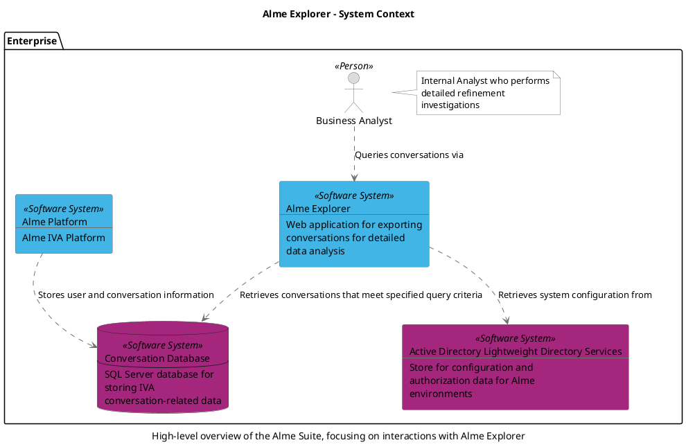
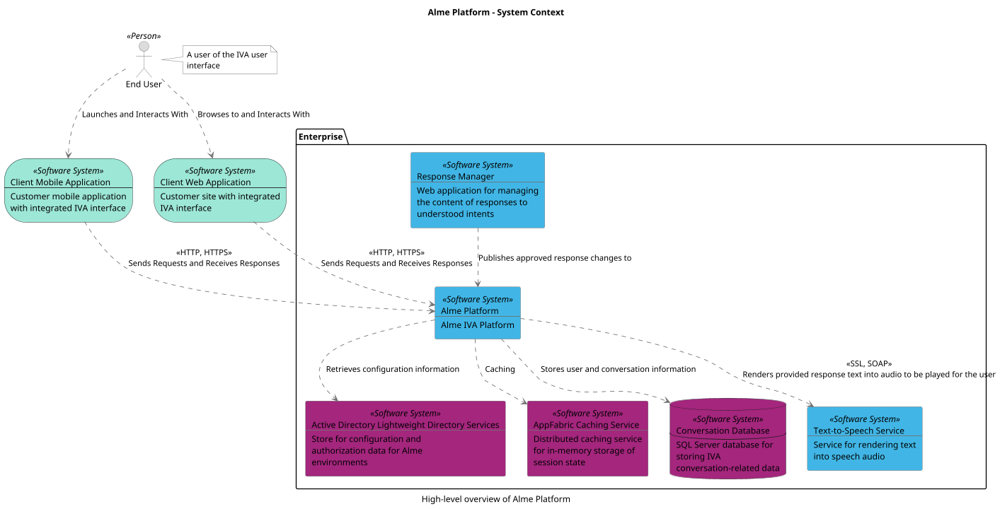
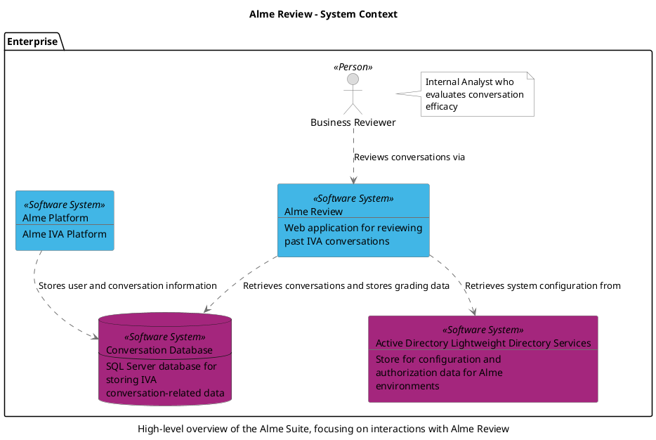
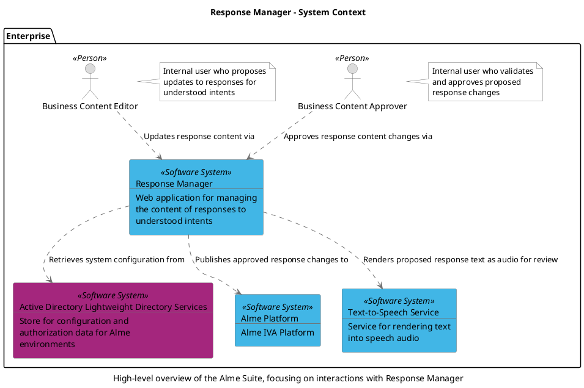
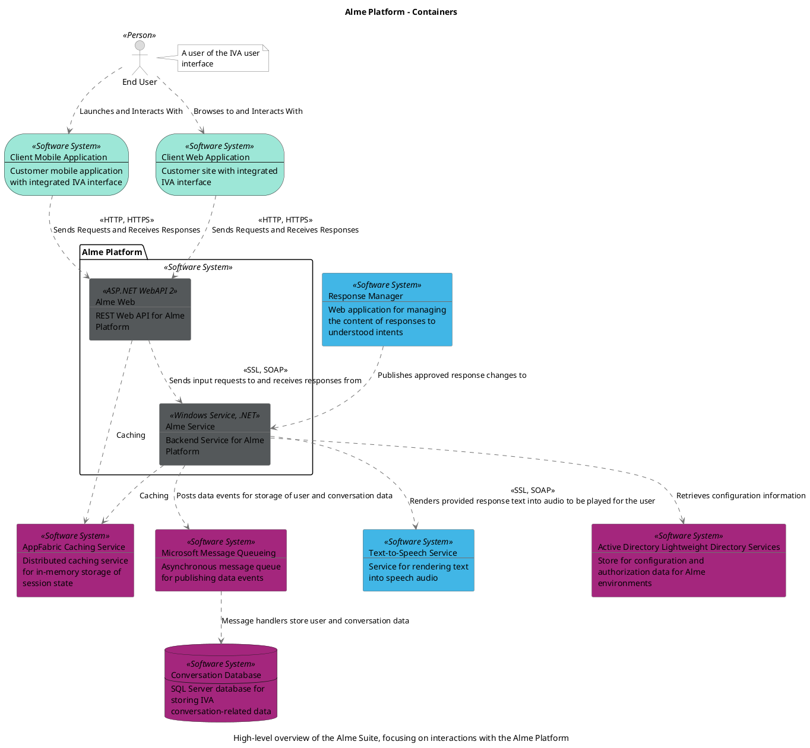
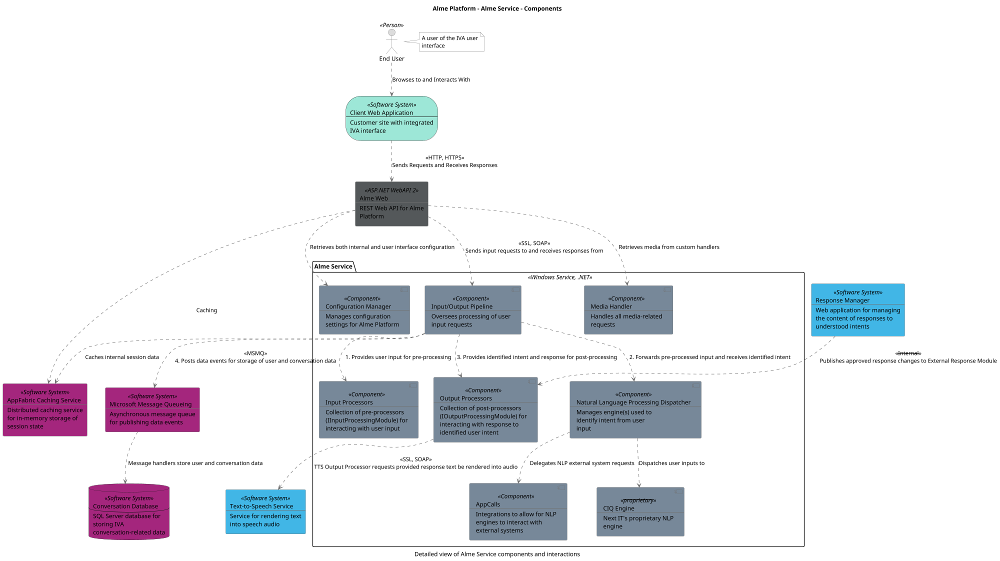
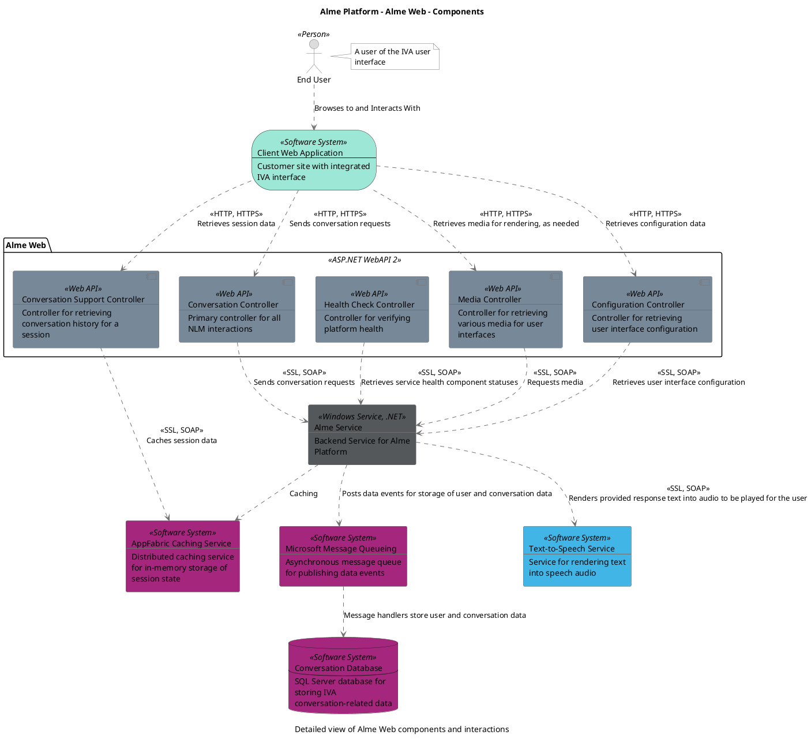

```plantuml
@startuml(id=suiteOverview)
scale max 1414x2000
title System Landscape
caption Enterprise overview of the Alme Suite

skinparam {
  shadowing false
  arrowColor #707070
  actorBorderColor #707070
  componentBorderColor #707070
  rectangleBorderColor #707070
  noteBackgroundColor #ffffff
  noteBorderColor #707070
}
actor "End User" <<Person>> as 63 #dcdcdc
note right of 63
  A user of the IVA user
  interface
end note
storage 56 <<Software System>> #9de7d7 [
  Client Mobile Application
  --
  Customer mobile application
  with integrated IVA interface
]
storage 49 <<Software System>> #9de7d7 [
  Client Web Application
  --
  Customer site with integrated
  IVA interface
]
package "Enterprise" {
  actor "Business Analyst" <<Person>> as 78 #dcdcdc
  note right of 78
    Internal Analyst who performs
    detailed refinement
    investigations
  end note
  actor "Business Content Approver" <<Person>> as 89 #dcdcdc
  note right of 89
    Internal user who validates
    and approves proposed
    response changes
  end note
  actor "Business Content Editor" <<Person>> as 88 #dcdcdc
  note right of 88
    Internal user who proposes
    updates to responses for
    understood intents
  end note
  actor "Business Reviewer" <<Person>> as 73 #dcdcdc
  note right of 73
    Internal Analyst who
    evaluates conversation
    efficacy
  end note
  rectangle 3 <<Software System>> #a4267d [
    Active Directory Lightweight Directory Services
    --
    Store for configuration and
    authorization data for Alme
    environments
  ]
  rectangle 75 <<Software System>> #41b6e6 [
    Alme Explorer
    --
    Web application for exporting
    conversations for detailed
    data analysis
  ]
  rectangle 6 <<Software System>> #41b6e6 [
    Alme Platform
    --
    Alme IVA Platform
  ]
  rectangle 70 <<Software System>> #41b6e6 [
    Alme Review
    --
    Web application for reviewing
    past IVA conversations
  ]
  rectangle 1 <<Software System>> #a4267d [
    AppFabric Caching Service
    --
    Distributed caching service
    for in-memory storage of
    session state
  ]
  database 2 <<Software System>> #a4267d [
    Conversation Database
    --
    SQL Server database for
    storing IVA
    conversation-related data
  ]
  rectangle 81 <<Software System>> #41b6e6 [
    Response Manager
    --
    Web application for managing
    the content of responses to
    understood intents
  ]
  database 80 <<Software System>> #a4267d [
    Response Manager Database
    --
    Data store for Response
    Manager
  ]
  rectangle 66 <<Software System>> #41b6e6 [
    Text-to-Speech Service
    --
    Service for rendering text
    into speech audio
  ]
}
75 .[#707070].> 3 : Retrieves system configuration from
75 .[#707070].> 2 : Retrieves conversations that meet specified query criteria
6 .[#707070].> 3 : Retrieves configuration information
6 .[#707070].> 1 : Caching
6 .[#707070].> 2 : Stores user and conversation information
6 .[#707070].> 66 : <<SSL, SOAP>>\nRenders provided response text into audio to be played for the user
70 .[#707070].> 3 : Retrieves system configuration from
70 .[#707070].> 2 : Retrieves conversations and stores grading data
78 .[#707070].> 75 : Queries conversations via
89 .[#707070].> 81 : Approves response content changes via
88 .[#707070].> 81 : Updates response content via
73 .[#707070].> 70 : Reviews conversations via
56 .[#707070].> 6 : <<HTTP, HTTPS>>\nSends Requests and Receives Responses
49 .[#707070].> 6 : <<HTTP, HTTPS>>\nSends Requests and Receives Responses
63 .[#707070].> 56 : Launches and Interacts With
63 .[#707070].> 49 : Browses to and Interacts With
81 .[#707070].> 3 : Retrieves system configuration from
81 .[#707070].> 6 : Publishes approved response changes to
81 .[#707070].> 80 : Stores response content and change data
81 .[#707070].> 66 : Renders proposed response text as audio for review
@enduml

```

```
@startuml(id=suiteOverview)
scale max 1414x2000
title System Landscape
caption Enterprise overview of the Alme Suite

skinparam {
  shadowing false
  arrowColor #707070
  actorBorderColor #707070
  componentBorderColor #707070
  rectangleBorderColor #707070
  noteBackgroundColor #ffffff
  noteBorderColor #707070
}
actor "End User" <<Person>> as 63 #dcdcdc
note right of 63
  A user of the IVA user
  interface
end note
storage 56 <<Software System>> #9de7d7 [
  Client Mobile Application
  --
  Customer mobile application
  with integrated IVA interface
]
storage 49 <<Software System>> #9de7d7 [
  Client Web Application
  --
  Customer site with integrated
  IVA interface
]
package "Enterprise" {
  actor "Business Analyst" <<Person>> as 78 #dcdcdc
  note right of 78
    Internal Analyst who performs
    detailed refinement
    investigations
  end note
  actor "Business Content Approver" <<Person>> as 89 #dcdcdc
  note right of 89
    Internal user who validates
    and approves proposed
    response changes
  end note
  actor "Business Content Editor" <<Person>> as 88 #dcdcdc
  note right of 88
    Internal user who proposes
    updates to responses for
    understood intents
  end note
  actor "Business Reviewer" <<Person>> as 73 #dcdcdc
  note right of 73
    Internal Analyst who
    evaluates conversation
    efficacy
  end note
  rectangle 3 <<Software System>> #a4267d [
    Active Directory Lightweight Directory Services
    --
    Store for configuration and
    authorization data for Alme
    environments
  ]
  rectangle 75 <<Software System>> #41b6e6 [
    Alme Explorer
    --
    Web application for exporting
    conversations for detailed
    data analysis
  ]
  rectangle 6 <<Software System>> #41b6e6 [
    Alme Platform
    --
    Alme IVA Platform
  ]
  rectangle 70 <<Software System>> #41b6e6 [
    Alme Review
    --
    Web application for reviewing
    past IVA conversations
  ]
  rectangle 1 <<Software System>> #a4267d [
    AppFabric Caching Service
    --
    Distributed caching service
    for in-memory storage of
    session state
  ]
  database 2 <<Software System>> #a4267d [
    Conversation Database
    --
    SQL Server database for
    storing IVA
    conversation-related data
  ]
  rectangle 81 <<Software System>> #41b6e6 [
    Response Manager
    --
    Web application for managing
    the content of responses to
    understood intents
  ]
  database 80 <<Software System>> #a4267d [
    Response Manager Database
    --
    Data store for Response
    Manager
  ]
  rectangle 66 <<Software System>> #41b6e6 [
    Text-to-Speech Service
    --
    Service for rendering text
    into speech audio
  ]
}
75 .[#707070].> 3 : Retrieves system configuration from
75 .[#707070].> 2 : Retrieves conversations that meet specified query criteria
6 .[#707070].> 3 : Retrieves configuration information
6 .[#707070].> 1 : Caching
6 .[#707070].> 2 : Stores user and conversation information
6 .[#707070].> 66 : <<SSL, SOAP>>\nRenders provided response text into audio to be played for the user
70 .[#707070].> 3 : Retrieves system configuration from
70 .[#707070].> 2 : Retrieves conversations and stores grading data
78 .[#707070].> 75 : Queries conversations via
89 .[#707070].> 81 : Approves response content changes via
88 .[#707070].> 81 : Updates response content via
73 .[#707070].> 70 : Reviews conversations via
56 .[#707070].> 6 : <<HTTP, HTTPS>>\nSends Requests and Receives Responses
49 .[#707070].> 6 : <<HTTP, HTTPS>>\nSends Requests and Receives Responses
63 .[#707070].> 56 : Launches and Interacts With
63 .[#707070].> 49 : Browses to and Interacts With
81 .[#707070].> 3 : Retrieves system configuration from
81 .[#707070].> 6 : Publishes approved response changes to
81 .[#707070].> 80 : Stores response content and change data
81 .[#707070].> 66 : Renders proposed response text as audio for review
@enduml

```



--


```
@startuml(id=almeExplorerContext)
scale max 2000x1409
title Alme Explorer - System Context
caption High-level overview of the Alme Suite, focusing on interactions with Alme Explorer

skinparam {
  shadowing false
  arrowColor #707070
  actorBorderColor #707070
  componentBorderColor #707070
  rectangleBorderColor #707070
  noteBackgroundColor #ffffff
  noteBorderColor #707070
}
package "Enterprise" {
  actor "Business Analyst" <<Person>> as 78 #dcdcdc
  note right of 78
    Internal Analyst who performs
    detailed refinement
    investigations
  end note
  rectangle 3 <<Software System>> #a4267d [
    Active Directory Lightweight Directory Services
    --
    Store for configuration and
    authorization data for Alme
    environments
  ]
  rectangle 75 <<Software System>> #41b6e6 [
    Alme Explorer
    --
    Web application for exporting
    conversations for detailed
    data analysis
  ]
  rectangle 6 <<Software System>> #41b6e6 [
    Alme Platform
    --
    Alme IVA Platform
  ]
  database 2 <<Software System>> #a4267d [
    Conversation Database
    --
    SQL Server database for
    storing IVA
    conversation-related data
  ]
}
75 .[#707070].> 3 : Retrieves system configuration from
75 .[#707070].> 2 : Retrieves conversations that meet specified query criteria
6 .[#707070].> 2 : Stores user and conversation information
78 .[#707070].> 75 : Queries conversations via
@enduml

```



--


```
@startuml(id=almePlatformOverview)
scale max 1413x2000
title Alme Platform - System Context
caption High-level overview of Alme Platform

skinparam {
  shadowing false
  arrowColor #707070
  actorBorderColor #707070
  componentBorderColor #707070
  rectangleBorderColor #707070
  noteBackgroundColor #ffffff
  noteBorderColor #707070
}
actor "End User" <<Person>> as 63 #dcdcdc
note right of 63
  A user of the IVA user
  interface
end note
storage 56 <<Software System>> #9de7d7 [
  Client Mobile Application
  --
  Customer mobile application
  with integrated IVA interface
]
storage 49 <<Software System>> #9de7d7 [
  Client Web Application
  --
  Customer site with integrated
  IVA interface
]
package "Enterprise" {
  rectangle 3 <<Software System>> #a4267d [
    Active Directory Lightweight Directory Services
    --
    Store for configuration and
    authorization data for Alme
    environments
  ]
  rectangle 6 <<Software System>> #41b6e6 [
    Alme Platform
    --
    Alme IVA Platform
  ]
  rectangle 1 <<Software System>> #a4267d [
    AppFabric Caching Service
    --
    Distributed caching service
    for in-memory storage of
    session state
  ]
  database 2 <<Software System>> #a4267d [
    Conversation Database
    --
    SQL Server database for
    storing IVA
    conversation-related data
  ]
  rectangle 81 <<Software System>> #41b6e6 [
    Response Manager
    --
    Web application for managing
    the content of responses to
    understood intents
  ]
  rectangle 66 <<Software System>> #41b6e6 [
    Text-to-Speech Service
    --
    Service for rendering text
    into speech audio
  ]
}
6 .[#707070].> 3 : Retrieves configuration information
6 .[#707070].> 1 : Caching
6 .[#707070].> 2 : Stores user and conversation information
6 .[#707070].> 66 : <<SSL, SOAP>>\nRenders provided response text into audio to be played for the user
56 .[#707070].> 6 : <<HTTP, HTTPS>>\nSends Requests and Receives Responses
49 .[#707070].> 6 : <<HTTP, HTTPS>>\nSends Requests and Receives Responses
63 .[#707070].> 56 : Launches and Interacts With
63 .[#707070].> 49 : Browses to and Interacts With
81 .[#707070].> 6 : Publishes approved response changes to
@enduml

```



--


```
@startuml(id=almeReviewContext)
scale max 2000x1409
title Alme Review - System Context
caption High-level overview of the Alme Suite, focusing on interactions with Alme Review

skinparam {
  shadowing false
  arrowColor #707070
  actorBorderColor #707070
  componentBorderColor #707070
  rectangleBorderColor #707070
  noteBackgroundColor #ffffff
  noteBorderColor #707070
}
package "Enterprise" {
  actor "Business Reviewer" <<Person>> as 73 #dcdcdc
  note right of 73
    Internal Analyst who
    evaluates conversation
    efficacy
  end note
  rectangle 3 <<Software System>> #a4267d [
    Active Directory Lightweight Directory Services
    --
    Store for configuration and
    authorization data for Alme
    environments
  ]
  rectangle 6 <<Software System>> #41b6e6 [
    Alme Platform
    --
    Alme IVA Platform
  ]
  rectangle 70 <<Software System>> #41b6e6 [
    Alme Review
    --
    Web application for reviewing
    past IVA conversations
  ]
  database 2 <<Software System>> #a4267d [
    Conversation Database
    --
    SQL Server database for
    storing IVA
    conversation-related data
  ]
}
6 .[#707070].> 2 : Stores user and conversation information
70 .[#707070].> 3 : Retrieves system configuration from
70 .[#707070].> 2 : Retrieves conversations and stores grading data
73 .[#707070].> 70 : Reviews conversations via
@enduml

```



--


```
@startuml(id=responseManagerContext)
scale max 1409x2000
title Response Manager - System Context
caption High-level overview of the Alme Suite, focusing on interactions with Response Manager

skinparam {
  shadowing false
  arrowColor #707070
  actorBorderColor #707070
  componentBorderColor #707070
  rectangleBorderColor #707070
  noteBackgroundColor #ffffff
  noteBorderColor #707070
}
package "Enterprise" {
  actor "Business Content Approver" <<Person>> as 89 #dcdcdc
  note right of 89
    Internal user who validates
    and approves proposed
    response changes
  end note
  actor "Business Content Editor" <<Person>> as 88 #dcdcdc
  note right of 88
    Internal user who proposes
    updates to responses for
    understood intents
  end note
  rectangle 3 <<Software System>> #a4267d [
    Active Directory Lightweight Directory Services
    --
    Store for configuration and
    authorization data for Alme
    environments
  ]
  rectangle 6 <<Software System>> #41b6e6 [
    Alme Platform
    --
    Alme IVA Platform
  ]
  rectangle 81 <<Software System>> #41b6e6 [
    Response Manager
    --
    Web application for managing
    the content of responses to
    understood intents
  ]
  rectangle 66 <<Software System>> #41b6e6 [
    Text-to-Speech Service
    --
    Service for rendering text
    into speech audio
  ]
}
89 .[#707070].> 81 : Approves response content changes via
88 .[#707070].> 81 : Updates response content via
81 .[#707070].> 3 : Retrieves system configuration from
81 .[#707070].> 6 : Publishes approved response changes to
81 .[#707070].> 66 : Renders proposed response text as audio for review
@enduml

```



--


```
@startuml(id=almePlatformContext)
scale max 1413x2000
title Alme Platform - Containers
caption High-level overview of the Alme Suite, focusing on interactions with the Alme Platform

skinparam {
  shadowing false
  arrowColor #707070
  actorBorderColor #707070
  componentBorderColor #707070
  rectangleBorderColor #707070
  noteBackgroundColor #ffffff
  noteBorderColor #707070
}
rectangle 3 <<Software System>> #a4267d [
  Active Directory Lightweight Directory Services
  --
  Store for configuration and
  authorization data for Alme
  environments
]
rectangle 1 <<Software System>> #a4267d [
  AppFabric Caching Service
  --
  Distributed caching service
  for in-memory storage of
  session state
]
storage 56 <<Software System>> #9de7d7 [
  Client Mobile Application
  --
  Customer mobile application
  with integrated IVA interface
]
storage 49 <<Software System>> #9de7d7 [
  Client Web Application
  --
  Customer site with integrated
  IVA interface
]
database 2 <<Software System>> #a4267d [
  Conversation Database
  --
  SQL Server database for
  storing IVA
  conversation-related data
]
actor "End User" <<Person>> as 63 #dcdcdc
note right of 63
  A user of the IVA user
  interface
end note
rectangle 4 <<Software System>> #a4267d [
  Microsoft Message Queueing
  --
  Asynchronous message queue
  for publishing data events
]
rectangle 81 <<Software System>> #41b6e6 [
  Response Manager
  --
  Web application for managing
  the content of responses to
  understood intents
]
rectangle 66 <<Software System>> #41b6e6 [
  Text-to-Speech Service
  --
  Service for rendering text
  into speech audio
]
package "Alme Platform" <<Software System>> {
  rectangle 10 <<Windows Service, .NET>> #54585a [
    Alme Service
    --
    Backend Service for Alme
    Platform
  ]
  rectangle 30 <<ASP.NET WebAPI 2>> #54585a [
    Alme Web
    --
    REST Web API for Alme
    Platform
  ]
}
10 .[#707070].> 3 : Retrieves configuration information
10 .[#707070].> 1 : Caching
10 .[#707070].> 4 : Posts data events for storage of user and conversation data
10 .[#707070].> 66 : <<SSL, SOAP>>\nRenders provided response text into audio to be played for the user
30 .[#707070].> 10 : <<SSL, SOAP>>\nSends input requests to and receives responses from
30 .[#707070].> 1 : Caching
56 .[#707070].> 30 : <<HTTP, HTTPS>>\nSends Requests and Receives Responses
49 .[#707070].> 30 : <<HTTP, HTTPS>>\nSends Requests and Receives Responses
63 .[#707070].> 56 : Launches and Interacts With
63 .[#707070].> 49 : Browses to and Interacts With
4 .[#707070].> 2 : Message handlers store user and conversation data
81 .[#707070].> 10 : Publishes approved response changes to
@enduml

```



--


```
@startuml(id=almeService)
scale max 2000x1413
title Alme Platform - Alme Service - Components
caption Detailed view of Alme Service components and interactions

skinparam {
  shadowing false
  arrowColor #707070
  actorBorderColor #707070
  componentBorderColor #707070
  rectangleBorderColor #707070
  noteBackgroundColor #ffffff
  noteBorderColor #707070
}
rectangle 30 <<ASP.NET WebAPI 2>> #54585a [
  Alme Web
  --
  REST Web API for Alme
  Platform
]
rectangle 1 <<Software System>> #a4267d [
  AppFabric Caching Service
  --
  Distributed caching service
  for in-memory storage of
  session state
]
storage 49 <<Software System>> #9de7d7 [
  Client Web Application
  --
  Customer site with integrated
  IVA interface
]
database 2 <<Software System>> #a4267d [
  Conversation Database
  --
  SQL Server database for
  storing IVA
  conversation-related data
]
actor "End User" <<Person>> as 63 #dcdcdc
note right of 63
  A user of the IVA user
  interface
end note
rectangle 4 <<Software System>> #a4267d [
  Microsoft Message Queueing
  --
  Asynchronous message queue
  for publishing data events
]
rectangle 81 <<Software System>> #41b6e6 [
  Response Manager
  --
  Web application for managing
  the content of responses to
  understood intents
]
rectangle 66 <<Software System>> #41b6e6 [
  Text-to-Speech Service
  --
  Service for rendering text
  into speech audio
]
package "Alme Service" <<Windows Service, .NET>> {
  component 14 <<Component>> #778899 [
    AppCalls
    --
    Integrations to allow for NLP
    engines to interact with
    external systems
  ]
  component 17 <<--proprietary-->> #778899 [
    CIQ Engine
    --
    Next IT's proprietary NLP
    engine
  ]
  component 27 <<Component>> #778899 [
    Configuration Manager
    --
    Manages configuration
    settings for Alme Platform
  ]
  component 21 <<Component>> #778899 [
    Input Processors
    --
    Collection of pre-processors
    (IInputProcessingModule) for
    interacting with user input
  ]
  component 19 <<Component>> #778899 [
    Input/Output Pipeline
    --
    Oversees processing of user
    input requests
  ]
  component 29 <<Component>> #778899 [
    Media Handler
    --
    Handles all media-related
    requests
  ]
  component 15 <<Component>> #778899 [
    Natural Language Processing Dispatcher
    --
    Manages engine(s) used to
    identify intent from user
    input
  ]
  component 22 <<Component>> #778899 [
    Output Processors
    --
    Collection of post-processors
    (IOutputProcessingModule) for
    interacting with response to
    identified user intent
  ]
}
30 .[#707070].> 1 : Caching
30 .[#707070].> 27 : Retrieves both internal and user interface configuration
30 .[#707070].> 19 : <<SSL, SOAP>>\nSends input requests to and receives responses from
30 .[#707070].> 29 : Retrieves media from custom handlers
49 .[#707070].> 30 : <<HTTP, HTTPS>>\nSends Requests and Receives Responses
63 .[#707070].> 49 : Browses to and Interacts With
19 .[#707070].> 1 : Caches internal session data
19 .[#707070].> 21 : 1. Provides user input for pre-processing
19 .[#707070].> 4 : <<MSMQ>>\n4. Posts data events for storage of user and conversation data
19 .[#707070].> 15 : 2. Forwards pre-processed input and receives identified intent
19 .[#707070].> 22 : 3. Provides identified intent and response for post-processing
4 .[#707070].> 2 : Message handlers store user and conversation data
15 .[#707070].> 14 : Delegates NLP external system requests
15 .[#707070].> 17 : Dispatches user inputs to
22 .[#707070].> 66 : <<SSL, SOAP>>\nTTS Output Processor requests provided response text be rendered into audio
81 .[#707070].> 22 : <<--Internal-->>\nPublishes approved response changes to External Response Module
@enduml

```



--


```
@startuml(id=almeWeb)
scale max 2000x1413
title Alme Platform - Alme Web - Components
caption Detailed view of Alme Web components and interactions

skinparam {
  shadowing false
  arrowColor #707070
  actorBorderColor #707070
  componentBorderColor #707070
  rectangleBorderColor #707070
  noteBackgroundColor #ffffff
  noteBorderColor #707070
}
rectangle 10 <<Windows Service, .NET>> #54585a [
  Alme Service
  --
  Backend Service for Alme
  Platform
]
rectangle 1 <<Software System>> #a4267d [
  AppFabric Caching Service
  --
  Distributed caching service
  for in-memory storage of
  session state
]
storage 49 <<Software System>> #9de7d7 [
  Client Web Application
  --
  Customer site with integrated
  IVA interface
]
database 2 <<Software System>> #a4267d [
  Conversation Database
  --
  SQL Server database for
  storing IVA
  conversation-related data
]
actor "End User" <<Person>> as 63 #dcdcdc
note right of 63
  A user of the IVA user
  interface
end note
rectangle 4 <<Software System>> #a4267d [
  Microsoft Message Queueing
  --
  Asynchronous message queue
  for publishing data events
]
rectangle 66 <<Software System>> #41b6e6 [
  Text-to-Speech Service
  --
  Service for rendering text
  into speech audio
]
package "Alme Web" <<ASP.NET WebAPI 2>> {
  component 41 <<Web API>> #778899 [
    Configuration Controller
    --
    Controller for retrieving
    user interface configuration
  ]
  component 36 <<Web API>> #778899 [
    Conversation Controller
    --
    Primary controller for all
    NLM interactions
  ]
  component 39 <<Web API>> #778899 [
    Conversation Support Controller
    --
    Controller for retrieving
    conversation history for a
    session
  ]
  component 44 <<Web API>> #778899 [
    Health Check Controller
    --
    Controller for verifying
    platform health
  ]
  component 46 <<Web API>> #778899 [
    Media Controller
    --
    Controller for retrieving
    various media for user
    interfaces
  ]
}
10 .[#707070].> 1 : Caching
10 .[#707070].> 4 : Posts data events for storage of user and conversation data
10 .[#707070].> 66 : <<SSL, SOAP>>\nRenders provided response text into audio to be played for the user
49 .[#707070].> 41 : <<HTTP, HTTPS>>\nRetrieves configuration data
49 .[#707070].> 36 : <<HTTP, HTTPS>>\nSends conversation requests
49 .[#707070].> 39 : <<HTTP, HTTPS>>\nRetrieves session data
49 .[#707070].> 46 : <<HTTP, HTTPS>>\nRetrieves media for rendering, as needed
41 .[#707070].> 10 : <<SSL, SOAP>>\nRetrieves user interface configuration
36 .[#707070].> 10 : <<SSL, SOAP>>\nSends conversation requests
39 .[#707070].> 1 : <<SSL, SOAP>>\nCaches session data
63 .[#707070].> 49 : Browses to and Interacts With
44 .[#707070].> 10 : <<SSL, SOAP>>\nRetrieves service health component statuses
46 .[#707070].> 10 : <<SSL, SOAP>>\nRequests media
4 .[#707070].> 2 : Message handlers store user and conversation data
@enduml

```



--


