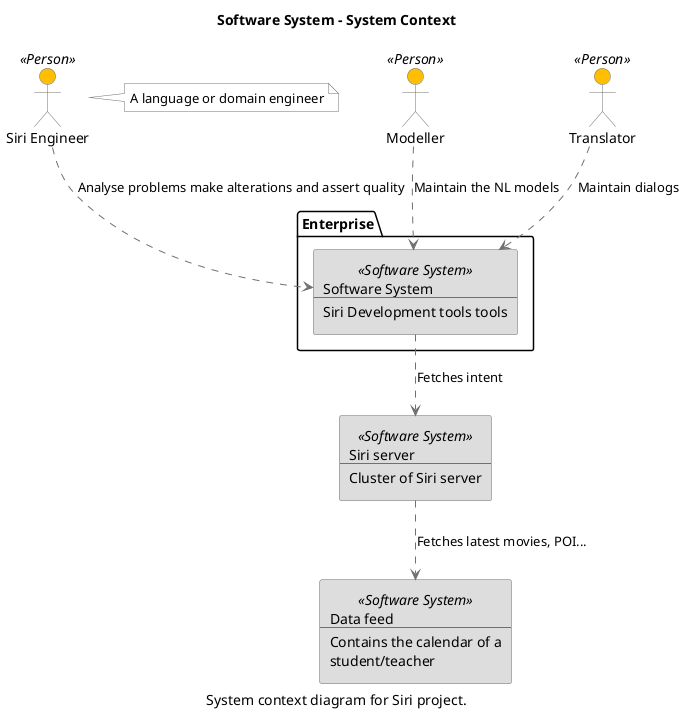
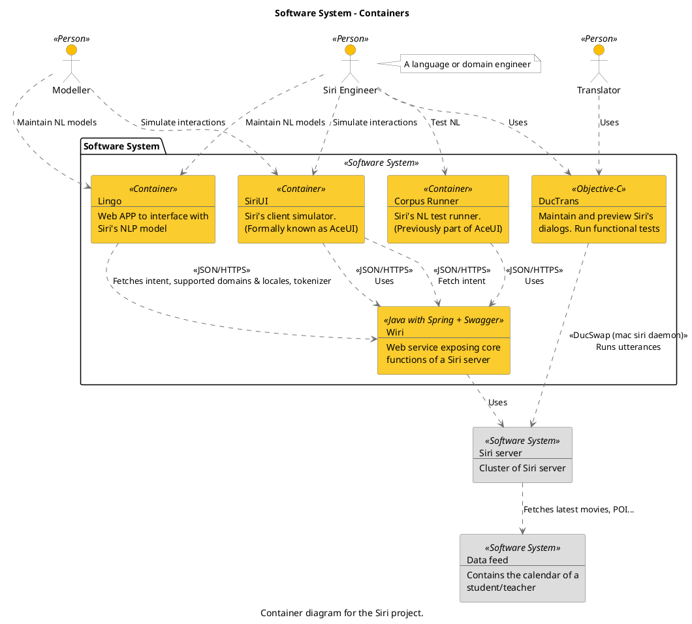

--

```
@startuml(id=Context)
scale max 2000x1409
title Software System - System Context
caption System context diagram for Siri project.

skinparam {
  shadowing false
  arrowColor #707070
  actorBorderColor #707070
  componentBorderColor #707070
  rectangleBorderColor #707070
  noteBackgroundColor #ffffff
  noteBorderColor #707070
}
actor "Modeller" <<Person>> as 2 #ffbf00
actor "Siri Engineer" <<Person>> as 1 #ffbf00
note right of 1
  A language or domain engineer
end note
actor "Translator" <<Person>> as 3 #ffbf00
rectangle 10 <<Software System>> #dddddd [
  Data feed
  --
  Contains the calendar of a
  student/teacher
]
rectangle 8 <<Software System>> #dddddd [
  Siri server
  --
  Cluster of Siri server
]
package "Enterprise" {
  rectangle 4 <<Software System>> #dddddd [
    Software System
    --
    Siri Development tools tools
  ]
}
2 .[#707070].> 4 : Maintain the NL models
1 .[#707070].> 4 : Analyse problems make alterations and assert quality
8 .[#707070].> 10 : Fetches latest movies, POI...
4 .[#707070].> 8 : Fetches intent
3 .[#707070].> 4 : Maintain dialogs
@enduml

```



--

```
@startuml(id=Containers)
scale max 2000x1124
title Software System - Containers
caption Container diagram for the Siri project.

skinparam {
  shadowing false
  arrowColor #707070
  actorBorderColor #707070
  componentBorderColor #707070
  rectangleBorderColor #707070
  noteBackgroundColor #ffffff
  noteBorderColor #707070
}
rectangle 10 <<Software System>> #dddddd [
  Data feed
  --
  Contains the calendar of a
  student/teacher
]
actor "Modeller" <<Person>> as 2 #ffbf00
actor "Siri Engineer" <<Person>> as 1 #ffbf00
note right of 1
  A language or domain engineer
end note
rectangle 8 <<Software System>> #dddddd [
  Siri server
  --
  Cluster of Siri server
]
actor "Translator" <<Person>> as 3 #ffbf00
package "Software System" <<Software System>> {
  rectangle 22 <<Container>> #facc2e [
    Corpus Runner
    --
    Siri's NL test runner.
    (Previously part of AceUI)
  ]
  rectangle 26 <<Objective-C>> #facc2e [
    DucTrans
    --
    Maintain and preview Siri's
    dialogs. Run functional tests
  ]
  rectangle 14 <<Container>> #facc2e [
    Lingo
    --
    Web APP to interface with
    Siri's NLP model
  ]
  rectangle 18 <<Container>> #facc2e [
    SiriUI
    --
    Siri's client simulator.
    (Formally known as AceUI)
  ]
  rectangle 12 <<Java with Spring + Swagger>> #facc2e [
    Wiri
    --
    Web service exposing core
    functions of a Siri server
  ]
}
22 .[#707070].> 12 : <<JSON/HTTPS>>\nUses
26 .[#707070].> 8 : <<DucSwap (mac siri daemon)>>\nRuns utterances
14 .[#707070].> 12 : <<JSON/HTTPS>>\nFetches intent, supported domains & locales, tokenizer
2 .[#707070].> 14 : Maintain NL models
2 .[#707070].> 18 : Simulate interactions
1 .[#707070].> 22 : Test NL
1 .[#707070].> 26 : Uses
1 .[#707070].> 14 : Maintain NL models
1 .[#707070].> 18 : Simulate interactions
8 .[#707070].> 10 : Fetches latest movies, POI...
18 .[#707070].> 12 : <<JSON/HTTPS>>\nFetch intent
18 .[#707070].> 12 : <<JSON/HTTPS>>\nUses
3 .[#707070].> 26 : Uses
12 .[#707070].> 8 : Uses
@enduml

```



