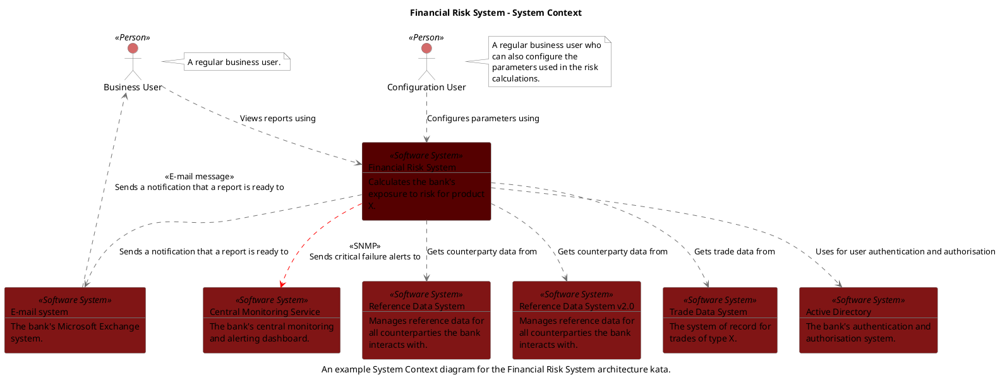

```
@startuml(id=Context)
scale max 2000x1413
title Financial Risk System - System Context
caption An example System Context diagram for the Financial Risk System architecture kata.

skinparam {
  shadowing false
  arrowColor #707070
  actorBorderColor #707070
  componentBorderColor #707070
  rectangleBorderColor #707070
  noteBackgroundColor #ffffff
  noteBorderColor #707070
}
actor "Business User" <<Person>> as 2 #d46a6a
note right of 2
  A regular business user.
end note
actor "Configuration User" <<Person>> as 4 #d46a6a
note right of 4
  A regular business user who
  can also configure the
  parameters used in the risk
  calculations.
end note
rectangle 17 <<Software System>> #801515 [
  Active Directory
  --
  The bank's authentication and
  authorisation system.
]
rectangle 15 <<Software System>> #801515 [
  Central Monitoring Service
  --
  The bank's central monitoring
  and alerting dashboard.
]
rectangle 12 <<Software System>> #801515 [
  E-mail system
  --
  The bank's Microsoft Exchange
  system.
]
rectangle 1 <<Software System>> #550000 [
  Financial Risk System
  --
  Calculates the bank's
  exposure to risk for product
  X.
]
rectangle 8 <<Software System>> #801515 [
  Reference Data System
  --
  Manages reference data for
  all counterparties the bank
  interacts with.
]
rectangle 10 <<Software System>> #801515 [
  Reference Data System v2.0
  --
  Manages reference data for
  all counterparties the bank
  interacts with.
]
rectangle 6 <<Software System>> #801515 [
  Trade Data System
  --
  The system of record for
  trades of type X.
]
2 .[#707070].> 1 : Views reports using
4 .[#707070].> 1 : Configures parameters using
12 .[#707070].> 2 : <<E-mail message>>\nSends a notification that a report is ready to
1 .[#707070].> 17 : Uses for user authentication and authorisation
1 .[#ff0000].> 15 : <<SNMP>>\nSends critical failure alerts to
1 .[#707070].> 12 : Sends a notification that a report is ready to
1 .[#707070].> 8 : Gets counterparty data from
1 .[#707070].> 10 : Gets counterparty data from
1 .[#707070].> 6 : Gets trade data from
@enduml

```


