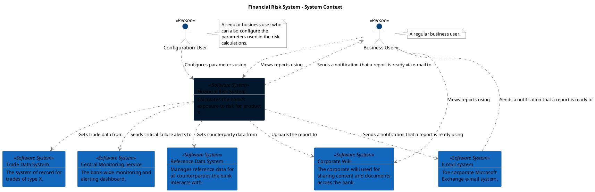

```
@startuml(id=SystemContext)
scale max 2000x1500
title Financial Risk System - System Context

skinparam {
  shadowing false
  arrowColor #707070
  actorBorderColor #707070
  componentBorderColor #707070
  rectangleBorderColor #707070
  noteBackgroundColor #ffffff
  noteBorderColor #707070
}
actor "Business User" <<Person>> as 2 #08427b
note right of 2
  A regular business user.
end note
actor "Configuration User" <<Person>> as 4 #08427b
note right of 4
  A regular business user who
  can also configure the
  parameters used in the risk
  calculations.
end note
rectangle 17 <<Software System>> #1168bd [
  Central Monitoring Service
  --
  The bank-wide monitoring and
  alerting dashboard.
]
rectangle 14 <<Software System>> #1168bd [
  Corporate Wiki
  --
  The corporate wiki used for
  sharing content and documents
  across the bank.
]
rectangle 10 <<Software System>> #1168bd [
  E-mail system
  --
  The corporate Microsoft
  Exchange e-mail system.
]
rectangle 1 <<Software System>> #02172c [
  Financial Risk System
  --
  Calculates the bank's
  exposure to risk for product
  X.
]
rectangle 8 <<Software System>> #1168bd [
  Reference Data System
  --
  Manages reference data for
  all counterparties the bank
  interacts with.
]
rectangle 6 <<Software System>> #1168bd [
  Trade Data System
  --
  The system of record for
  trades of type X.
]
2 .[#707070].> 14 : Views reports using
2 .[#707070].> 1 : Views reports using
4 .[#707070].> 1 : Configures parameters using
10 .[#707070].> 2 : Sends a notification that a report is ready to
1 .[#707070].> 2 : Sends a notification that a report is ready via e-mail to
1 .[#707070].> 17 : Sends critical failure alerts to
1 .[#707070].> 14 : Uploads the report to
1 .[#707070].> 10 : Sends a notification that a report is ready using
1 .[#707070].> 8 : Gets counterparty data from
1 .[#707070].> 6 : Gets trade data from
@enduml
```


