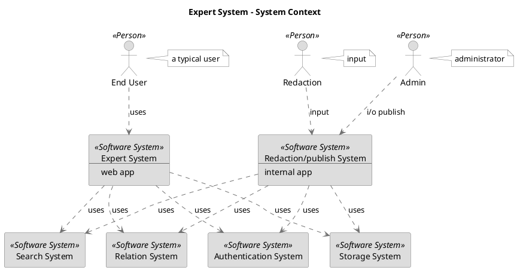
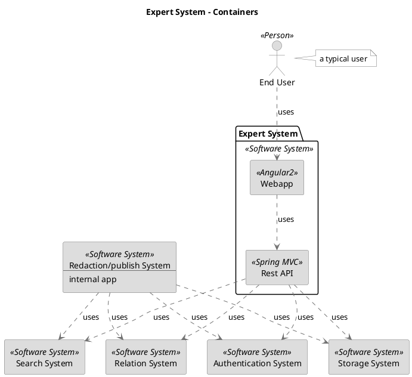
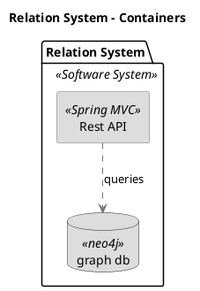
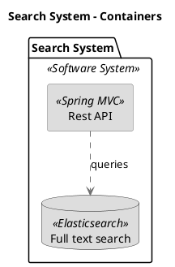

```
@startuml(id=context)
scale max 1413x2000
title Expert System - System Context

skinparam {
  shadowing false
  arrowColor #707070
  actorBorderColor #707070
  componentBorderColor #707070
  rectangleBorderColor #707070
  noteBackgroundColor #ffffff
  noteBorderColor #707070
}
actor "Admin" <<Person>> as 2 #dddddd
note right of 2
  administrator
end note
actor "End User" <<Person>> as 1 #dddddd
note right of 1
  a typical user
end note
actor "Redaction" <<Person>> as 3 #dddddd
note right of 3
  input
end note
rectangle "Authentication System" <<Software System>> as 4 #dddddd
rectangle 20 <<Software System>> #dddddd [
  Expert System
  --
  web app
]
rectangle 34 <<Software System>> #dddddd [
  Redaction/publish System
  --
  internal app
]
rectangle "Relation System" <<Software System>> as 12 #dddddd
rectangle "Search System" <<Software System>> as 8 #dddddd
rectangle "Storage System" <<Software System>> as 16 #dddddd
2 .[#707070].> 34 : i/o publish
1 .[#707070].> 20 : uses
20 .[#707070].> 4 : uses
20 .[#707070].> 12 : uses
20 .[#707070].> 8 : uses
20 .[#707070].> 16 : uses
34 .[#707070].> 4 : uses
34 .[#707070].> 12 : uses
34 .[#707070].> 8 : uses
34 .[#707070].> 16 : uses
3 .[#707070].> 34 : input
@enduml

```



--

```
@startuml(id=containers)
scale max 1413x2000
title Expert System - Containers

skinparam {
  shadowing false
  arrowColor #707070
  actorBorderColor #707070
  componentBorderColor #707070
  rectangleBorderColor #707070
  noteBackgroundColor #ffffff
  noteBorderColor #707070
}
rectangle "Authentication System" <<Software System>> as 4 #dddddd
actor "End User" <<Person>> as 1 #dddddd
note right of 1
  a typical user
end note
rectangle 34 <<Software System>> #dddddd [
  Redaction/publish System
  --
  internal app
]
rectangle "Relation System" <<Software System>> as 12 #dddddd
rectangle "Search System" <<Software System>> as 8 #dddddd
rectangle "Storage System" <<Software System>> as 16 #dddddd
package "Expert System" <<Software System>> {
  rectangle "Rest API" <<Spring MVC>> as 21 #dddddd
  rectangle "Webapp" <<Angular2>> as 22 #dddddd
}
1 .[#707070].> 22 : uses
34 .[#707070].> 4 : uses
34 .[#707070].> 12 : uses
34 .[#707070].> 8 : uses
34 .[#707070].> 16 : uses
21 .[#707070].> 4 : uses
21 .[#707070].> 12 : uses
21 .[#707070].> 8 : uses
21 .[#707070].> 16 : uses
22 .[#707070].> 21 : uses
@enduml

```



--

```
@startuml(id=relation_containers)
scale max 1413x2000
title Relation System - Containers

skinparam {
  shadowing false
  arrowColor #707070
  actorBorderColor #707070
  componentBorderColor #707070
  rectangleBorderColor #707070
  noteBackgroundColor #ffffff
  noteBorderColor #707070
}
package "Relation System" <<Software System>> {
  rectangle "Rest API" <<Spring MVC>> as 13 #dddddd
  database "graph db" <<neo4j>> as 14 #dddddd
}
13 .[#707070].> 14 : queries
@enduml

```



--


```
@startuml(id=search_containers)
scale max 1413x2000
title Search System - Containers

skinparam {
  shadowing false
  arrowColor #707070
  actorBorderColor #707070
  componentBorderColor #707070
  rectangleBorderColor #707070
  noteBackgroundColor #ffffff
  noteBorderColor #707070
}
package "Search System" <<Software System>> {
  database "Full text search" <<Elasticsearch>> as 10 #dddddd
  rectangle "Rest API" <<Spring MVC>> as 9 #dddddd
}
9 .[#707070].> 10 : queries
@enduml

```


