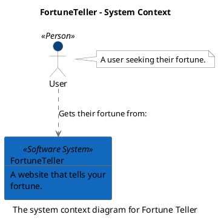
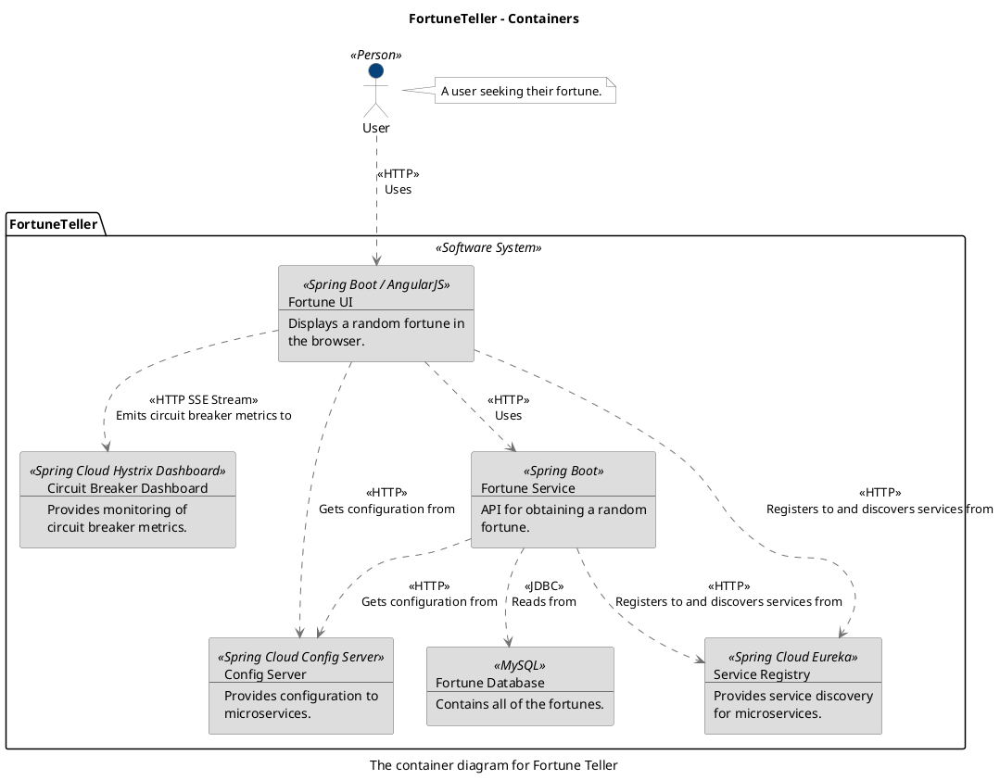

--

--

```
@startuml(id=Context)
scale max 2000x1409
title FortuneTeller - System Context
caption The system context diagram for Fortune Teller

skinparam {
  shadowing false
  arrowColor #707070
  actorBorderColor #707070
  componentBorderColor #707070
  rectangleBorderColor #707070
  noteBackgroundColor #ffffff
  noteBorderColor #707070
}
actor "User" <<Person>> as 1 #08427b
note right of 1
  A user seeking their fortune.
end note
rectangle 2 <<Software System>> #1168bd [
  FortuneTeller
  --
  A website that tells your
  fortune.
]
1 .[#707070].> 2 : Gets their fortune from:
@enduml

```



--

```
@startuml(id=Containers)
scale max 2000x1500
title FortuneTeller - Containers
caption The container diagram for Fortune Teller

skinparam {
  shadowing false
  arrowColor #707070
  actorBorderColor #707070
  componentBorderColor #707070
  rectangleBorderColor #707070
  noteBackgroundColor #ffffff
  noteBorderColor #707070
}
actor "User" <<Person>> as 1 #08427b
note right of 1
  A user seeking their fortune.
end note
package "FortuneTeller" <<Software System>> {
  rectangle 8 <<Spring Cloud Hystrix Dashboard>> #dddddd [
    Circuit Breaker Dashboard
    --
    Provides monitoring of
    circuit breaker metrics.
  ]
  rectangle 6 <<Spring Cloud Config Server>> #dddddd [
    Config Server
    --
    Provides configuration to
    microservices.
  ]
  rectangle 9 <<MySQL>> #dddddd [
    Fortune Database
    --
    Contains all of the fortunes.
  ]
  rectangle 5 <<Spring Boot>> #dddddd [
    Fortune Service
    --
    API for obtaining a random
    fortune.
  ]
  rectangle 4 <<Spring Boot / AngularJS>> #dddddd [
    Fortune UI
    --
    Displays a random fortune in
    the browser.
  ]
  rectangle 7 <<Spring Cloud Eureka>> #dddddd [
    Service Registry
    --
    Provides service discovery
    for microservices.
  ]
}
5 .[#707070].> 6 : <<HTTP>>\nGets configuration from
5 .[#707070].> 9 : <<JDBC>>\nReads from
5 .[#707070].> 7 : <<HTTP>>\nRegisters to and discovers services from
4 .[#707070].> 8 : <<HTTP SSE Stream>>\nEmits circuit breaker metrics to
4 .[#707070].> 6 : <<HTTP>>\nGets configuration from
4 .[#707070].> 5 : <<HTTP>>\nUses
4 .[#707070].> 7 : <<HTTP>>\nRegisters to and discovers services from
1 .[#707070].> 4 : <<HTTP>>\nUses
@enduml

```



--
