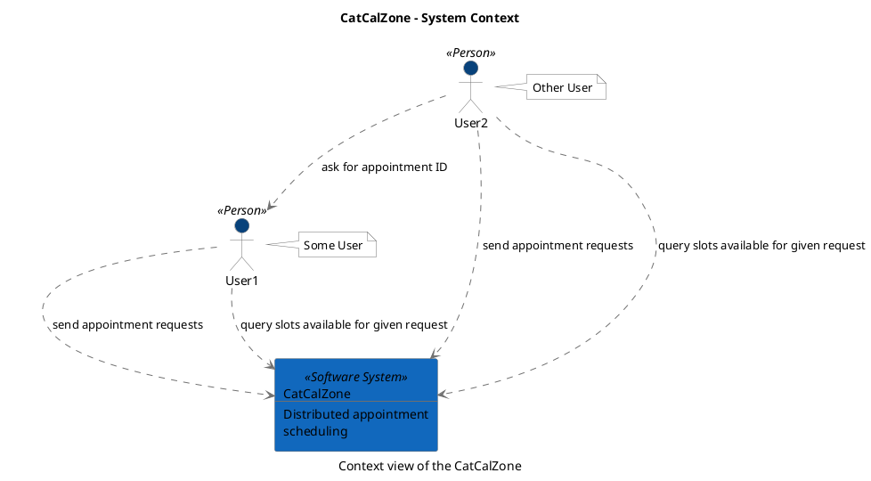
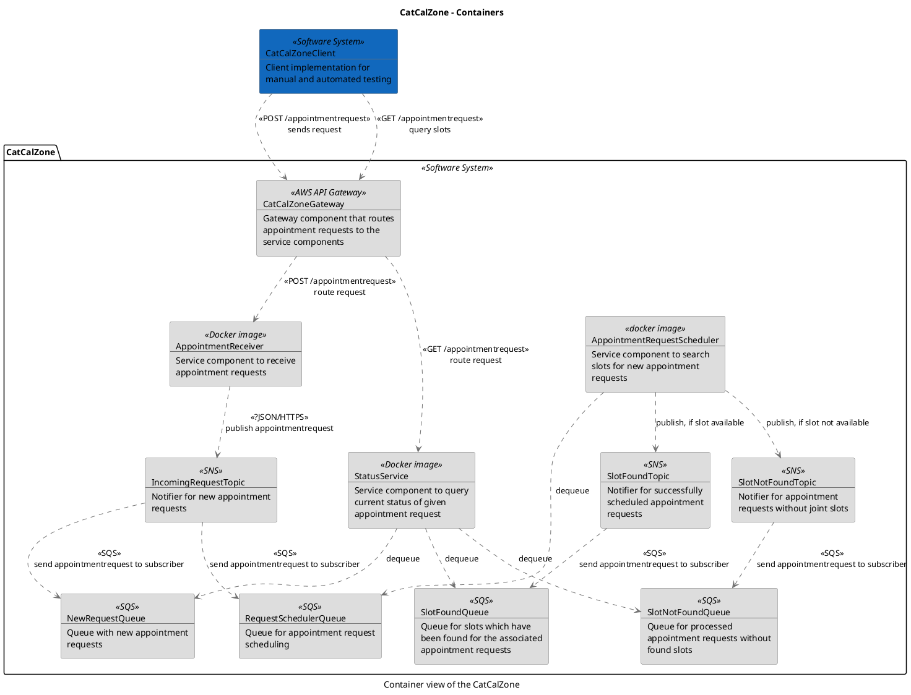

```
@startuml(id=CatCalZone_Context)
scale max 2000x1409
title CatCalZone - System Context
caption Context view of the CatCalZone

skinparam {
  shadowing false
  arrowColor #707070
  actorBorderColor #707070
  componentBorderColor #707070
  rectangleBorderColor #707070
  noteBackgroundColor #ffffff
  noteBorderColor #707070
}
actor "User1" <<Person>> as 1 #08427b
note right of 1
  Some User
end note
actor "User2" <<Person>> as 2 #08427b
note right of 2
  Other User
end note
rectangle 3 <<Software System>> #1168bd [
  CatCalZone
  --
  Distributed appointment
  scheduling
]
1 .[#707070].> 3 : send appointment requests
1 .[#707070].> 3 : query slots available for given request
2 .[#707070].> 3 : send appointment requests
2 .[#707070].> 3 : query slots available for given request
2 .[#707070].> 1 : ask for appointment ID
@enduml

```



--

```
@startuml(id=CatCalZone_Container)
scale max 2000x1413
title CatCalZone - Containers
caption Container view of the CatCalZone

skinparam {
  shadowing false
  arrowColor #707070
  actorBorderColor #707070
  componentBorderColor #707070
  rectangleBorderColor #707070
  noteBackgroundColor #ffffff
  noteBorderColor #707070
}
rectangle 4 <<Software System>> #1168bd [
  CatCalZoneClient
  --
  Client implementation for
  manual and automated testing
]
package "CatCalZone" <<Software System>> {
  rectangle 11 <<Docker image>> #dddddd [
    AppointmentReceiver
    --
    Service component to receive
    appointment requests
  ]
  rectangle 19 <<docker image>> #dddddd [
    AppointmentRequestScheduler
    --
    Service component to search
    slots for new appointment
    requests
  ]
  rectangle 10 <<AWS API Gateway>> #dddddd [
    CatCalZoneGateway
    --
    Gateway component that routes
    appointment requests to the
    service components
  ]
  rectangle 12 <<SNS>> #dddddd [
    IncomingRequestTopic
    --
    Notifier for new appointment
    requests
  ]
  rectangle 15 <<SQS>> #dddddd [
    NewRequestQueue
    --
    Queue with new appointment
    requests
  ]
  rectangle 16 <<SQS>> #dddddd [
    RequestSchedulerQueue
    --
    Queue for appointment request
    scheduling
  ]
  rectangle 17 <<SQS>> #dddddd [
    SlotFoundQueue
    --
    Queue for slots which have
    been found for the associated
    appointment requests
  ]
  rectangle 13 <<SNS>> #dddddd [
    SlotFoundTopic
    --
    Notifier for successfully
    scheduled appointment
    requests
  ]
  rectangle 18 <<SQS>> #dddddd [
    SlotNotFoundQueue
    --
    Queue for processed
    appointment requests without
    found slots
  ]
  rectangle 14 <<SNS>> #dddddd [
    SlotNotFoundTopic
    --
    Notifier for appointment
    requests without joint slots
  ]
  rectangle 20 <<Docker image>> #dddddd [
    StatusService
    --
    Service component to query
    current status of given
    appointment request
  ]
}
11 .[#707070].> 12 : <<?JSON/HTTPS>>\npublish appointmentrequest
19 .[#707070].> 16 : dequeue
19 .[#707070].> 13 : publish, if slot available
19 .[#707070].> 14 : publish, if slot not available
4 .[#707070].> 10 : <<POST /appointmentrequest>>\nsends request
4 .[#707070].> 10 : <<GET /appointmentrequest>>\nquery slots
10 .[#707070].> 11 : <<POST /appointmentrequest>>\nroute request
10 .[#707070].> 20 : <<GET /appointmentrequest>>\nroute request
12 .[#707070].> 15 : <<SQS>>\nsend appointmentrequest to subscriber
12 .[#707070].> 16 : <<SQS>>\nsend appointmentrequest to subscriber
13 .[#707070].> 17 : <<SQS>>\nsend appointmentrequest to subscriber
14 .[#707070].> 18 : <<SQS>>\nsend appointmentrequest to subscriber
20 .[#707070].> 15 : dequeue
20 .[#707070].> 17 : dequeue
20 .[#707070].> 18 : dequeue
@enduml

```


