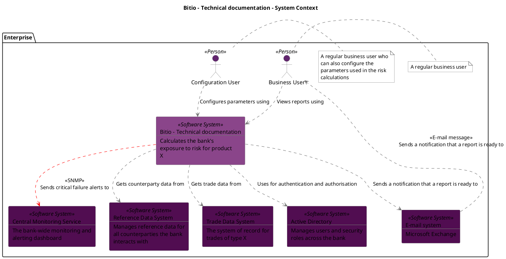
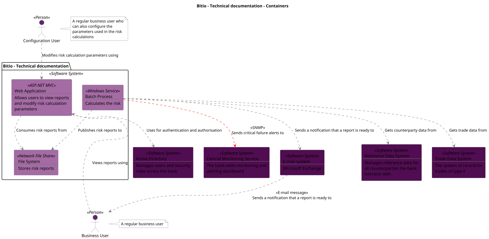
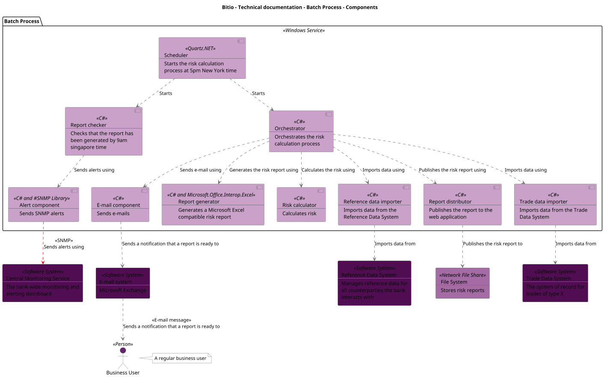

```
@startuml(id=Context)
scale max 2000x1413
title Bitio - Technical documentation - System Context

skinparam {
  shadowing false
  arrowColor #707070
  actorBorderColor #707070
  componentBorderColor #707070
  rectangleBorderColor #707070
  noteBackgroundColor #ffffff
  noteBorderColor #707070
}
package "Enterprise" {
  actor "Business User" <<Person>> as 2 #62256e
  note right of 2
    A regular business user
  end note
  actor "Configuration User" <<Person>> as 4 #62256e
  note right of 4
    A regular business user who
    can also configure the
    parameters used in the risk
    calculations
  end note
  rectangle 15 <<Software System>> #510d51 [
    Active Directory
    --
    Manages users and security
    roles across the bank
  ]
  rectangle 1 <<Software System>> #8a458a [
    Bitio - Technical documentation
    --
    Calculates the bank's
    exposure to risk for product
    X
  ]
  rectangle 13 <<Software System>> #510d51 [
    Central Monitoring Service
    --
    The bank-wide monitoring and
    alerting dashboard
  ]
  rectangle 10 <<Software System>> #510d51 [
    E-mail system
    --
    Microsoft Exchange
  ]
  rectangle 8 <<Software System>> #510d51 [
    Reference Data System
    --
    Manages reference data for
    all counterparties the bank
    interacts with
  ]
  rectangle 6 <<Software System>> #510d51 [
    Trade Data System
    --
    The system of record for
    trades of type X
  ]
}
1 .[#707070].> 15 : Uses for authentication and authorisation
1 .[#ff0000].> 13 : <<SNMP>>\nSends critical failure alerts to
1 .[#707070].> 10 : Sends a notification that a report is ready to
1 .[#707070].> 8 : Gets counterparty data from
1 .[#707070].> 6 : Gets trade data from
2 .[#707070].> 1 : Views reports using
4 .[#707070].> 1 : Configures parameters using
10 .[#707070].> 2 : <<E-mail message>>\nSends a notification that a report is ready to
@enduml

```



--

```
@startuml(id=Containers)
scale max 1413x2000
title Bitio - Technical documentation - Containers

skinparam {
  shadowing false
  arrowColor #707070
  actorBorderColor #707070
  componentBorderColor #707070
  rectangleBorderColor #707070
  noteBackgroundColor #ffffff
  noteBorderColor #707070
}
rectangle 15 <<Software System>> #510d51 [
  Active Directory
  --
  Manages users and security
  roles across the bank
]
actor "Business User" <<Person>> as 2 #62256e
note right of 2
  A regular business user
end note
rectangle 13 <<Software System>> #510d51 [
  Central Monitoring Service
  --
  The bank-wide monitoring and
  alerting dashboard
]
actor "Configuration User" <<Person>> as 4 #62256e
note right of 4
  A regular business user who
  can also configure the
  parameters used in the risk
  calculations
end note
rectangle 10 <<Software System>> #510d51 [
  E-mail system
  --
  Microsoft Exchange
]
rectangle 8 <<Software System>> #510d51 [
  Reference Data System
  --
  Manages reference data for
  all counterparties the bank
  interacts with
]
rectangle 6 <<Software System>> #510d51 [
  Trade Data System
  --
  The system of record for
  trades of type X
]
package "Bitio - Technical documentation" <<Software System>> {
  rectangle 21 <<Windows Service>> #a46ba4 [
    Batch Process
    --
    Calculates the risk
  ]
  rectangle 26 <<Network File Share>> #a46ba4 [
    File System
    --
    Stores risk reports
  ]
  rectangle 17 <<ASP.NET MVC>> #a46ba4 [
    Web Application
    --
    Allows users to view reports
    and modify risk calculation
    parameters
  ]
}
21 .[#ff0000].> 13 : <<SNMP>>\nSends critical failure alerts to
21 .[#707070].> 10 : Sends a notification that a report is ready to
21 .[#707070].> 26 : Publishes risk reports to
21 .[#707070].> 8 : Gets counterparty data from
21 .[#707070].> 6 : Gets trade data from
2 .[#707070].> 17 : Views reports using
4 .[#707070].> 17 : Modifies risk calculation parameters using
10 .[#707070].> 2 : <<E-mail message>>\nSends a notification that a report is ready to
17 .[#707070].> 15 : Uses for authentication and authorisation
17 .[#707070].> 26 : Consumes risk reports from
@enduml

```



--

```
@startuml(id=Components)
scale max 1413x2000
title Bitio - Technical documentation - Batch Process - Components

skinparam {
  shadowing false
  arrowColor #707070
  actorBorderColor #707070
  componentBorderColor #707070
  rectangleBorderColor #707070
  noteBackgroundColor #ffffff
  noteBorderColor #707070
}
actor "Business User" <<Person>> as 2 #62256e
note right of 2
  A regular business user
end note
rectangle 13 <<Software System>> #510d51 [
  Central Monitoring Service
  --
  The bank-wide monitoring and
  alerting dashboard
]
rectangle 10 <<Software System>> #510d51 [
  E-mail system
  --
  Microsoft Exchange
]
rectangle 26 <<Network File Share>> #a46ba4 [
  File System
  --
  Stores risk reports
]
rectangle 8 <<Software System>> #510d51 [
  Reference Data System
  --
  Manages reference data for
  all counterparties the bank
  interacts with
]
rectangle 6 <<Software System>> #510d51 [
  Trade Data System
  --
  The system of record for
  trades of type X
]
package "Batch Process" <<Windows Service>> {
  component 38 <<C# and #SNMP Library>> #c9a1c9 [
    Alert component
    --
    Sends SNMP alerts
  ]
  component 36 <<C#>> #c9a1c9 [
    E-mail component
    --
    Sends e-mails
  ]
  component 30 <<C#>> #c9a1c9 [
    Orchestrator
    --
    Orchestrates the risk
    calculation process
  ]
  component 32 <<C#>> #c9a1c9 [
    Reference data importer
    --
    Imports data from the
    Reference Data System
  ]
  component 37 <<C#>> #c9a1c9 [
    Report checker
    --
    Checks that the report has
    been generated by 9am
    singapore time
  ]
  component 35 <<C#>> #c9a1c9 [
    Report distributor
    --
    Publishes the report to the
    web application
  ]
  component 34 <<C# and Microsoft.Office.Interop.Excel>> #c9a1c9 [
    Report generator
    --
    Generates a Microsoft Excel
    compatible risk report
  ]
  component 33 <<C#>> #c9a1c9 [
    Risk calculator
    --
    Calculates risk
  ]
  component 29 <<Quartz.NET>> #c9a1c9 [
    Scheduler
    --
    Starts the risk calculation
    process at 5pm New York time
  ]
  component 31 <<C#>> #c9a1c9 [
    Trade data importer
    --
    Imports data from the Trade
    Data System
  ]
}
38 .[#ff0000].> 13 : <<SNMP>>\nSends alerts using
36 .[#707070].> 10 : Sends a notification that a report is ready to
10 .[#707070].> 2 : <<E-mail message>>\nSends a notification that a report is ready to
30 .[#707070].> 36 : Sends e-mail using
30 .[#707070].> 32 : Imports data using
30 .[#707070].> 35 : Publishes the risk report using
30 .[#707070].> 34 : Generates the risk report using
30 .[#707070].> 33 : Calculates the risk using
30 .[#707070].> 31 : Imports data using
32 .[#707070].> 8 : Imports data from
37 .[#707070].> 38 : Sends alerts using
35 .[#707070].> 26 : Publishes the risk report to
29 .[#707070].> 30 : Starts
29 .[#707070].> 37 : Starts
31 .[#707070].> 6 : Imports data from
@enduml

```



