```
@startuml(id=DIPS_Context)
scale max 1413x2000
title DIPS Arena - System Context
caption A simple example of a DIPS Arena System Context diagram.

skinparam {
  shadowing false
  arrowColor #707070
  actorBorderColor #707070
  componentBorderColor #707070
  rectangleBorderColor #707070
  noteBackgroundColor #ffffff
  noteBorderColor #707070
}
rectangle 1 <<Software System>> #1168bd [
  DIPS Arena
  --
  DIPS Arena
]
rectangle 124 <<Software System>> #1168bd [
  DIPS Classic
  --
  DIPS Classic
]
@enduml

```

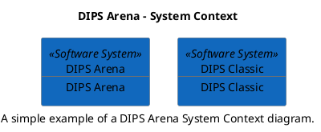

--

```
@startuml(id=Arena_Containers)
scale max 2000x1414
title DIPS Arena - Containers
caption The containers that make up the DIPS Arena system.

skinparam {
  shadowing false
  arrowColor #707070
  actorBorderColor #707070
  componentBorderColor #707070
  rectangleBorderColor #707070
  noteBackgroundColor #ffffff
  noteBorderColor #707070
}
package "DIPS Arena" <<Software System>> {
  rectangle 53 <<Container>> #fdedcf [
    Arena-Essential.Client
    --
    18.1
  ]
  rectangle 2 <<Container>> #ddeff4 [
    Arena-Essential.Service
    --
    18.1
  ]
}
@enduml

```

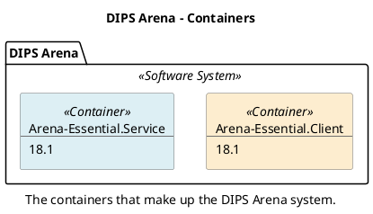

--

```
@startuml(id=Classic_Containers)
scale max 2000x1414
title DIPS Classic - Containers
caption The containers that make up the DIPS Classic system.

skinparam {
  shadowing false
  arrowColor #707070
  actorBorderColor #707070
  componentBorderColor #707070
  rectangleBorderColor #707070
  noteBackgroundColor #ffffff
  noteBorderColor #707070
}
package "DIPS Classic" <<Software System>> {
  rectangle 125 <<Container>> #fdedcf [
    Classic-DipsApi.Client
    --
    7.4.3.0
  ]
  rectangle 127 <<Container>> #fdedcf [
    Classic-ReportServer.Client
    --
    7.4.3.0
  ]
  rectangle 129 <<Container>> #fdedcf [
    MedicationSuite.Client
    --
    2.0
  ]
  rectangle 131 <<Container>> #ddeff4 [
    MedicationSuite.Service
    --
    2.0
  ]
  rectangle 133 <<Container>> #fdedcf [
    PatientBilling.Client
    --
    1.10.0
  ]
  database 135 <<Container>> #8bc9da [
    PatientBilling.Database
    --
    1.10.0
  ]
  rectangle 137 <<Container>> #ddeff4 [
    PatientBilling.Service
    --
    1.10.0
  ]
}
@enduml

```

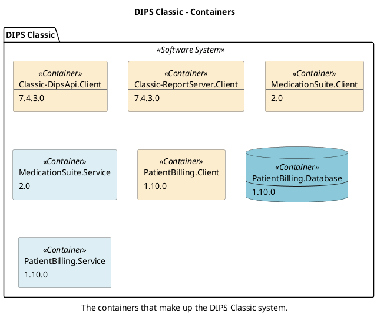

--

```
@startuml(id=Arena.Arena-Essential.Client_Components)
scale max 2000x1414
title DIPS Arena - Arena-Essential.Client - Components
caption The components that make up the Arena-Essential.Client process.

skinparam {
  shadowing false
  arrowColor #707070
  actorBorderColor #707070
  componentBorderColor #707070
  rectangleBorderColor #707070
  noteBackgroundColor #ffffff
  noteBorderColor #707070
}
package "Arena-Essential.Client" <<Container>> {
  component 122 <<Component>> #8bc9da [
    dips-arena-client-auditeventpublisher-plugin
    --
    5.23.0
  ]
  component 56 <<Component>> #8bc9da [
    dips-arena-contracts-client
    --
    2.7.23
  ]
  component 54 <<Component>> #8bc9da [
    dips-arena-dependencies-client
    --
    18.1.0.26
  ]
  component 69 <<Component>> #8bc9da [
    dips-arena-desktop-client
    --
    5.1.66
  ]
  component 89 <<Component>> #8bc9da [
    dips-arena-documentpublish-client
    --
    18.0.16
  ]
  component 84 <<Component>> #8bc9da [
    dips-arena-documentpublish-contracts-client
    --
    18.0.3
  ]
  component 76 <<Component>> #8bc9da [
    dips-arena-dynamicpublish-client
    --
    18.0.16
  ]
  component 82 <<Component>> #8bc9da [
    dips-arena-dynamicpublish-contracts-client
    --
    18.0.3
  ]
  component 65 <<Component>> #8bc9da [
    dips-arena-embeddedbrowser-client
    --
    9.3.1
  ]
  component 67 <<Component>> #8bc9da [
    dips-arena-encryptedclipboard-client
    --
    2.2.3
  ]
  component 96 <<Component>> #8bc9da [
    dips-arena-fest-client
    --
    1.5.3
  ]
  component 60 <<Component>> #8bc9da [
    dips-arena-framework-client
    --
    18.1.0.70
  ]
  component 116 <<Component>> #8bc9da [
    dips-arena-healthcarepartysearch-client
    --
    1.4.4
  ]
  component 62 <<Component>> #8bc9da [
    dips-arena-internaldependencies-client
    --
    7.4.6
  ]
  component 117 <<Component>> #8bc9da [
    dips-arena-notificationcenter-contracts
    --
    2.0.21
  ]
  component 119 <<Component>> #8bc9da [
    dips-arena-panorama-contracts
    --
    1.0.4
  ]
  component 111 <<Component>> #8bc9da [
    dips-arena-patientactivation-client-plugin
    --
    2.2.0
  ]
  component 97 <<Component>> #8bc9da [
    dips-arena-patientadministrativesummaries-client
    --
    2.8.0
  ]
  component 74 <<Component>> #8bc9da [
    dips-arena-patientlist-client
    --
    18.1.0.426
  ]
  component 92 <<Component>> #8bc9da [
    dips-arena-systemmanager-client
    --
    18.1.0.581
  ]
  component 55 <<Component>> #8bc9da [
    dips-arena-ui
    --
    6.0.106
  ]
  component 58 <<Component>> #8bc9da [
    dips-arena-ui-devexpress
    --
    5.0.8
  ]
  component 72 <<Component>> #8bc9da [
    dips-arena-universalprintingframework-arena-client
    --
    1.0.0
  ]
  component 71 <<Component>> #8bc9da [
    dips-arena-universalprintingframework-client
    --
    2.1.11
  ]
  component 120 <<Component>> #8bc9da [
    dips-arena-version
    --
    18.1.0.2-build0008
  ]
  component 78 <<Component>> #8bc9da [
    dips-arena-workflow-engine-contracts-client
    --
    2.2.2
  ]
  component 79 <<Component>> #8bc9da [
    dips-arena-workflowscript-client
    --
    3.6.16
  ]
  component 100 <<Component>> #8bc9da [
    dips-arena-worktasks-client
    --
    2.12.4
  ]
  component 98 <<Component>> #8bc9da [
    dips-arena-worktasks-contracts
    --
    8.3.10
  ]
  component 99 <<Component>> #8bc9da [
    dips-arena-worktasks-contracts-desktop
    --
    6.6.0
  ]
  component 107 <<Component>> #8bc9da [
    dips-arena-worktasks-controls
    --
    3.0.17
  ]
}
122 .[#000000].> 60 : Depends on
69 .[#000000].> 62 : Depends on
89 .[#000000].> 84 : Depends on
89 .[#000000].> 76 : Depends on
84 .[#000000].> 82 : Depends on
76 .[#000000].> 82 : Depends on
76 .[#000000].> 60 : Depends on
76 .[#000000].> 72 : Depends on
82 .[#000000].> 56 : Depends on
65 .[#000000].> 54 : Depends on
65 .[#000000].> 60 : Depends on
67 .[#000000].> 60 : Depends on
60 .[#000000].> 54 : Depends on
62 .[#000000].> 54 : Depends on
62 .[#000000].> 65 : Depends on
62 .[#000000].> 67 : Depends on
62 .[#000000].> 60 : Depends on
111 .[#000000].> 60 : Depends on
111 .[#000000].> 98 : Depends on
74 .[#000000].> 76 : Depends on
74 .[#000000].> 60 : Depends on
92 .[#000000].> 69 : Depends on
92 .[#000000].> 60 : Depends on
92 .[#000000].> 62 : Depends on
58 .[#000000].> 55 : Depends on
55 .[#000000].> 56 : Depends on
72 .[#000000].> 71 : Depends on
120 .[#000000].> 69 : Depends on
79 .[#000000].> 60 : Depends on
79 .[#000000].> 78 : Depends on
100 .[#000000].> 69 : Depends on
100 .[#000000].> 60 : Depends on
100 .[#000000].> 62 : Depends on
100 .[#000000].> 74 : Depends on
100 .[#000000].> 98 : Depends on
100 .[#000000].> 99 : Depends on
100 .[#000000].> 107 : Depends on
107 .[#000000].> 60 : Depends on
107 .[#000000].> 98 : Depends on
@enduml

```

```plantuml
@startuml(id=Arena.Arena-Essential.Client_Components)
scale max 2000x1414
title DIPS Arena - Arena-Essential.Client - Components
caption The components that make up the Arena-Essential.Client process.

skinparam {
  shadowing false
  arrowColor #707070
  actorBorderColor #707070
  componentBorderColor #707070
  rectangleBorderColor #707070
  noteBackgroundColor #ffffff
  noteBorderColor #707070
}
package "Arena-Essential.Client" <<Container>> {
  component 122 <<Component>> #8bc9da [
    dips-arena-client-auditeventpublisher-plugin
    --
    5.23.0
  ]
  component 56 <<Component>> #8bc9da [
    dips-arena-contracts-client
    --
    2.7.23
  ]
  component 54 <<Component>> #8bc9da [
    dips-arena-dependencies-client
    --
    18.1.0.26
  ]
  component 69 <<Component>> #8bc9da [
    dips-arena-desktop-client
    --
    5.1.66
  ]
  component 89 <<Component>> #8bc9da [
    dips-arena-documentpublish-client
    --
    18.0.16
  ]
  component 84 <<Component>> #8bc9da [
    dips-arena-documentpublish-contracts-client
    --
    18.0.3
  ]
  component 76 <<Component>> #8bc9da [
    dips-arena-dynamicpublish-client
    --
    18.0.16
  ]
  component 82 <<Component>> #8bc9da [
    dips-arena-dynamicpublish-contracts-client
    --
    18.0.3
  ]
  component 65 <<Component>> #8bc9da [
    dips-arena-embeddedbrowser-client
    --
    9.3.1
  ]
  component 67 <<Component>> #8bc9da [
    dips-arena-encryptedclipboard-client
    --
    2.2.3
  ]
  component 96 <<Component>> #8bc9da [
    dips-arena-fest-client
    --
    1.5.3
  ]
  component 60 <<Component>> #8bc9da [
    dips-arena-framework-client
    --
    18.1.0.70
  ]
  component 116 <<Component>> #8bc9da [
    dips-arena-healthcarepartysearch-client
    --
    1.4.4
  ]
  component 62 <<Component>> #8bc9da [
    dips-arena-internaldependencies-client
    --
    7.4.6
  ]
  component 117 <<Component>> #8bc9da [
    dips-arena-notificationcenter-contracts
    --
    2.0.21
  ]
  component 119 <<Component>> #8bc9da [
    dips-arena-panorama-contracts
    --
    1.0.4
  ]
  component 111 <<Component>> #8bc9da [
    dips-arena-patientactivation-client-plugin
    --
    2.2.0
  ]
  component 97 <<Component>> #8bc9da [
    dips-arena-patientadministrativesummaries-client
    --
    2.8.0
  ]
  component 74 <<Component>> #8bc9da [
    dips-arena-patientlist-client
    --
    18.1.0.426
  ]
  component 92 <<Component>> #8bc9da [
    dips-arena-systemmanager-client
    --
    18.1.0.581
  ]
  component 55 <<Component>> #8bc9da [
    dips-arena-ui
    --
    6.0.106
  ]
  component 58 <<Component>> #8bc9da [
    dips-arena-ui-devexpress
    --
    5.0.8
  ]
  component 72 <<Component>> #8bc9da [
    dips-arena-universalprintingframework-arena-client
    --
    1.0.0
  ]
  component 71 <<Component>> #8bc9da [
    dips-arena-universalprintingframework-client
    --
    2.1.11
  ]
  component 120 <<Component>> #8bc9da [
    dips-arena-version
    --
    18.1.0.2-build0008
  ]
  component 78 <<Component>> #8bc9da [
    dips-arena-workflow-engine-contracts-client
    --
    2.2.2
  ]
  component 79 <<Component>> #8bc9da [
    dips-arena-workflowscript-client
    --
    3.6.16
  ]
  component 100 <<Component>> #8bc9da [
    dips-arena-worktasks-client
    --
    2.12.4
  ]
  component 98 <<Component>> #8bc9da [
    dips-arena-worktasks-contracts
    --
    8.3.10
  ]
  component 99 <<Component>> #8bc9da [
    dips-arena-worktasks-contracts-desktop
    --
    6.6.0
  ]
  component 107 <<Component>> #8bc9da [
    dips-arena-worktasks-controls
    --
    3.0.17
  ]
}
122 .[#000000].> 60 : Depends on
69 .[#000000].> 62 : Depends on
89 .[#000000].> 84 : Depends on
89 .[#000000].> 76 : Depends on
84 .[#000000].> 82 : Depends on
76 .[#000000].> 82 : Depends on
76 .[#000000].> 60 : Depends on
76 .[#000000].> 72 : Depends on
82 .[#000000].> 56 : Depends on
65 .[#000000].> 54 : Depends on
65 .[#000000].> 60 : Depends on
67 .[#000000].> 60 : Depends on
60 .[#000000].> 54 : Depends on
62 .[#000000].> 54 : Depends on
62 .[#000000].> 65 : Depends on
62 .[#000000].> 67 : Depends on
62 .[#000000].> 60 : Depends on
111 .[#000000].> 60 : Depends on
111 .[#000000].> 98 : Depends on
74 .[#000000].> 76 : Depends on
74 .[#000000].> 60 : Depends on
92 .[#000000].> 69 : Depends on
92 .[#000000].> 60 : Depends on
92 .[#000000].> 62 : Depends on
58 .[#000000].> 55 : Depends on
55 .[#000000].> 56 : Depends on
72 .[#000000].> 71 : Depends on
120 .[#000000].> 69 : Depends on
79 .[#000000].> 60 : Depends on
79 .[#000000].> 78 : Depends on
100 .[#000000].> 69 : Depends on
100 .[#000000].> 60 : Depends on
100 .[#000000].> 62 : Depends on
100 .[#000000].> 74 : Depends on
100 .[#000000].> 98 : Depends on
100 .[#000000].> 99 : Depends on
100 .[#000000].> 107 : Depends on
107 .[#000000].> 60 : Depends on
107 .[#000000].> 98 : Depends on
@enduml

```

--

```
@startuml(id=Arena.Arena-Essential.Service_Components)
scale max 2000x1414
title DIPS Arena - Arena-Essential.Service - Components
caption The components that make up the Arena-Essential.Service process.

skinparam {
  shadowing false
  arrowColor #707070
  actorBorderColor #707070
  componentBorderColor #707070
  rectangleBorderColor #707070
  noteBackgroundColor #ffffff
  noteBorderColor #707070
}
package "Arena-Essential.Service" <<Container>> {
  component 11 <<Component>> #8bc9da [
    dips-arena-contracts-server
    --
    2.7.23
  ]
  component 3 <<Component>> #8bc9da [
    dips-arena-dependencies-server
    --
    18.1.0.26
  ]
  component 12 <<Component>> #8bc9da [
    dips-arena-desktop-server
    --
    5.1.66
  ]
  component 26 <<Component>> #8bc9da [
    dips-arena-documentpublish-contracts-server
    --
    18.0.3
  ]
  component 30 <<Component>> #8bc9da [
    dips-arena-documentpublish-server
    --
    18.0.16
  ]
  component 24 <<Component>> #8bc9da [
    dips-arena-dynamicpublish-contracts-server
    --
    18.0.3
  ]
  component 28 <<Component>> #8bc9da [
    dips-arena-dynamicpublish-server
    --
    18.0.12
  ]
  component 37 <<Component>> #8bc9da [
    dips-arena-fest-server
    --
    1.5.3
  ]
  component 4 <<Component>> #8bc9da [
    dips-arena-framework-authorization-libs
    --
    0.15.1
  ]
  component 5 <<Component>> #8bc9da [
    dips-arena-framework-server
    --
    18.1.0.70
  ]
  component 46 <<Component>> #8bc9da [
    dips-arena-healthcarepartysearch-server
    --
    1.4.4
  ]
  component 45 <<Component>> #8bc9da [
    dips-arena-infection-monitoring-service
    --
    1.1.0
  ]
  component 8 <<Component>> #8bc9da [
    dips-arena-internaldependencies-server
    --
    7.4.6
  ]
  component 47 <<Component>> #8bc9da [
    dips-arena-jetformcontent-server
    --
    1.0.0.19032002
  ]
  component 14 <<Component>> #8bc9da [
    dips-arena-packagemanager-contracts-server
    --
    1.1.12
  ]
  component 43 <<Component>> #8bc9da [
    dips-arena-patientactivation-service-plugin
    --
    2.1.4
  ]
  component 38 <<Component>> #8bc9da [
    dips-arena-patientadministrativesummaries-server
    --
    2.8.0
  ]
  component 15 <<Component>> #8bc9da [
    dips-arena-patientlist-server
    --
    18.1.0.426
  ]
  component 51 <<Component>> #8bc9da [
    dips-arena-server-auditeventpublisher-plugin
    --
    5.23.0
  ]
  component 21 <<Component>> #8bc9da [
    dips-arena-systemmanager-server
    --
    18.1.0.581
  ]
  component 18 <<Component>> #8bc9da [
    dips-arena-workflow-engine-contracts-server
    --
    2.2.2
  ]
  component 19 <<Component>> #8bc9da [
    dips-arena-workflowscript-server
    --
    3.6.16
  ]
  component 39 <<Component>> #8bc9da [
    dips-arena-worktasks-server
    --
    5.9.6
  ]
}
12 .[#000000].> 8 : Depends on
26 .[#000000].> 24 : Depends on
30 .[#000000].> 26 : Depends on
30 .[#000000].> 28 : Depends on
24 .[#000000].> 11 : Depends on
28 .[#000000].> 24 : Depends on
5 .[#000000].> 3 : Depends on
5 .[#000000].> 4 : Depends on
8 .[#000000].> 3 : Depends on
8 .[#000000].> 5 : Depends on
47 .[#000000].> 12 : Depends on
47 .[#000000].> 5 : Depends on
47 .[#000000].> 8 : Depends on
43 .[#000000].> 5 : Depends on
15 .[#000000].> 5 : Depends on
15 .[#000000].> 14 : Depends on
51 .[#000000].> 5 : Depends on
21 .[#000000].> 12 : Depends on
21 .[#000000].> 5 : Depends on
21 .[#000000].> 8 : Depends on
21 .[#000000].> 14 : Depends on
19 .[#000000].> 8 : Depends on
19 .[#000000].> 21 : Depends on
19 .[#000000].> 18 : Depends on
39 .[#000000].> 5 : Depends on
39 .[#000000].> 15 : Depends on
39 .[#000000].> 18 : Depends on
@enduml

```

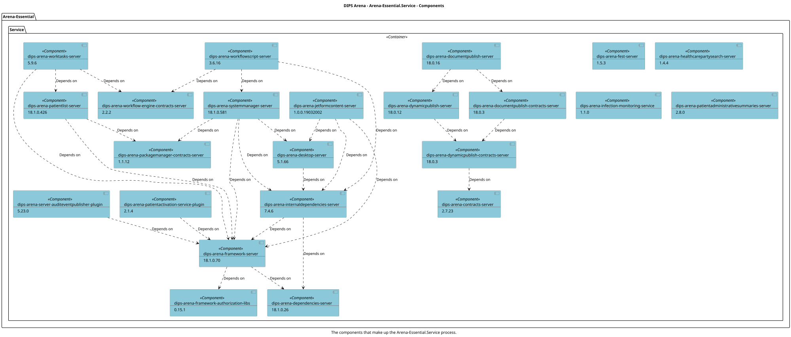

--

```
@startuml(id=Classic.Classic-DipsApi.Client_Components)
scale max 2000x1414
title DIPS Classic - Classic-DipsApi.Client - Components
caption The components that make up the Classic-DipsApi.Client process.

skinparam {
  shadowing false
  arrowColor #707070
  actorBorderColor #707070
  componentBorderColor #707070
  rectangleBorderColor #707070
  noteBackgroundColor #ffffff
  noteBorderColor #707070
}
package "Classic-DipsApi.Client" <<Container>> {
  component 126 <<Component>> #8bc9da [
    dips-api-complete
    --
    74.3.0.48
  ]
}
@enduml

```

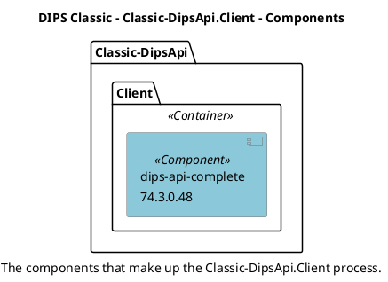

--

```
@startuml(id=Classic.Classic-ReportServer.Client_Components)
scale max 2000x1414
title DIPS Classic - Classic-ReportServer.Client - Components
caption The components that make up the Classic-ReportServer.Client process.

skinparam {
  shadowing false
  arrowColor #707070
  actorBorderColor #707070
  componentBorderColor #707070
  rectangleBorderColor #707070
  noteBackgroundColor #ffffff
  noteBorderColor #707070
}
package "Classic-ReportServer.Client" <<Container>> {
  component 128 <<Component>> #8bc9da [
    dips-epjpas-reportserver
    --
    74.3.0.99
  ]
}
@enduml

```

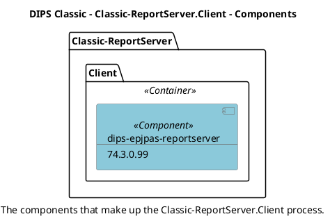

--

```
@startuml(id=Classic.MedicationSuite.Client_Components)
scale max 2000x1414
title DIPS Classic - MedicationSuite.Client - Components
caption The components that make up the MedicationSuite.Client process.

skinparam {
  shadowing false
  arrowColor #707070
  actorBorderColor #707070
  componentBorderColor #707070
  rectangleBorderColor #707070
  noteBackgroundColor #ffffff
  noteBorderColor #707070
}
package "MedicationSuite.Client" <<Container>> {
  component 130 <<Component>> #8bc9da [
    dips-medicationsuite-client
    --
    2.0.2.0-Build2400926
  ]
}
@enduml

```

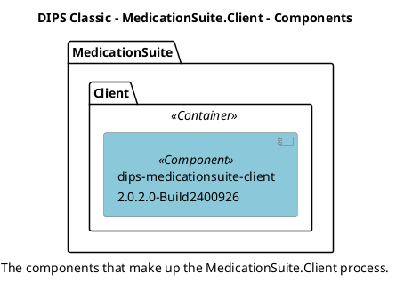

--

```
@startuml(id=Classic.MedicationSuite.Service_Components)
scale max 2000x1414
title DIPS Classic - MedicationSuite.Service - Components
caption The components that make up the MedicationSuite.Service process.

skinparam {
  shadowing false
  arrowColor #707070
  actorBorderColor #707070
  componentBorderColor #707070
  rectangleBorderColor #707070
  noteBackgroundColor #ffffff
  noteBorderColor #707070
}
package "MedicationSuite.Service" <<Container>> {
  component 132 <<Component>> #8bc9da [
    dips-medicationsuite-server
    --
    2.0.2.0-Build2400916
  ]
}
@enduml

```

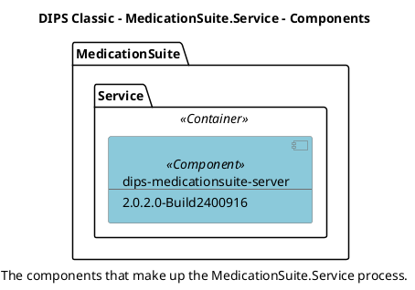

--

```
@startuml(id=Classic.PatientBilling.Client_Components)
scale max 2000x1414
title DIPS Classic - PatientBilling.Client - Components
caption The components that make up the PatientBilling.Client process.

skinparam {
  shadowing false
  arrowColor #707070
  actorBorderColor #707070
  componentBorderColor #707070
  rectangleBorderColor #707070
  noteBackgroundColor #ffffff
  noteBorderColor #707070
}
package "PatientBilling.Client" <<Container>> {
  component 134 <<Component>> #8bc9da [
    dips-patientbilling-client
    --
    1.10.0.0
  ]
}
@enduml

```

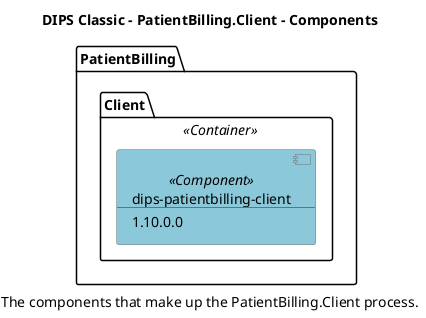

--

```
@startuml(id=Classic.PatientBilling.Database_Components)
scale max 2000x1414
title DIPS Classic - PatientBilling.Database - Components
caption The components that make up the PatientBilling.Database process.

skinparam {
  shadowing false
  arrowColor #707070
  actorBorderColor #707070
  componentBorderColor #707070
  rectangleBorderColor #707070
  noteBackgroundColor #ffffff
  noteBorderColor #707070
}
package "PatientBilling.Database" <<Container>> {
  component 136 <<Component>> #8bc9da [
    patientbilling-database-1.9.0
    --
    1.0.0
  ]
}
@enduml

```

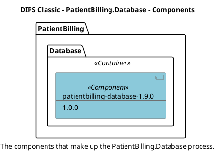

--

```
@startuml(id=Classic.PatientBilling.Service_Components)
scale max 2000x1414
title DIPS Classic - PatientBilling.Service - Components
caption The components that make up the PatientBilling.Service process.

skinparam {
  shadowing false
  arrowColor #707070
  actorBorderColor #707070
  componentBorderColor #707070
  rectangleBorderColor #707070
  noteBackgroundColor #ffffff
  noteBorderColor #707070
}
package "PatientBilling.Service" <<Container>> {
  component 138 <<Component>> #8bc9da [
    dips-patientbilling-server
    --
    1.10.0.0
  ]
}
@enduml

```

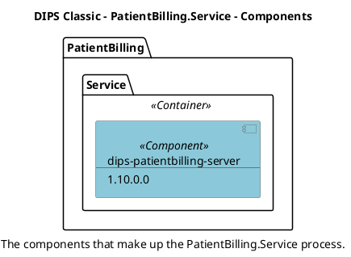
