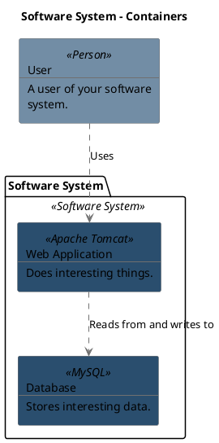

```
@startuml(id=_2)
scale max 2000x1409
title Software System - Containers

skinparam {
  shadowing false
  arrowColor #707070
  actorBorderColor #707070
  componentBorderColor #707070
  rectangleBorderColor #707070
  noteBackgroundColor #ffffff
  noteBorderColor #707070
}
rectangle 1 <<Person>> #728da5 [
  User
  --
  A user of your software
  system.
]
package "Software System" <<Software System>> {
  rectangle 5 <<MySQL>> #2a4e6e [
    Database
    --
    Stores interesting data.
  ]
  rectangle 4 <<Apache Tomcat>> #2a4e6e [
    Web Application
    --
    Does interesting things.
  ]
}
1 .[#707070].> 4 : Uses
4 .[#707070].> 5 : Reads from and writes to
@enduml

```


