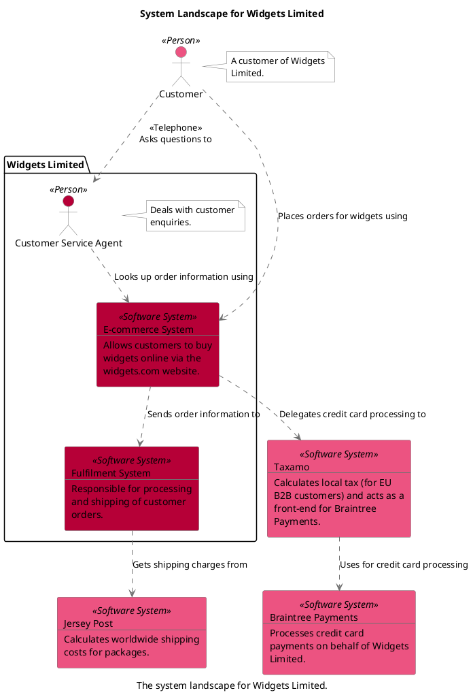
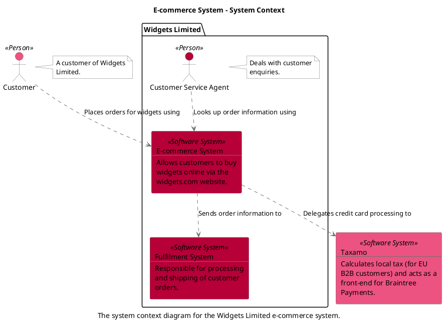
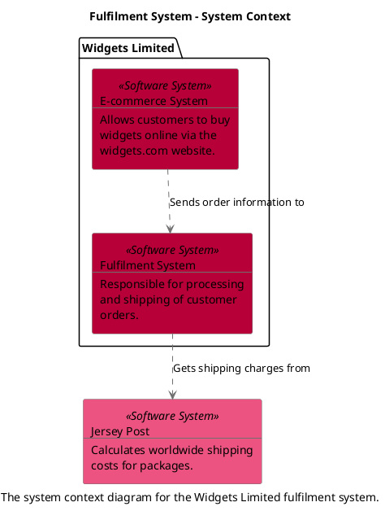
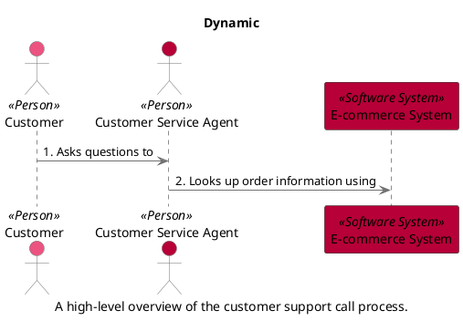

```
@startuml(id=SystemLandscape)
scale max 2000x1409
title System Landscape for Widgets Limited
caption The system landscape for Widgets Limited.

skinparam {
  shadowing false
  arrowColor #707070
  actorBorderColor #707070
  componentBorderColor #707070
  rectangleBorderColor #707070
  noteBackgroundColor #ffffff
  noteBorderColor #707070
}
actor "Customer" <<Person>> as 1 #ec5381
note right of 1
  A customer of Widgets
  Limited.
end note
rectangle 6 <<Software System>> #ec5381 [
  Braintree Payments
  --
  Processes credit card
  payments on behalf of Widgets
  Limited.
]
rectangle 7 <<Software System>> #ec5381 [
  Jersey Post
  --
  Calculates worldwide shipping
  costs for packages.
]
rectangle 5 <<Software System>> #ec5381 [
  Taxamo
  --
  Calculates local tax (for EU
  B2B customers) and acts as a
  front-end for Braintree
  Payments.
]
package "Widgets Limited" {
  actor "Customer Service Agent" <<Person>> as 2 #b60037
  note right of 2
    Deals with customer
    enquiries.
  end note
  rectangle 3 <<Software System>> #b60037 [
    E-commerce System
    --
    Allows customers to buy
    widgets online via the
    widgets.com website.
  ]
  rectangle 4 <<Software System>> #b60037 [
    Fulfilment System
    --
    Responsible for processing
    and shipping of customer
    orders.
  ]
}
2 .[#707070].> 3 : Looks up order information using
1 .[#707070].> 2 : <<Telephone>>\nAsks questions to
1 .[#707070].> 3 : Places orders for widgets using
3 .[#707070].> 4 : Sends order information to
3 .[#707070].> 5 : Delegates credit card processing to
4 .[#707070].> 7 : Gets shipping charges from
5 .[#707070].> 6 : Uses for credit card processing
@enduml

```



--

```
@startuml(id=EcommerceSystemContext)
scale max 2000x1409
title E-commerce System - System Context
caption The system context diagram for the Widgets Limited e-commerce system.

skinparam {
  shadowing false
  arrowColor #707070
  actorBorderColor #707070
  componentBorderColor #707070
  rectangleBorderColor #707070
  noteBackgroundColor #ffffff
  noteBorderColor #707070
}
actor "Customer" <<Person>> as 1 #ec5381
note right of 1
  A customer of Widgets
  Limited.
end note
rectangle 5 <<Software System>> #ec5381 [
  Taxamo
  --
  Calculates local tax (for EU
  B2B customers) and acts as a
  front-end for Braintree
  Payments.
]
package "Widgets Limited" {
  actor "Customer Service Agent" <<Person>> as 2 #b60037
  note right of 2
    Deals with customer
    enquiries.
  end note
  rectangle 3 <<Software System>> #b60037 [
    E-commerce System
    --
    Allows customers to buy
    widgets online via the
    widgets.com website.
  ]
  rectangle 4 <<Software System>> #b60037 [
    Fulfilment System
    --
    Responsible for processing
    and shipping of customer
    orders.
  ]
}
2 .[#707070].> 3 : Looks up order information using
1 .[#707070].> 3 : Places orders for widgets using
3 .[#707070].> 4 : Sends order information to
3 .[#707070].> 5 : Delegates credit card processing to
@enduml

```



--

```

@startuml(id=FulfilmentSystemContext)
scale max 2000x1409
title Fulfilment System - System Context
caption The system context diagram for the Widgets Limited fulfilment system.

skinparam {
  shadowing false
  arrowColor #707070
  actorBorderColor #707070
  componentBorderColor #707070
  rectangleBorderColor #707070
  noteBackgroundColor #ffffff
  noteBorderColor #707070
}
rectangle 7 <<Software System>> #ec5381 [
  Jersey Post
  --
  Calculates worldwide shipping
  costs for packages.
]
package "Widgets Limited" {
  rectangle 3 <<Software System>> #b60037 [
    E-commerce System
    --
    Allows customers to buy
    widgets online via the
    widgets.com website.
  ]
  rectangle 4 <<Software System>> #b60037 [
    Fulfilment System
    --
    Responsible for processing
    and shipping of customer
    orders.
  ]
}
3 .[#707070].> 4 : Sends order information to
4 .[#707070].> 7 : Gets shipping charges from
@enduml


```



--


```
@startuml(id=CustomerSupportCall)
scale max 2000x1409
title Dynamic
caption A high-level overview of the customer support call process.

skinparam {
  shadowing false
  arrowColor #707070
  actorBorderColor #707070
  componentBorderColor #707070
  rectangleBorderColor #707070
  noteBackgroundColor #ffffff
  noteBorderColor #707070
}
actor "Customer" as 1 <<Person>> #ec5381
actor "Customer Service Agent" as 2 <<Person>> #b60037
participant "E-commerce System" as 3 <<Software System>> #b60037
1 -[#707070]> 2 : 1. Asks questions to
2 -[#707070]> 3 : 2. Looks up order information using
@enduml

```


