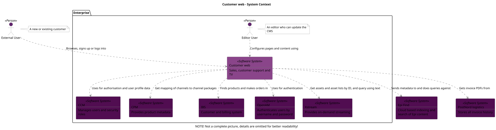
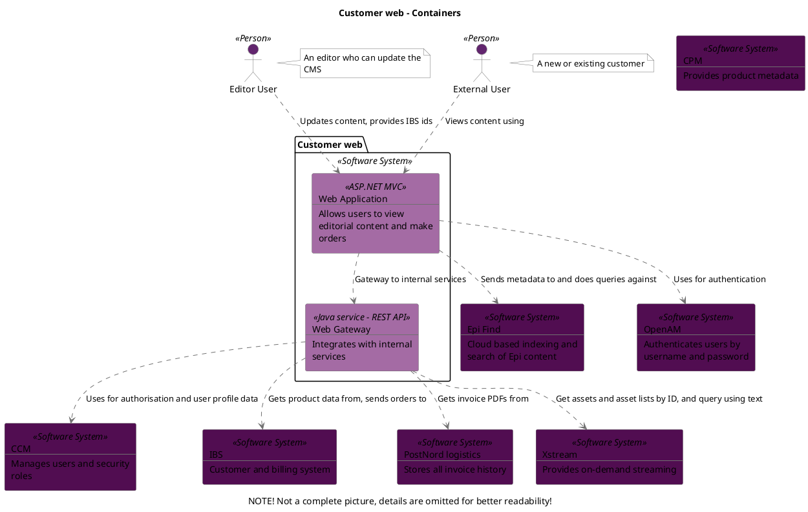

```plantuml
@startuml(id=Web_components)
scale max 2000x1413
title Customer web - Web Application - Components
caption NOTE! Not a complete picture, details are omitted for better readability!

skinparam {
  shadowing false
  arrowColor #707070
  actorBorderColor #707070
  componentBorderColor #707070
  rectangleBorderColor #707070
  noteBackgroundColor #ffffff
  noteBorderColor #707070
}
rectangle 8 <<Software System>> #510d51 [
  Epi Find
  --
  Cloud based indexing and
  search of Epi content
]
actor "External User" <<Person>> as 2 #62256e
note right of 2
  A new or existing customer
end note
rectangle 6 <<Software System>> #510d51 [
  IBS
  --
  Customer and billing system
]
rectangle 10 <<Software System>> #510d51 [
  OpenAM
  --
  Authenticates users by
  username and password
]
rectangle 7 <<Software System>> #510d51 [
  PostNord logistics
  --
  Stores all invoice history
]
rectangle 11 <<Software System>> #510d51 [
  Xstream
  --
  Provides on-demand streaming
]
package "Web Application" <<ASP.NET MVC>> {
  component 36 <<ASP.NET MVC>> #c9a1c9 [
    AntennaPageController
    --
    controller
  ]
  component 52 <<ASP.NET MVC>> #c9a1c9 [
    BundlePageController
    --
    controller
  ]
  component 69 <<ASP.NET MVC>> #c9a1c9 [
    BundleSelectionPageController
    --
    controller
  ]
  component 53 <<ASP.NET MVC>> #c9a1c9 [
    CampaignConfigurationPageController
    --
    controller
  ]
  component 57 <<ASP.NET MVC>> #c9a1c9 [
    CampaignPageController
    --
    controller
  ]
  component 38 <<ASP.NET MVC>> #c9a1c9 [
    ContainerPageController
    --
    controller
  ]
  component 46 <<ASP.NET MVC>> #c9a1c9 [
    CustomerRegistrationPageController
    --
    controller
  ]
  component 37 <<ASP.NET MVC>> #c9a1c9 [
    DecoderPageController
    --
    controller
  ]
  component 68 <<ASP.NET MVC>> #c9a1c9 [
    DowngradePageController
    --
    controller
  ]
  component 56 <<ASP.NET MVC>> #c9a1c9 [
    EmailValidationPageController
    --
    controller
  ]
  component 39 <<ASP.NET MVC>> #c9a1c9 [
    EquipmentListPageController
    --
    controller
  ]
  component 47 <<ASP.NET MVC>> #c9a1c9 [
    ForgotCustomerNumberPageController
    --
    controller
  ]
  component 49 <<ASP.NET MVC>> #c9a1c9 [
    HardwarePageController
    --
    controller
  ]
  component 67 <<ASP.NET MVC>> #c9a1c9 [
    LoginPageController
    --
    controller
  ]
  component 58 <<ASP.NET MVC>> #c9a1c9 [
    MaintenancePageController
    --
    controller
  ]
  component 66 <<ASP.NET MVC>> #c9a1c9 [
    MyPageController
    --
    controller
  ]
  component 65 <<ASP.NET MVC>> #c9a1c9 [
    ObjectCachePageController
    --
    controller
  ]
  component 64 <<ASP.NET MVC>> #c9a1c9 [
    OnePlacePageController
    --
    controller
  ]
  component 48 <<ASP.NET MVC>> #c9a1c9 [
    PaymentStatusPageController
    --
    controller
  ]
  component 55 <<ASP.NET MVC>> #c9a1c9 [
    ReceiptPageController
    --
    controller
  ]
  component 45 <<ASP.NET MVC>> #c9a1c9 [
    ResetPasswordPageController
    --
    controller
  ]
  component 33 <<ASP.NET MVC>> #c9a1c9 [
    SearchPageController
    --
    controller
  ]
  component 51 <<ASP.NET MVC>> #c9a1c9 [
    SubscriptionListPageController
    --
    controller
  ]
  component 50 <<ASP.NET MVC>> #c9a1c9 [
    SubscriptionPageController
    --
    controller
  ]
  component 44 <<ASP.NET MVC>> #c9a1c9 [
    SupportCategoryPageController
    --
    controller
  ]
  component 42 <<ASP.NET MVC>> #c9a1c9 [
    SupportEquipmentCategoryPageController
    --
    controller
  ]
  component 41 <<ASP.NET MVC>> #c9a1c9 [
    SupportRootPageController
    --
    controller
  ]
  component 31 <<ASP.NET MVC>> #c9a1c9 [
    UnsubscribePageController
    --
    controller
  ]
  component 60 <<ASP.NET MVC>> #c9a1c9 [
    UpsaleCampaignPageController
    --
    controller
  ]
}
2 .[#707070].> 36 : <<HTTP>>\nUses
2 .[#707070].> 52 : <<HTTP>>\nUses
2 .[#707070].> 69 : <<HTTP>>\nUses
2 .[#707070].> 53 : <<HTTP>>\nUses
2 .[#707070].> 57 : <<HTTP>>\nUses
2 .[#707070].> 38 : <<HTTP>>\nUses
2 .[#707070].> 46 : <<HTTP>>\nUses
2 .[#707070].> 37 : <<HTTP>>\nUses
2 .[#707070].> 68 : <<HTTP>>\nUses
2 .[#707070].> 56 : <<HTTP>>\nUses
2 .[#707070].> 39 : <<HTTP>>\nUses
2 .[#707070].> 47 : <<HTTP>>\nUses
2 .[#707070].> 49 : <<HTTP>>\nUses
2 .[#707070].> 67 : <<HTTP>>\nUses
2 .[#707070].> 58 : <<HTTP>>\nUses
2 .[#707070].> 66 : <<HTTP>>\nUses
2 .[#707070].> 65 : <<HTTP>>\nUses
2 .[#707070].> 64 : <<HTTP>>\nUses
2 .[#707070].> 48 : <<HTTP>>\nUses
2 .[#707070].> 55 : <<HTTP>>\nUses
2 .[#707070].> 45 : <<HTTP>>\nUses
2 .[#707070].> 33 : <<HTTP>>\nUses
2 .[#707070].> 51 : <<HTTP>>\nUses
2 .[#707070].> 50 : <<HTTP>>\nUses
2 .[#707070].> 44 : <<HTTP>>\nUses
2 .[#707070].> 42 : <<HTTP>>\nUses
2 .[#707070].> 41 : <<HTTP>>\nUses
2 .[#707070].> 31 : <<HTTP>>\nUses
2 .[#707070].> 60 : <<HTTP>>\nUses
67 .[#707070].> 10 : verify username/password
66 .[#707070].> 7 : Get invoice as PDF
33 .[#707070].> 11 : Get search results from GO
@enduml

```

```
@startuml(id=Context)
scale max 2000x1413
title Customer web - System Context
caption NOTE! Not a complete picture, details are omitted for better readability!

skinparam {
  shadowing false
  arrowColor #707070
  actorBorderColor #707070
  componentBorderColor #707070
  rectangleBorderColor #707070
  noteBackgroundColor #ffffff
  noteBorderColor #707070
}
actor "External User" <<Person>> as 2 #62256e
note right of 2
  A new or existing customer
end note
rectangle 8 <<Software System>> #510d51 [
  Epi Find
  --
  Cloud based indexing and
  search of Epi content
]
rectangle 7 <<Software System>> #510d51 [
  PostNord logistics
  --
  Stores all invoice history
]
package "Enterprise" {
  actor "Editor User" <<Person>> as 3 #62256e
  note right of 3
    An editor who can update the
    CMS
  end note
  rectangle 9 <<Software System>> #510d51 [
    CCM
    --
    Manages users and security
    roles
  ]
  rectangle 12 <<Software System>> #510d51 [
    CPM
    --
    Provides product metadata
  ]
  rectangle 1 <<Software System>> #8a458a [
    Customer web
    --
    Sales, customer support and
    TV
  ]
  rectangle 6 <<Software System>> #510d51 [
    IBS
    --
    Customer and billing system
  ]
  rectangle 10 <<Software System>> #510d51 [
    OpenAM
    --
    Authenticates users by
    username and password
  ]
  rectangle 11 <<Software System>> #510d51 [
    Xstream
    --
    Provides on-demand streaming
  ]
}
1 .[#707070].> 9 : Uses for authorisation and user profile data
1 .[#707070].> 12 : Get mapping of channels to channel packages
1 .[#707070].> 8 : Sends metadata to and does queries against
1 .[#707070].> 6 : Finds products and makes orders in
1 .[#707070].> 10 : Uses for authentication
1 .[#707070].> 7 : Gets invoice PDFs from
1 .[#707070].> 11 : Get assets and asset lists by ID, and query using text
3 .[#707070].> 1 : Configures pages and content using
2 .[#707070].> 1 : Browses, signs up or logs into
@enduml

```



--

```
@startuml(id=Containers)
scale max 2000x1413
title Customer web - Containers
caption NOTE! Not a complete picture, details are omitted for better readability!

skinparam {
  shadowing false
  arrowColor #707070
  actorBorderColor #707070
  componentBorderColor #707070
  rectangleBorderColor #707070
  noteBackgroundColor #ffffff
  noteBorderColor #707070
}
rectangle 9 <<Software System>> #510d51 [
  CCM
  --
  Manages users and security
  roles
]
rectangle 12 <<Software System>> #510d51 [
  CPM
  --
  Provides product metadata
]
actor "Editor User" <<Person>> as 3 #62256e
note right of 3
  An editor who can update the
  CMS
end note
rectangle 8 <<Software System>> #510d51 [
  Epi Find
  --
  Cloud based indexing and
  search of Epi content
]
actor "External User" <<Person>> as 2 #62256e
note right of 2
  A new or existing customer
end note
rectangle 6 <<Software System>> #510d51 [
  IBS
  --
  Customer and billing system
]
rectangle 10 <<Software System>> #510d51 [
  OpenAM
  --
  Authenticates users by
  username and password
]
rectangle 7 <<Software System>> #510d51 [
  PostNord logistics
  --
  Stores all invoice history
]
rectangle 11 <<Software System>> #510d51 [
  Xstream
  --
  Provides on-demand streaming
]
package "Customer web" <<Software System>> {
  rectangle 25 <<ASP.NET MVC>> #a46ba4 [
    Web Application
    --
    Allows users to view
    editorial content and make
    orders
  ]
  rectangle 20 <<Java service - REST API>> #a46ba4 [
    Web Gateway
    --
    Integrates with internal
    services
  ]
}
3 .[#707070].> 25 : Updates content, provides IBS ids
2 .[#707070].> 25 : Views content using
25 .[#707070].> 8 : Sends metadata to and does queries against
25 .[#707070].> 10 : Uses for authentication
25 .[#707070].> 20 : Gateway to internal services
20 .[#707070].> 9 : Uses for authorisation and user profile data
20 .[#707070].> 6 : Gets product data from, sends orders to
20 .[#707070].> 7 : Gets invoice PDFs from
20 .[#707070].> 11 : Get assets and asset lists by ID, and query using text
@enduml

```



--


```
@startuml(id=Web_components)
scale max 2000x1413
title Customer web - Web Application - Components
caption NOTE! Not a complete picture, details are omitted for better readability!

skinparam {
  shadowing false
  arrowColor #707070
  actorBorderColor #707070
  componentBorderColor #707070
  rectangleBorderColor #707070
  noteBackgroundColor #ffffff
  noteBorderColor #707070
}
rectangle 8 <<Software System>> #510d51 [
  Epi Find
  --
  Cloud based indexing and
  search of Epi content
]
actor "External User" <<Person>> as 2 #62256e
note right of 2
  A new or existing customer
end note
rectangle 6 <<Software System>> #510d51 [
  IBS
  --
  Customer and billing system
]
rectangle 10 <<Software System>> #510d51 [
  OpenAM
  --
  Authenticates users by
  username and password
]
rectangle 7 <<Software System>> #510d51 [
  PostNord logistics
  --
  Stores all invoice history
]
rectangle 11 <<Software System>> #510d51 [
  Xstream
  --
  Provides on-demand streaming
]
package "Web Application" <<ASP.NET MVC>> {
  component 36 <<ASP.NET MVC>> #c9a1c9 [
    AntennaPageController
    --
    controller
  ]
  component 52 <<ASP.NET MVC>> #c9a1c9 [
    BundlePageController
    --
    controller
  ]
  component 69 <<ASP.NET MVC>> #c9a1c9 [
    BundleSelectionPageController
    --
    controller
  ]
  component 53 <<ASP.NET MVC>> #c9a1c9 [
    CampaignConfigurationPageController
    --
    controller
  ]
  component 57 <<ASP.NET MVC>> #c9a1c9 [
    CampaignPageController
    --
    controller
  ]
  component 38 <<ASP.NET MVC>> #c9a1c9 [
    ContainerPageController
    --
    controller
  ]
  component 46 <<ASP.NET MVC>> #c9a1c9 [
    CustomerRegistrationPageController
    --
    controller
  ]
  component 37 <<ASP.NET MVC>> #c9a1c9 [
    DecoderPageController
    --
    controller
  ]
  component 68 <<ASP.NET MVC>> #c9a1c9 [
    DowngradePageController
    --
    controller
  ]
  component 56 <<ASP.NET MVC>> #c9a1c9 [
    EmailValidationPageController
    --
    controller
  ]
  component 39 <<ASP.NET MVC>> #c9a1c9 [
    EquipmentListPageController
    --
    controller
  ]
  component 47 <<ASP.NET MVC>> #c9a1c9 [
    ForgotCustomerNumberPageController
    --
    controller
  ]
  component 49 <<ASP.NET MVC>> #c9a1c9 [
    HardwarePageController
    --
    controller
  ]
  component 67 <<ASP.NET MVC>> #c9a1c9 [
    LoginPageController
    --
    controller
  ]
  component 58 <<ASP.NET MVC>> #c9a1c9 [
    MaintenancePageController
    --
    controller
  ]
  component 66 <<ASP.NET MVC>> #c9a1c9 [
    MyPageController
    --
    controller
  ]
  component 65 <<ASP.NET MVC>> #c9a1c9 [
    ObjectCachePageController
    --
    controller
  ]
  component 64 <<ASP.NET MVC>> #c9a1c9 [
    OnePlacePageController
    --
    controller
  ]
  component 48 <<ASP.NET MVC>> #c9a1c9 [
    PaymentStatusPageController
    --
    controller
  ]
  component 55 <<ASP.NET MVC>> #c9a1c9 [
    ReceiptPageController
    --
    controller
  ]
  component 45 <<ASP.NET MVC>> #c9a1c9 [
    ResetPasswordPageController
    --
    controller
  ]
  component 33 <<ASP.NET MVC>> #c9a1c9 [
    SearchPageController
    --
    controller
  ]
  component 51 <<ASP.NET MVC>> #c9a1c9 [
    SubscriptionListPageController
    --
    controller
  ]
  component 50 <<ASP.NET MVC>> #c9a1c9 [
    SubscriptionPageController
    --
    controller
  ]
  component 44 <<ASP.NET MVC>> #c9a1c9 [
    SupportCategoryPageController
    --
    controller
  ]
  component 42 <<ASP.NET MVC>> #c9a1c9 [
    SupportEquipmentCategoryPageController
    --
    controller
  ]
  component 41 <<ASP.NET MVC>> #c9a1c9 [
    SupportRootPageController
    --
    controller
  ]
  component 31 <<ASP.NET MVC>> #c9a1c9 [
    UnsubscribePageController
    --
    controller
  ]
  component 60 <<ASP.NET MVC>> #c9a1c9 [
    UpsaleCampaignPageController
    --
    controller
  ]
}
2 .[#707070].> 36 : <<HTTP>>\nUses
2 .[#707070].> 52 : <<HTTP>>\nUses
2 .[#707070].> 69 : <<HTTP>>\nUses
2 .[#707070].> 53 : <<HTTP>>\nUses
2 .[#707070].> 57 : <<HTTP>>\nUses
2 .[#707070].> 38 : <<HTTP>>\nUses
2 .[#707070].> 46 : <<HTTP>>\nUses
2 .[#707070].> 37 : <<HTTP>>\nUses
2 .[#707070].> 68 : <<HTTP>>\nUses
2 .[#707070].> 56 : <<HTTP>>\nUses
2 .[#707070].> 39 : <<HTTP>>\nUses
2 .[#707070].> 47 : <<HTTP>>\nUses
2 .[#707070].> 49 : <<HTTP>>\nUses
2 .[#707070].> 67 : <<HTTP>>\nUses
2 .[#707070].> 58 : <<HTTP>>\nUses
2 .[#707070].> 66 : <<HTTP>>\nUses
2 .[#707070].> 65 : <<HTTP>>\nUses
2 .[#707070].> 64 : <<HTTP>>\nUses
2 .[#707070].> 48 : <<HTTP>>\nUses
2 .[#707070].> 55 : <<HTTP>>\nUses
2 .[#707070].> 45 : <<HTTP>>\nUses
2 .[#707070].> 33 : <<HTTP>>\nUses
2 .[#707070].> 51 : <<HTTP>>\nUses
2 .[#707070].> 50 : <<HTTP>>\nUses
2 .[#707070].> 44 : <<HTTP>>\nUses
2 .[#707070].> 42 : <<HTTP>>\nUses
2 .[#707070].> 41 : <<HTTP>>\nUses
2 .[#707070].> 31 : <<HTTP>>\nUses
2 .[#707070].> 60 : <<HTTP>>\nUses
67 .[#707070].> 10 : verify username/password
66 .[#707070].> 7 : Get invoice as PDF
33 .[#707070].> 11 : Get search results from GO
@enduml

```


