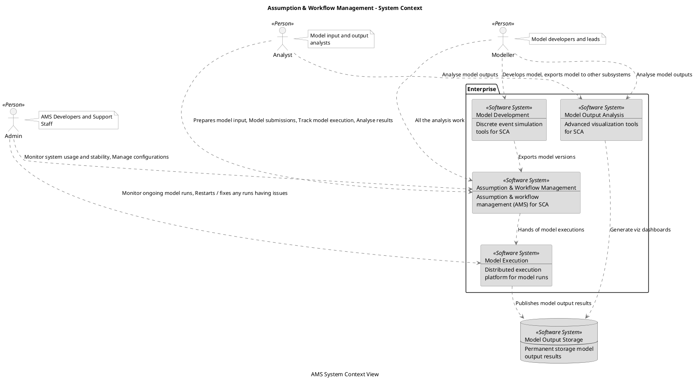
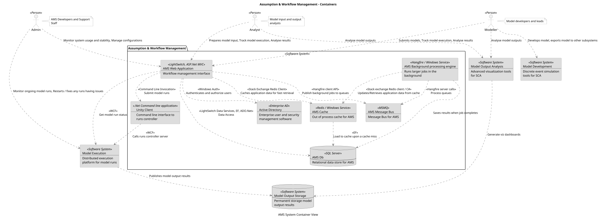
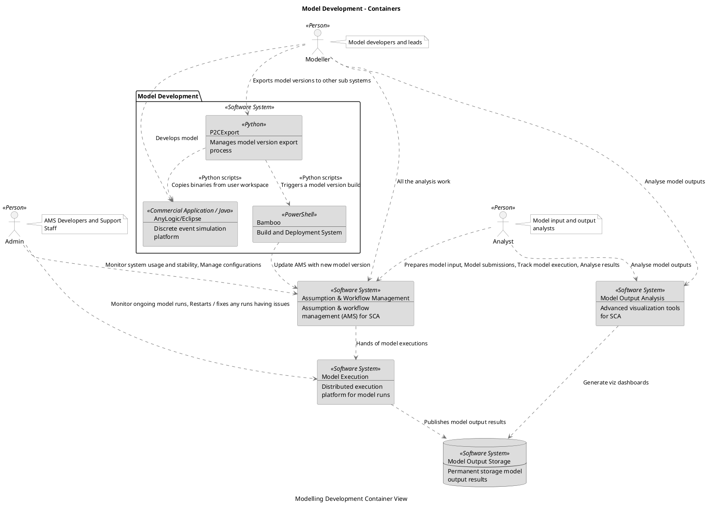
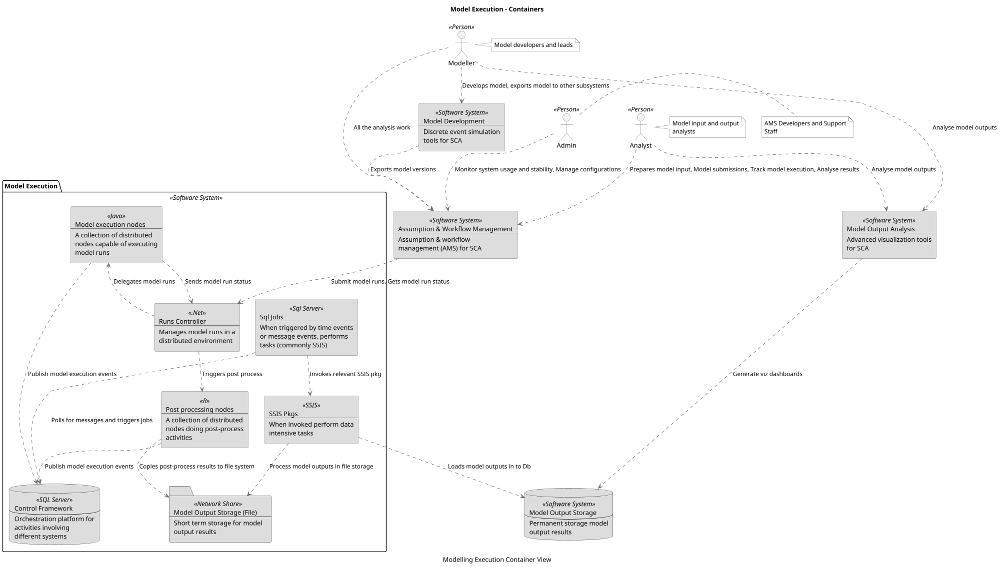
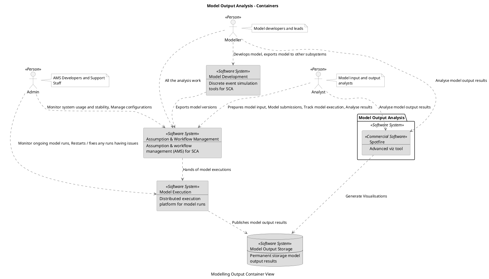

```
@startuml(id=Context)
scale max 2000x1413
title Assumption & Workflow Management - System Context
caption AMS System Context View

skinparam {
  shadowing false
  arrowColor #707070
  actorBorderColor #707070
  componentBorderColor #707070
  rectangleBorderColor #707070
  noteBackgroundColor #ffffff
  noteBorderColor #707070
}
actor "Admin" <<Person>> as 13 #f2f2f2
note right of 13
  AMS Developers and Support
  Staff
end note
actor "Analyst" <<Person>> as 10 #f2f2f2
note right of 10
  Model input and output
  analysts
end note
actor "Modeller" <<Person>> as 6 #f2f2f2
note right of 6
  Model developers and leads
end note
database 5 <<Software System>> #dddddd [
  Model Output Storage
  --
  Permanent storage model
  output results
]
package "Enterprise" {
  rectangle 1 <<Software System>> #dddddd [
    Assumption & Workflow Management
    --
    Assumption & workflow
    management (AMS) for SCA
  ]
  rectangle 4 <<Software System>> #dddddd [
    Model Development
    --
    Discrete event simulation
    tools for SCA
  ]
  rectangle 3 <<Software System>> #dddddd [
    Model Execution
    --
    Distributed execution
    platform for model runs
  ]
  rectangle 2 <<Software System>> #dddddd [
    Model Output Analysis
    --
    Advanced visualization tools
    for SCA
  ]
}
13 .[#707070].> 1 : Monitor system usage and stability, Manage configurations
13 .[#707070].> 3 : Monitor ongoing model runs, Restarts / fixes any runs having issues
10 .[#707070].> 1 : Prepares model input, Model submissions, Track model execution, Analyse results
10 .[#707070].> 2 : Analyse model outputs
1 .[#707070].> 3 : Hands of model executions
4 .[#707070].> 1 : Exports model versions
3 .[#707070].> 5 : Publishes model output results
2 .[#707070].> 5 : Generate viz dashboards
6 .[#707070].> 1 : All the analysis work
6 .[#707070].> 4 : Develops model, exports model to other subsystems
6 .[#707070].> 2 : Analyse model outputs
@enduml

```



--

```
@startuml(id=AMS_Container)
scale max 2000x1414
title Assumption & Workflow Management - Containers
caption AMS System Container View

skinparam {
  shadowing false
  arrowColor #707070
  actorBorderColor #707070
  componentBorderColor #707070
  rectangleBorderColor #707070
  noteBackgroundColor #ffffff
  noteBorderColor #707070
}
actor "Admin" <<Person>> as 13 #f2f2f2
note right of 13
  AMS Developers and Support
  Staff
end note
actor "Analyst" <<Person>> as 10 #f2f2f2
note right of 10
  Model input and output
  analysts
end note
rectangle 4 <<Software System>> #dddddd [
  Model Development
  --
  Discrete event simulation
  tools for SCA
]
rectangle 3 <<Software System>> #dddddd [
  Model Execution
  --
  Distributed execution
  platform for model runs
]
rectangle 2 <<Software System>> #dddddd [
  Model Output Analysis
  --
  Advanced visualization tools
  for SCA
]
database 5 <<Software System>> #dddddd [
  Model Output Storage
  --
  Permanent storage model
  output results
]
actor "Modeller" <<Person>> as 6 #f2f2f2
note right of 6
  Model developers and leads
end note
package "Assumption & Workflow Management" <<Software System>> {
  rectangle 24 <<Hangfire / Windows Service>> #dddddd [
    AMS Background processing engine
    --
    Runs larger jobs in the
    background
  ]
  rectangle 26 <<Redis / Windows Service>> #dddddd [
    AMS Cache
    --
    Out of process cache for AMS
  ]
  database 21 <<SQL Server>> #dddddd [
    AMS Db
    --
    Relational data store for AMS
  ]
  rectangle 23 <<MSMQ>> #dddddd [
    AMS Message Bus
    --
    Message Bus for AMS
  ]
  rectangle 20 <<LightSwitch, ASP.Net MVC>> #dddddd [
    AMS Web Application
    --
    Workflow management interface
  ]
  rectangle 22 <<Enterprise AD>> #dddddd [
    Active Directory
    --
    Enterprise user and security
    management software
  ]
  rectangle 25 <<.Net Command line application>> #dddddd [
    Unity Client
    --
    Command line interface to
    runs controller
  ]
}
24 .[#707070].> 26 : <<Stack exchange Redis client / C#>>\nUpdates/Retrieves application data from cache
24 .[#707070].> 21 : Saves results when job completes
24 .[#707070].> 23 : <<Hangfire server calls>>\nProcess queues
26 .[#707070].> 21 : <<EF>>\nLoad to cache upon a cache miss
20 .[#707070].> 26 : <<Stack Exchange Redis Client>>\nCaches application data for fast retrieval
20 .[#707070].> 21 : <<LightSwitch Data Services, EF, ADO.Net>>\nData Access
20 .[#707070].> 23 : <<Hangfire client API>>\nPublish background jobs to queues
20 .[#707070].> 22 : <<Windows Auth>>\nAuthenticates and authorize users
20 .[#707070].> 3 : <<WCF>>\nGet model run status
20 .[#707070].> 25 : <<Command Line Invocation>>\nSubmit model runs
13 .[#707070].> 20 : Monitor system usage and stability, Manage configurations
13 .[#707070].> 3 : Monitor ongoing model runs, Restarts / fixes any runs having issues
10 .[#707070].> 20 : Prepares model input, Track model execution, Analyse results
10 .[#707070].> 2 : Analyse model outputs
3 .[#707070].> 5 : Publishes model output results
2 .[#707070].> 5 : Generate viz dashboards
6 .[#707070].> 20 : Submits models, Track model execution, Analyse results
6 .[#707070].> 4 : Develops model, exports model to other subsystems
6 .[#707070].> 2 : Analyse model outputs
25 .[#707070].> 3 : <<WCF>>\nCalls runs controller server
@enduml

```



--

```
@startuml(id=Model_Platform_Container)
scale max 2000x1414
title Model Development - Containers
caption Modelling Development Container View

skinparam {
  shadowing false
  arrowColor #707070
  actorBorderColor #707070
  componentBorderColor #707070
  rectangleBorderColor #707070
  noteBackgroundColor #ffffff
  noteBorderColor #707070
}
actor "Admin" <<Person>> as 13 #f2f2f2
note right of 13
  AMS Developers and Support
  Staff
end note
actor "Analyst" <<Person>> as 10 #f2f2f2
note right of 10
  Model input and output
  analysts
end note
rectangle 1 <<Software System>> #dddddd [
  Assumption & Workflow Management
  --
  Assumption & workflow
  management (AMS) for SCA
]
rectangle 3 <<Software System>> #dddddd [
  Model Execution
  --
  Distributed execution
  platform for model runs
]
rectangle 2 <<Software System>> #dddddd [
  Model Output Analysis
  --
  Advanced visualization tools
  for SCA
]
database 5 <<Software System>> #dddddd [
  Model Output Storage
  --
  Permanent storage model
  output results
]
actor "Modeller" <<Person>> as 6 #f2f2f2
note right of 6
  Model developers and leads
end note
package "Model Development" <<Software System>> {
  rectangle 42 <<Commercial Application / Java>> #dddddd [
    AnyLogic/Eclipse
    --
    Discrete event simulation
    platform
  ]
  rectangle 43 <<PowerShell>> #dddddd [
    Bamboo
    --
    Build and Deployment System
  ]
  rectangle 41 <<Python>> #dddddd [
    P2CExport
    --
    Manages model version export
    process
  ]
}
13 .[#707070].> 1 : Monitor system usage and stability, Manage configurations
13 .[#707070].> 3 : Monitor ongoing model runs, Restarts / fixes any runs having issues
10 .[#707070].> 1 : Prepares model input, Model submissions, Track model execution, Analyse results
10 .[#707070].> 2 : Analyse model outputs
1 .[#707070].> 3 : Hands of model executions
43 .[#707070].> 1 : Update AMS with new model version
3 .[#707070].> 5 : Publishes model output results
2 .[#707070].> 5 : Generate viz dashboards
6 .[#707070].> 42 : Develops model
6 .[#707070].> 1 : All the analysis work
6 .[#707070].> 2 : Analyse model outputs
6 .[#707070].> 41 : Exports model versions to other sub systems
41 .[#707070].> 42 : <<Python scripts>>\nCopies binaries from user workspace
41 .[#707070].> 43 : <<Python scripts>>\nTriggers a model version build
@enduml

```



--

```
@startuml(id=Model_Execution_Container)
scale max 2000x1414
title Model Execution - Containers
caption Modelling Execution Container View

skinparam {
  shadowing false
  arrowColor #707070
  actorBorderColor #707070
  componentBorderColor #707070
  rectangleBorderColor #707070
  noteBackgroundColor #ffffff
  noteBorderColor #707070
}
actor "Admin" <<Person>> as 13 #f2f2f2
note right of 13
  AMS Developers and Support
  Staff
end note
actor "Analyst" <<Person>> as 10 #f2f2f2
note right of 10
  Model input and output
  analysts
end note
rectangle 1 <<Software System>> #dddddd [
  Assumption & Workflow Management
  --
  Assumption & workflow
  management (AMS) for SCA
]
rectangle 4 <<Software System>> #dddddd [
  Model Development
  --
  Discrete event simulation
  tools for SCA
]
rectangle 2 <<Software System>> #dddddd [
  Model Output Analysis
  --
  Advanced visualization tools
  for SCA
]
database 5 <<Software System>> #dddddd [
  Model Output Storage
  --
  Permanent storage model
  output results
]
actor "Modeller" <<Person>> as 6 #f2f2f2
note right of 6
  Model developers and leads
end note
package "Model Execution" <<Software System>> {
  database 51 <<SQL Server>> #dddddd [
    Control Framework
    --
    Orchestration platform for
    activities involving
    different systems
  ]
  folder 54 <<Network Share>> #dddddd [
    Model Output Storage (File)
    --
    Short term storage for model
    output results
  ]
  rectangle 52 <<Java>> #dddddd [
    Model execution nodes
    --
    A collection of distributed
    nodes capable of executing
    model runs
  ]
  rectangle 53 <<R>> #dddddd [
    Post processing nodes
    --
    A collection of distributed
    nodes doing post-process
    activities
  ]
  rectangle 50 <<.Net>> #dddddd [
    Runs Controller
    --
    Manages model runs in a
    distributed environment
  ]
  rectangle 56 <<SSIS>> #dddddd [
    SSIS Pkgs
    --
    When invoked perform data
    intensive tasks
  ]
  rectangle 55 <<Sql Server>> #dddddd [
    Sql Jobs
    --
    When triggered by time events
    or message events, performs
    tasks (commonly SSIS)
  ]
}
13 .[#707070].> 1 : Monitor system usage and stability, Manage configurations
10 .[#707070].> 1 : Prepares model input, Model submissions, Track model execution, Analyse results
10 .[#707070].> 2 : Analyse model outputs
1 .[#707070].> 50 : Submit model runs, Gets model run status
4 .[#707070].> 1 : Exports model versions
2 .[#707070].> 5 : Generate viz dashboards
52 .[#707070].> 51 : Publish model execution events
52 .[#707070].> 50 : Sends model run status
6 .[#707070].> 1 : All the analysis work
6 .[#707070].> 4 : Develops model, exports model to other subsystems
6 .[#707070].> 2 : Analyse model outputs
53 .[#707070].> 51 : Publish model execution events
53 .[#707070].> 54 : Copies post-process results to file system
50 .[#707070].> 52 : Delegates model runs
50 .[#707070].> 53 : Triggers post process
56 .[#707070].> 5 : Loads model outputs in to Db
56 .[#707070].> 54 : Process model outputs in file storage
55 .[#707070].> 51 : Polls for messages and triggers jobs
55 .[#707070].> 56 : Invokes relevant SSIS pkg
@enduml

```



--

```
@startuml(id=Model_Output_Analysis_Container)
scale max 2000x1413
title Model Output Analysis - Containers
caption Modelling Output Container View

skinparam {
  shadowing false
  arrowColor #707070
  actorBorderColor #707070
  componentBorderColor #707070
  rectangleBorderColor #707070
  noteBackgroundColor #ffffff
  noteBorderColor #707070
}
actor "Admin" <<Person>> as 13 #f2f2f2
note right of 13
  AMS Developers and Support
  Staff
end note
actor "Analyst" <<Person>> as 10 #f2f2f2
note right of 10
  Model input and output
  analysts
end note
rectangle 1 <<Software System>> #dddddd [
  Assumption & Workflow Management
  --
  Assumption & workflow
  management (AMS) for SCA
]
rectangle 4 <<Software System>> #dddddd [
  Model Development
  --
  Discrete event simulation
  tools for SCA
]
rectangle 3 <<Software System>> #dddddd [
  Model Execution
  --
  Distributed execution
  platform for model runs
]
database 5 <<Software System>> #dddddd [
  Model Output Storage
  --
  Permanent storage model
  output results
]
actor "Modeller" <<Person>> as 6 #f2f2f2
note right of 6
  Model developers and leads
end note
package "Model Output Analysis" <<Software System>> {
  rectangle 68 <<Commercial Software>> #dddddd [
    Spotfire
    --
    Advanced viz tool
  ]
}
13 .[#707070].> 1 : Monitor system usage and stability, Manage configurations
13 .[#707070].> 3 : Monitor ongoing model runs, Restarts / fixes any runs having issues
10 .[#707070].> 1 : Prepares model input, Model submissions, Track model execution, Analyse results
10 .[#707070].> 68 : Analyse model output results
1 .[#707070].> 3 : Hands of model executions
4 .[#707070].> 1 : Exports model versions
3 .[#707070].> 5 : Publishes model output results
6 .[#707070].> 1 : All the analysis work
6 .[#707070].> 4 : Develops model, exports model to other subsystems
6 .[#707070].> 68 : Analyse model output results
68 .[#707070].> 5 : Generate Visualisations
@enduml

```



--
