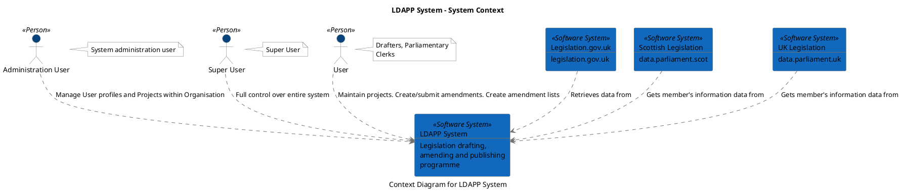
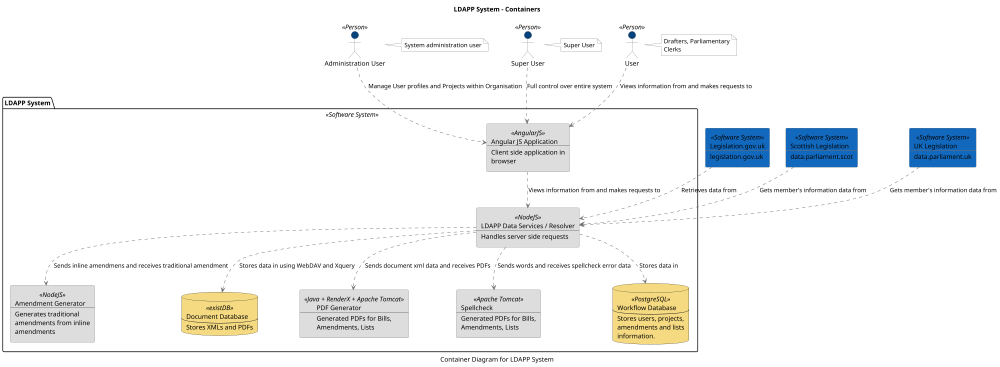
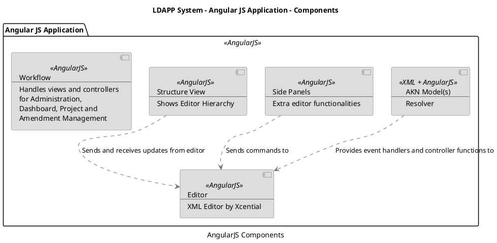
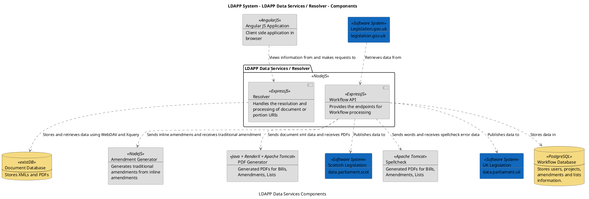

```
@startuml(id=Context)
scale max 2000x1545
title LDAPP System - System Context
caption Context Diagram for LDAPP System

skinparam {
  shadowing false
  arrowColor #707070
  actorBorderColor #707070
  componentBorderColor #707070
  rectangleBorderColor #707070
  noteBackgroundColor #ffffff
  noteBorderColor #707070
}
actor "Administration User" <<Person>> as 4 #08427b
note right of 4
  System administration user
end note
actor "Super User" <<Person>> as 6 #08427b
note right of 6
  Super User
end note
actor "User" <<Person>> as 2 #08427b
note right of 2
  Drafters, Parliamentary
  Clerks
end note
rectangle 1 <<Software System>> #1168bd [
  LDAPP System
  --
  Legislation drafting,
  amending and publishing
  programme
]
rectangle 8 <<Software System>> #1168bd [
  Legislation.gov.uk
  --
  legislation.gov.uk
]
rectangle 10 <<Software System>> #1168bd [
  Scottish Legislation
  --
  data.parliament.scot
]
rectangle 12 <<Software System>> #1168bd [
  UK Legislation
  --
  data.parliament.uk
]
4 .[#707070].> 1 : Manage User profiles and Projects within Organisation
8 .[#707070].> 1 : Retrieves data from
10 .[#707070].> 1 : Gets member's information data from
6 .[#707070].> 1 : Full control over entire system
12 .[#707070].> 1 : Gets member's information data from
2 .[#707070].> 1 : Maintain projects. Create/submit amendments. Create amendment lists
@enduml

```



--

```
@startuml(id=Containers)
scale max 2000x1545
title LDAPP System - Containers
caption Container Diagram for LDAPP System

skinparam {
  shadowing false
  arrowColor #707070
  actorBorderColor #707070
  componentBorderColor #707070
  rectangleBorderColor #707070
  noteBackgroundColor #ffffff
  noteBorderColor #707070
}
actor "Administration User" <<Person>> as 4 #08427b
note right of 4
  System administration user
end note
rectangle 8 <<Software System>> #1168bd [
  Legislation.gov.uk
  --
  legislation.gov.uk
]
rectangle 10 <<Software System>> #1168bd [
  Scottish Legislation
  --
  data.parliament.scot
]
actor "Super User" <<Person>> as 6 #08427b
note right of 6
  Super User
end note
rectangle 12 <<Software System>> #1168bd [
  UK Legislation
  --
  data.parliament.uk
]
actor "User" <<Person>> as 2 #08427b
note right of 2
  Drafters, Parliamentary
  Clerks
end note
package "LDAPP System" <<Software System>> {
  rectangle 23 <<NodeJS>> #dddddd [
    Amendment Generator
    --
    Generates traditional
    amendments from inline
    amendments
  ]
  rectangle 18 <<AngularJS>> #dddddd [
    Angular JS Application
    --
    Client side application in
    browser
  ]
  database 31 <<existDB>> #f5da81 [
    Document Database
    --
    Stores XMLs and PDFs
  ]
  rectangle 14 <<NodeJS>> #dddddd [
    LDAPP Data Services / Resolver
    --
    Handles server side requests
  ]
  rectangle 25 <<Java + RenderX + Apache Tomcat>> #dddddd [
    PDF Generator
    --
    Generated PDFs for Bills,
    Amendments, Lists
  ]
  rectangle 27 <<Apache Tomcat>> #dddddd [
    Spellcheck
    --
    Generated PDFs for Bills,
    Amendments, Lists
  ]
  database 29 <<PostgreSQL>> #f5da81 [
    Workflow Database
    --
    Stores users, projects,
    amendments and lists
    information.
  ]
}
4 .[#707070].> 18 : Manage User profiles and Projects within Organisation
18 .[#707070].> 14 : Views information from and makes requests to
14 .[#707070].> 23 : Sends inline amendmens and receives traditional amendment
14 .[#707070].> 31 : Stores data in using WebDAV and Xquery
14 .[#707070].> 25 : Sends document xml data and receives PDFs
14 .[#707070].> 27 : Sends words and receives spellcheck error data
14 .[#707070].> 29 : Stores data in
8 .[#707070].> 14 : Retrieves data from
10 .[#707070].> 14 : Gets member's information data from
6 .[#707070].> 18 : Full control over entire system
12 .[#707070].> 14 : Gets member's information data from
2 .[#707070].> 18 : Views information from and makes requests to
@enduml

```



--

```
@startuml(id=Angular)
scale max 2000x1545
title LDAPP System - Angular JS Application - Components
caption AngularJS Components

skinparam {
  shadowing false
  arrowColor #707070
  actorBorderColor #707070
  componentBorderColor #707070
  rectangleBorderColor #707070
  noteBackgroundColor #ffffff
  noteBorderColor #707070
}
package "Angular JS Application" <<AngularJS>> {
  component 48 <<XML + AngularJS>> #dddddd [
    AKN Model(s)
    --
    Resolver
  ]
  component 45 <<AngularJS>> #dddddd [
    Editor
    --
    XML Editor by Xcential
  ]
  component 47 <<AngularJS>> #dddddd [
    Side Panels
    --
    Extra editor functionalities
  ]
  component 46 <<AngularJS>> #dddddd [
    Structure View
    --
    Shows Editor Hierarchy
  ]
  component 44 <<AngularJS>> #dddddd [
    Workflow
    --
    Handles views and controllers
    for Administration,
    Dashboard, Project and
    Amendment Management
  ]
}
48 .[#707070].> 45 : Provides event handlers and controller functions to
47 .[#707070].> 45 : Sends commands to
46 .[#707070].> 45 : Sends and receives updates from editor
@enduml

```



--

```
@startuml(id=LDAPP_Data_Services)
scale max 2000x1545
title LDAPP System - LDAPP Data Services / Resolver - Components
caption LDAPP Data Services Components

skinparam {
  shadowing false
  arrowColor #707070
  actorBorderColor #707070
  componentBorderColor #707070
  rectangleBorderColor #707070
  noteBackgroundColor #ffffff
  noteBorderColor #707070
}
rectangle 23 <<NodeJS>> #dddddd [
  Amendment Generator
  --
  Generates traditional
  amendments from inline
  amendments
]
rectangle 18 <<AngularJS>> #dddddd [
  Angular JS Application
  --
  Client side application in
  browser
]
database 31 <<existDB>> #f5da81 [
  Document Database
  --
  Stores XMLs and PDFs
]
rectangle 8 <<Software System>> #1168bd [
  Legislation.gov.uk
  --
  legislation.gov.uk
]
rectangle 25 <<Java + RenderX + Apache Tomcat>> #dddddd [
  PDF Generator
  --
  Generated PDFs for Bills,
  Amendments, Lists
]
rectangle 10 <<Software System>> #1168bd [
  Scottish Legislation
  --
  data.parliament.scot
]
rectangle 27 <<Apache Tomcat>> #dddddd [
  Spellcheck
  --
  Generated PDFs for Bills,
  Amendments, Lists
]
rectangle 12 <<Software System>> #1168bd [
  UK Legislation
  --
  data.parliament.uk
]
database 29 <<PostgreSQL>> #f5da81 [
  Workflow Database
  --
  Stores users, projects,
  amendments and lists
  information.
]
package "LDAPP Data Services / Resolver" <<NodeJS>> {
  component 41 <<ExpressJS>> #dddddd [
    Resolver
    --
    Handles the resolution and
    processing of document or
    portion URIs
  ]
  component 33 <<ExpressJS>> #dddddd [
    Workflow API
    --
    Provides the endpoints for
    Workflow processing
  ]
}
18 .[#707070].> 41 : Views information from and makes requests to
8 .[#707070].> 33 : Retrieves data from
41 .[#707070].> 31 : Stores and retrieves data using WebDAV and Xquery
33 .[#707070].> 23 : Sends inline amendmens and receives traditional amendment
33 .[#707070].> 25 : Sends document xml data and receives PDFs
33 .[#707070].> 10 : Publishes data to
33 .[#707070].> 27 : Sends words and receives spellcheck error data
33 .[#707070].> 12 : Publishes data to
33 .[#707070].> 29 : Stores data in
@enduml

```



