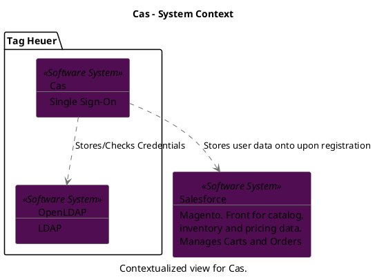
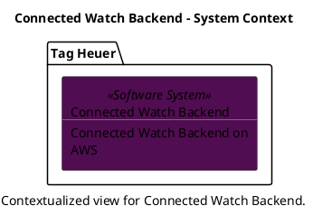
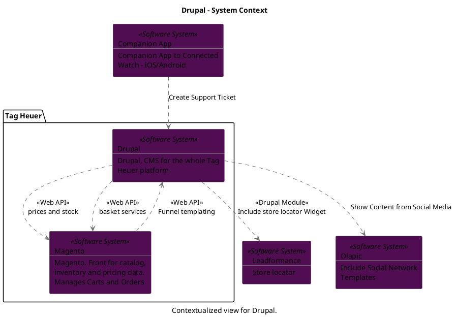
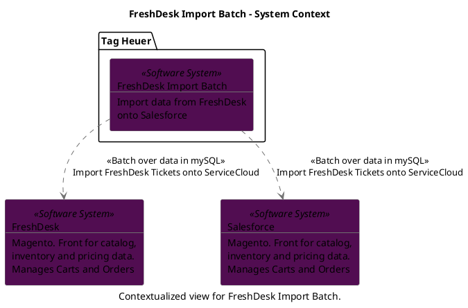
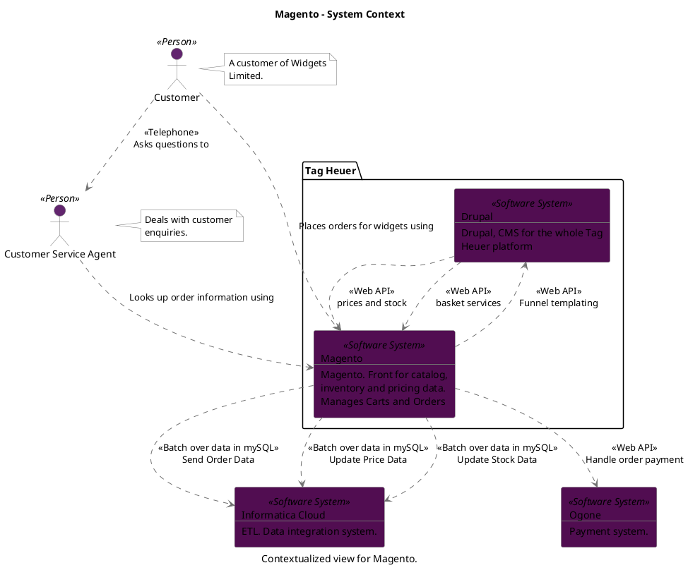
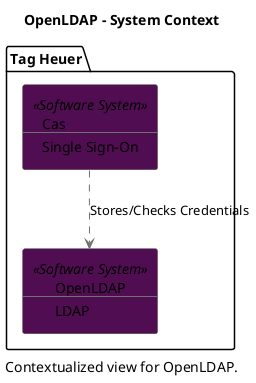
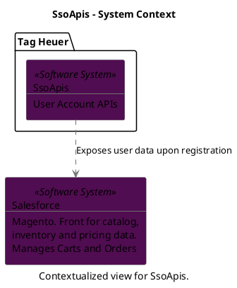

```plantuml
@startuml(id=tagHeuerContext)
scale max 2000x1414
title System Landscape for Tag Heuer
caption Tag Heuer Online Platform.

skinparam {
  shadowing false
  arrowColor #707070
  actorBorderColor #707070
  componentBorderColor #707070
  rectangleBorderColor #707070
  noteBackgroundColor #ffffff
  noteBorderColor #707070
}
actor "Connected Watch wearer" <<Person>> as 19 #62256e
note right of 19
  A customer of Connected
  Watch.
end note
actor "Customer" <<Person>> as 59 #62256e
note right of 59
  A customer of Widgets
  Limited.
end note
actor "Customer Service Agent" <<Person>> as 60 #62256e
note right of 60
  Deals with customer
  enquiries.
end note
rectangle 16 <<Software System>> #510d51 [
  Companion App
  --
  Companion App to Connected
  Watch - iOS/Android
]
rectangle 15 <<Software System>> #510d51 [
  Connected Watch
  --
  Connected Watch - Android
  Wear
]
rectangle 9 <<Software System>> #510d51 [
  FreshDesk
  --
  Magento. Front for catalog,
  inventory and pricing data.
  Manages Carts and Orders
]
rectangle 27 <<Software System>> #510d51 [
  Informatica Cloud
  --
  ETL. Data integration system.
]
rectangle 37 <<Software System>> #510d51 [
  Leadformance
  --
  Store locator
]
rectangle 58 <<Software System>> #510d51 [
  NewRelic
  --
  NewRelic, APM for the whole
  Tag Heuer platform
]
rectangle 3 <<Software System>> #510d51 [
  Ogone
  --
  Payment system.
]
rectangle 39 <<Software System>> #510d51 [
  Olapic
  --
  Include Social Network
  Templates
]
rectangle 26 <<Software System>> #510d51 [
  SAP
  --
  Fullfillment System.
]
rectangle 4 <<Software System>> #510d51 [
  Salesforce
  --
  Magento. Front for catalog,
  inventory and pricing data.
  Manages Carts and Orders
]
rectangle 42 <<Software System>> #510d51 [
  facebook
  --
  facebook
]
rectangle 44 <<Software System>> #510d51 [
  instagram
  --
  instagram
]
rectangle 40 <<Software System>> #510d51 [
  twitter
  --
  twitter
]
package "Tag Heuer" {
  rectangle 13 <<Software System>> #510d51 [
    Cas
    --
    Single Sign-On
  ]
  rectangle 22 <<Software System>> #510d51 [
    Connected Watch Backend
    --
    Connected Watch Backend on
    AWS
  ]
  rectangle 1 <<Software System>> #510d51 [
    Drupal
    --
    Drupal, CMS for the whole Tag
    Heuer platform
  ]
  rectangle 10 <<Software System>> #510d51 [
    FreshDesk Import Batch
    --
    Import data from FreshDesk
    onto Salesforce
  ]
  rectangle 2 <<Software System>> #510d51 [
    Magento
    --
    Magento. Front for catalog,
    inventory and pricing data.
    Manages Carts and Orders
  ]
  rectangle 54 <<Software System>> #510d51 [
    OpenLDAP
    --
    LDAP
  ]
  rectangle 14 <<Software System>> #510d51 [
    SsoApis
    --
    User Account APIs
  ]
}
13 .[#707070].> 54 : Stores/Checks Credentials
13 .[#707070].> 4 : Stores user data onto upon registration
16 .[#707070].> 15 : Pairing, registration
16 .[#707070].> 1 : Create Support Ticket
19 .[#707070].> 16 : Configures/Pairs Connected Watch
19 .[#707070].> 15 : Wears connected watch
15 .[#707070].> 16 : Pairing, registration
60 .[#707070].> 2 : Looks up order information using
60 .[#707070].> 4 : Looks up order information using
59 .[#707070].> 60 : <<Telephone>>\nAsks questions to
59 .[#707070].> 2 : Places orders for widgets using
1 .[#707070].> 37 : <<Drupal Module>>\nInclude store locator Widget
1 .[#707070].> 2 : <<Web API>>\nprices and stock
1 .[#707070].> 2 : <<Web API>>\nbasket services
1 .[#707070].> 39 : Show Content from Social Media
10 .[#707070].> 9 : <<Batch over data in mySQL>>\nImport FreshDesk Tickets onto ServiceCloud
10 .[#707070].> 4 : <<Batch over data in mySQL>>\nImport FreshDesk Tickets onto ServiceCloud
27 .[#707070].> 26 : Transfers data to and from in batches.
2 .[#707070].> 1 : <<Web API>>\nFunnel templating
2 .[#707070].> 27 : <<Batch over data in mySQL>>\nSend Order Data
2 .[#707070].> 27 : <<Batch over data in mySQL>>\nUpdate Price Data
2 .[#707070].> 27 : <<Batch over data in mySQL>>\nUpdate Stock Data
2 .[#707070].> 3 : <<Web API>>\nHandle order payment
39 .[#707070].> 42 : Aggregates image from
39 .[#707070].> 44 : Aggregates image from
39 .[#707070].> 40 : Aggregates image from
14 .[#707070].> 4 : Exposes user data upon registration
@enduml

```

```
@startuml(id=tagHeuerContext)
scale max 2000x1414
title System Landscape for Tag Heuer
caption Tag Heuer Online Platform.

skinparam {
  shadowing false
  arrowColor #707070
  actorBorderColor #707070
  componentBorderColor #707070
  rectangleBorderColor #707070
  noteBackgroundColor #ffffff
  noteBorderColor #707070
}
actor "Connected Watch wearer" <<Person>> as 19 #62256e
note right of 19
  A customer of Connected
  Watch.
end note
actor "Customer" <<Person>> as 59 #62256e
note right of 59
  A customer of Widgets
  Limited.
end note
actor "Customer Service Agent" <<Person>> as 60 #62256e
note right of 60
  Deals with customer
  enquiries.
end note
rectangle 16 <<Software System>> #510d51 [
  Companion App
  --
  Companion App to Connected
  Watch - iOS/Android
]
rectangle 15 <<Software System>> #510d51 [
  Connected Watch
  --
  Connected Watch - Android
  Wear
]
rectangle 9 <<Software System>> #510d51 [
  FreshDesk
  --
  Magento. Front for catalog,
  inventory and pricing data.
  Manages Carts and Orders
]
rectangle 27 <<Software System>> #510d51 [
  Informatica Cloud
  --
  ETL. Data integration system.
]
rectangle 37 <<Software System>> #510d51 [
  Leadformance
  --
  Store locator
]
rectangle 58 <<Software System>> #510d51 [
  NewRelic
  --
  NewRelic, APM for the whole
  Tag Heuer platform
]
rectangle 3 <<Software System>> #510d51 [
  Ogone
  --
  Payment system.
]
rectangle 39 <<Software System>> #510d51 [
  Olapic
  --
  Include Social Network
  Templates
]
rectangle 26 <<Software System>> #510d51 [
  SAP
  --
  Fullfillment System.
]
rectangle 4 <<Software System>> #510d51 [
  Salesforce
  --
  Magento. Front for catalog,
  inventory and pricing data.
  Manages Carts and Orders
]
rectangle 42 <<Software System>> #510d51 [
  facebook
  --
  facebook
]
rectangle 44 <<Software System>> #510d51 [
  instagram
  --
  instagram
]
rectangle 40 <<Software System>> #510d51 [
  twitter
  --
  twitter
]
package "Tag Heuer" {
  rectangle 13 <<Software System>> #510d51 [
    Cas
    --
    Single Sign-On
  ]
  rectangle 22 <<Software System>> #510d51 [
    Connected Watch Backend
    --
    Connected Watch Backend on
    AWS
  ]
  rectangle 1 <<Software System>> #510d51 [
    Drupal
    --
    Drupal, CMS for the whole Tag
    Heuer platform
  ]
  rectangle 10 <<Software System>> #510d51 [
    FreshDesk Import Batch
    --
    Import data from FreshDesk
    onto Salesforce
  ]
  rectangle 2 <<Software System>> #510d51 [
    Magento
    --
    Magento. Front for catalog,
    inventory and pricing data.
    Manages Carts and Orders
  ]
  rectangle 54 <<Software System>> #510d51 [
    OpenLDAP
    --
    LDAP
  ]
  rectangle 14 <<Software System>> #510d51 [
    SsoApis
    --
    User Account APIs
  ]
}
13 .[#707070].> 54 : Stores/Checks Credentials
13 .[#707070].> 4 : Stores user data onto upon registration
16 .[#707070].> 15 : Pairing, registration
16 .[#707070].> 1 : Create Support Ticket
19 .[#707070].> 16 : Configures/Pairs Connected Watch
19 .[#707070].> 15 : Wears connected watch
15 .[#707070].> 16 : Pairing, registration
60 .[#707070].> 2 : Looks up order information using
60 .[#707070].> 4 : Looks up order information using
59 .[#707070].> 60 : <<Telephone>>\nAsks questions to
59 .[#707070].> 2 : Places orders for widgets using
1 .[#707070].> 37 : <<Drupal Module>>\nInclude store locator Widget
1 .[#707070].> 2 : <<Web API>>\nprices and stock
1 .[#707070].> 2 : <<Web API>>\nbasket services
1 .[#707070].> 39 : Show Content from Social Media
10 .[#707070].> 9 : <<Batch over data in mySQL>>\nImport FreshDesk Tickets onto ServiceCloud
10 .[#707070].> 4 : <<Batch over data in mySQL>>\nImport FreshDesk Tickets onto ServiceCloud
27 .[#707070].> 26 : Transfers data to and from in batches.
2 .[#707070].> 1 : <<Web API>>\nFunnel templating
2 .[#707070].> 27 : <<Batch over data in mySQL>>\nSend Order Data
2 .[#707070].> 27 : <<Batch over data in mySQL>>\nUpdate Price Data
2 .[#707070].> 27 : <<Batch over data in mySQL>>\nUpdate Stock Data
2 .[#707070].> 3 : <<Web API>>\nHandle order payment
39 .[#707070].> 42 : Aggregates image from
39 .[#707070].> 44 : Aggregates image from
39 .[#707070].> 40 : Aggregates image from
14 .[#707070].> 4 : Exposes user data upon registration
@enduml

```



--

```
@startuml(id=CasContext)
scale max 1413x2000
title Cas - System Context
caption Contextualized view for Cas.

skinparam {
  shadowing false
  arrowColor #707070
  actorBorderColor #707070
  componentBorderColor #707070
  rectangleBorderColor #707070
  noteBackgroundColor #ffffff
  noteBorderColor #707070
}
rectangle 4 <<Software System>> #510d51 [
  Salesforce
  --
  Magento. Front for catalog,
  inventory and pricing data.
  Manages Carts and Orders
]
package "Tag Heuer" {
  rectangle 13 <<Software System>> #510d51 [
    Cas
    --
    Single Sign-On
  ]
  rectangle 54 <<Software System>> #510d51 [
    OpenLDAP
    --
    LDAP
  ]
}
13 .[#707070].> 54 : Stores/Checks Credentials
13 .[#707070].> 4 : Stores user data onto upon registration
@enduml

```



--

```
@startuml(id=Connected_Watch_BackendContext)
scale max 1413x2000
title Connected Watch Backend - System Context
caption Contextualized view for Connected Watch Backend.

skinparam {
  shadowing false
  arrowColor #707070
  actorBorderColor #707070
  componentBorderColor #707070
  rectangleBorderColor #707070
  noteBackgroundColor #ffffff
  noteBorderColor #707070
}
package "Tag Heuer" {
  rectangle 22 <<Software System>> #510d51 [
    Connected Watch Backend
    --
    Connected Watch Backend on
    AWS
  ]
}
@enduml

```



--

```
@startuml(id=DrupalContext)
scale max 1413x2000
title Drupal - System Context
caption Contextualized view for Drupal.

skinparam {
  shadowing false
  arrowColor #707070
  actorBorderColor #707070
  componentBorderColor #707070
  rectangleBorderColor #707070
  noteBackgroundColor #ffffff
  noteBorderColor #707070
}
rectangle 16 <<Software System>> #510d51 [
  Companion App
  --
  Companion App to Connected
  Watch - iOS/Android
]
rectangle 37 <<Software System>> #510d51 [
  Leadformance
  --
  Store locator
]
rectangle 39 <<Software System>> #510d51 [
  Olapic
  --
  Include Social Network
  Templates
]
package "Tag Heuer" {
  rectangle 1 <<Software System>> #510d51 [
    Drupal
    --
    Drupal, CMS for the whole Tag
    Heuer platform
  ]
  rectangle 2 <<Software System>> #510d51 [
    Magento
    --
    Magento. Front for catalog,
    inventory and pricing data.
    Manages Carts and Orders
  ]
}
16 .[#707070].> 1 : Create Support Ticket
1 .[#707070].> 37 : <<Drupal Module>>\nInclude store locator Widget
1 .[#707070].> 2 : <<Web API>>\nprices and stock
1 .[#707070].> 2 : <<Web API>>\nbasket services
1 .[#707070].> 39 : Show Content from Social Media
2 .[#707070].> 1 : <<Web API>>\nFunnel templating
@enduml

```



--

```
@startuml(id=FreshDesk_Import_BatchContext)
scale max 1413x2000
title FreshDesk Import Batch - System Context
caption Contextualized view for FreshDesk Import Batch.

skinparam {
  shadowing false
  arrowColor #707070
  actorBorderColor #707070
  componentBorderColor #707070
  rectangleBorderColor #707070
  noteBackgroundColor #ffffff
  noteBorderColor #707070
}
rectangle 9 <<Software System>> #510d51 [
  FreshDesk
  --
  Magento. Front for catalog,
  inventory and pricing data.
  Manages Carts and Orders
]
rectangle 4 <<Software System>> #510d51 [
  Salesforce
  --
  Magento. Front for catalog,
  inventory and pricing data.
  Manages Carts and Orders
]
package "Tag Heuer" {
  rectangle 10 <<Software System>> #510d51 [
    FreshDesk Import Batch
    --
    Import data from FreshDesk
    onto Salesforce
  ]
}
10 .[#707070].> 9 : <<Batch over data in mySQL>>\nImport FreshDesk Tickets onto ServiceCloud
10 .[#707070].> 4 : <<Batch over data in mySQL>>\nImport FreshDesk Tickets onto ServiceCloud
@enduml

```



--

```
@startuml(id=MagentoContext)
scale max 1413x2000
title Magento - System Context
caption Contextualized view for Magento.

skinparam {
  shadowing false
  arrowColor #707070
  actorBorderColor #707070
  componentBorderColor #707070
  rectangleBorderColor #707070
  noteBackgroundColor #ffffff
  noteBorderColor #707070
}
actor "Customer" <<Person>> as 59 #62256e
note right of 59
  A customer of Widgets
  Limited.
end note
actor "Customer Service Agent" <<Person>> as 60 #62256e
note right of 60
  Deals with customer
  enquiries.
end note
rectangle 27 <<Software System>> #510d51 [
  Informatica Cloud
  --
  ETL. Data integration system.
]
rectangle 3 <<Software System>> #510d51 [
  Ogone
  --
  Payment system.
]
package "Tag Heuer" {
  rectangle 1 <<Software System>> #510d51 [
    Drupal
    --
    Drupal, CMS for the whole Tag
    Heuer platform
  ]
  rectangle 2 <<Software System>> #510d51 [
    Magento
    --
    Magento. Front for catalog,
    inventory and pricing data.
    Manages Carts and Orders
  ]
}
60 .[#707070].> 2 : Looks up order information using
59 .[#707070].> 60 : <<Telephone>>\nAsks questions to
59 .[#707070].> 2 : Places orders for widgets using
1 .[#707070].> 2 : <<Web API>>\nprices and stock
1 .[#707070].> 2 : <<Web API>>\nbasket services
2 .[#707070].> 1 : <<Web API>>\nFunnel templating
2 .[#707070].> 27 : <<Batch over data in mySQL>>\nSend Order Data
2 .[#707070].> 27 : <<Batch over data in mySQL>>\nUpdate Price Data
2 .[#707070].> 27 : <<Batch over data in mySQL>>\nUpdate Stock Data
2 .[#707070].> 3 : <<Web API>>\nHandle order payment
@enduml

```



--

```
@startuml(id=OpenLDAPContext)
scale max 1413x2000
title OpenLDAP - System Context
caption Contextualized view for OpenLDAP.

skinparam {
  shadowing false
  arrowColor #707070
  actorBorderColor #707070
  componentBorderColor #707070
  rectangleBorderColor #707070
  noteBackgroundColor #ffffff
  noteBorderColor #707070
}
package "Tag Heuer" {
  rectangle 13 <<Software System>> #510d51 [
    Cas
    --
    Single Sign-On
  ]
  rectangle 54 <<Software System>> #510d51 [
    OpenLDAP
    --
    LDAP
  ]
}
13 .[#707070].> 54 : Stores/Checks Credentials
@enduml

```



--

```
@startuml(id=SsoApisContext)
scale max 1413x2000
title SsoApis - System Context
caption Contextualized view for SsoApis.

skinparam {
  shadowing false
  arrowColor #707070
  actorBorderColor #707070
  componentBorderColor #707070
  rectangleBorderColor #707070
  noteBackgroundColor #ffffff
  noteBorderColor #707070
}
rectangle 4 <<Software System>> #510d51 [
  Salesforce
  --
  Magento. Front for catalog,
  inventory and pricing data.
  Manages Carts and Orders
]
package "Tag Heuer" {
  rectangle 14 <<Software System>> #510d51 [
    SsoApis
    --
    User Account APIs
  ]
}
14 .[#707070].> 4 : Exposes user data upon registration
@enduml

```


