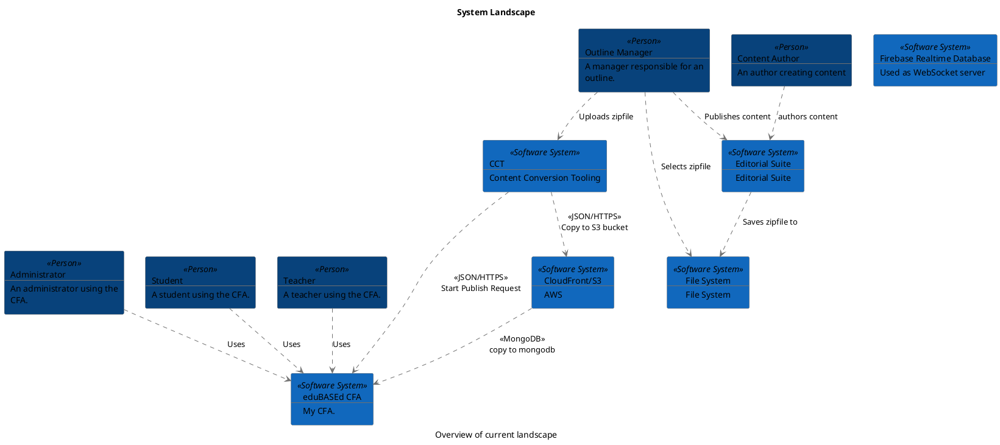
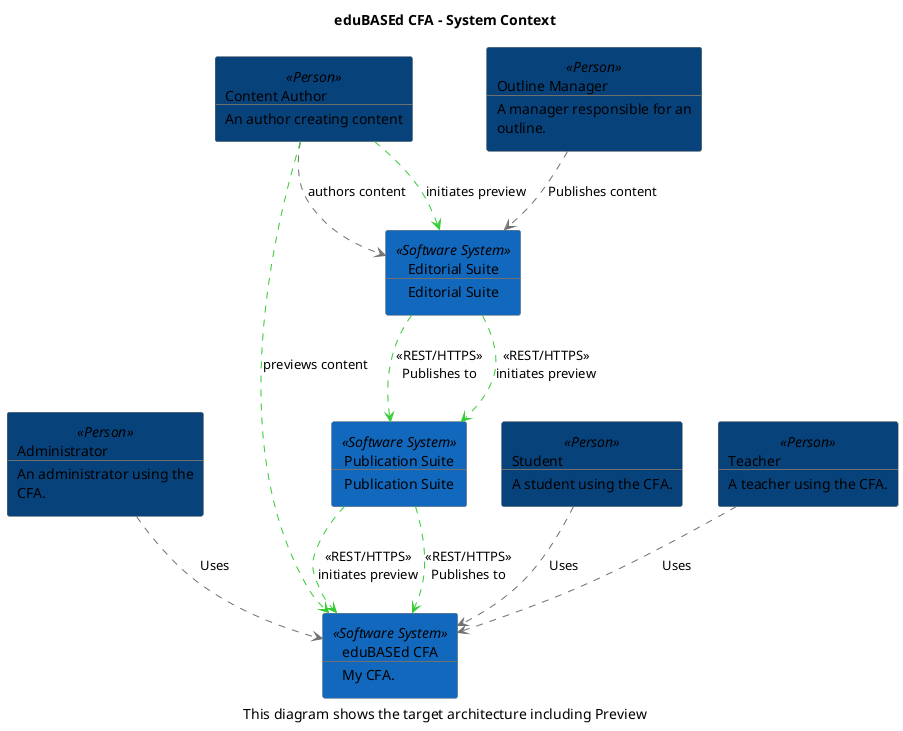
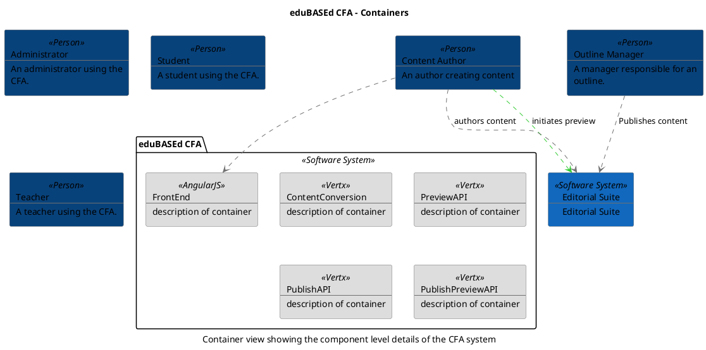
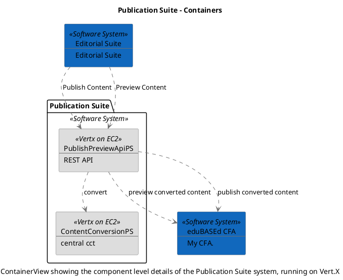
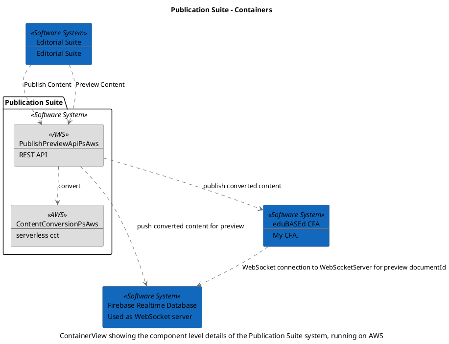

```
@startuml(id=currentEnterpriseContext)
scale max 2000x1409
title System Landscape
caption Overview of current landscape

skinparam {
  shadowing false
  arrowColor #707070
  actorBorderColor #707070
  componentBorderColor #707070
  rectangleBorderColor #707070
  noteBackgroundColor #ffffff
  noteBorderColor #707070
}
rectangle 3 <<Person>> #08427b [
  Administrator
  --
  An administrator using the
  CFA.
]
rectangle 4 <<Person>> #08427b [
  Content Author
  --
  An author creating content
]
rectangle 5 <<Person>> #08427b [
  Outline Manager
  --
  A manager responsible for an
  outline.
]
rectangle 1 <<Person>> #08427b [
  Student
  --
  A student using the CFA.
]
rectangle 2 <<Person>> #08427b [
  Teacher
  --
  A teacher using the CFA.
]
rectangle 8 <<Software System>> #1168bd [
  CCT
  --
  Content Conversion Tooling
]
rectangle 9 <<Software System>> #1168bd [
  CloudFront/S3
  --
  AWS
]
rectangle 7 <<Software System>> #1168bd [
  Editorial Suite
  --
  Editorial Suite
]
rectangle 10 <<Software System>> #1168bd [
  File System
  --
  File System
]
rectangle 11 <<Software System>> #1168bd [
  Firebase Realtime Database
  --
  Used as WebSocket server
]
rectangle 6 <<Software System>> #1168bd [
  eduBASEd CFA
  --
  My CFA.
]
3 .[#707070].> 6 : Uses
8 .[#707070].> 9 : <<JSON/HTTPS>>\nCopy to S3 bucket
8 .[#707070].> 6 : <<JSON/HTTPS>>\nStart Publish Request
9 .[#707070].> 6 : <<MongoDB>>\ncopy to mongodb
4 .[#707070].> 7 : authors content
7 .[#707070].> 10 : Saves zipfile to
5 .[#707070].> 8 : Uploads zipfile
5 .[#707070].> 7 : Publishes content
5 .[#707070].> 10 : Selects zipfile
1 .[#707070].> 6 : Uses
2 .[#707070].> 6 : Uses
@enduml

```



--

```
@startuml(id=newContext)
scale max 2000x1409
title eduBASEd CFA - System Context
caption This diagram shows the target architecture including Preview

skinparam {
  shadowing false
  arrowColor #707070
  actorBorderColor #707070
  componentBorderColor #707070
  rectangleBorderColor #707070
  noteBackgroundColor #ffffff
  noteBorderColor #707070
}
rectangle 3 <<Person>> #08427b [
  Administrator
  --
  An administrator using the
  CFA.
]
rectangle 4 <<Person>> #08427b [
  Content Author
  --
  An author creating content
]
rectangle 5 <<Person>> #08427b [
  Outline Manager
  --
  A manager responsible for an
  outline.
]
rectangle 1 <<Person>> #08427b [
  Student
  --
  A student using the CFA.
]
rectangle 2 <<Person>> #08427b [
  Teacher
  --
  A teacher using the CFA.
]
rectangle 7 <<Software System>> #1168bd [
  Editorial Suite
  --
  Editorial Suite
]
rectangle 23 <<Software System>> #1168bd [
  Publication Suite
  --
  Publication Suite
]
rectangle 6 <<Software System>> #1168bd [
  eduBASEd CFA
  --
  My CFA.
]
3 .[#707070].> 6 : Uses
4 .[#33cc33].> 7 : initiates preview
4 .[#707070].> 7 : authors content
4 .[#33cc33].> 6 : previews content
7 .[#33cc33].> 23 : <<REST/HTTPS>>\ninitiates preview
7 .[#33cc33].> 23 : <<REST/HTTPS>>\nPublishes to
5 .[#707070].> 7 : Publishes content
23 .[#33cc33].> 6 : <<REST/HTTPS>>\ninitiates preview
23 .[#33cc33].> 6 : <<REST/HTTPS>>\nPublishes to
1 .[#707070].> 6 : Uses
2 .[#707070].> 6 : Uses
@enduml

```



--

```
@startuml(id=cfaContainerView)
scale max 2000x1409
title eduBASEd CFA - Containers
caption Container view showing the component level details of the CFA system

skinparam {
  shadowing false
  arrowColor #707070
  actorBorderColor #707070
  componentBorderColor #707070
  rectangleBorderColor #707070
  noteBackgroundColor #ffffff
  noteBorderColor #707070
}
rectangle 3 <<Person>> #08427b [
  Administrator
  --
  An administrator using the
  CFA.
]
rectangle 4 <<Person>> #08427b [
  Content Author
  --
  An author creating content
]
rectangle 7 <<Software System>> #1168bd [
  Editorial Suite
  --
  Editorial Suite
]
rectangle 5 <<Person>> #08427b [
  Outline Manager
  --
  A manager responsible for an
  outline.
]
rectangle 1 <<Person>> #08427b [
  Student
  --
  A student using the CFA.
]
rectangle 2 <<Person>> #08427b [
  Teacher
  --
  A teacher using the CFA.
]
package "eduBASEd CFA" <<Software System>> {
  rectangle 49 <<Vertx>> #dddddd [
    ContentConversion
    --
    description of container
  ]
  rectangle 46 <<AngularJS>> #dddddd [
    FrontEnd
    --
    description of container
  ]
  rectangle 48 <<Vertx>> #dddddd [
    PreviewAPI
    --
    description of container
  ]
  rectangle 47 <<Vertx>> #dddddd [
    PublishAPI
    --
    description of container
  ]
  rectangle 45 <<Vertx>> #dddddd [
    PublishPreviewAPI
    --
    description of container
  ]
}
4 .[#33cc33].> 7 : initiates preview
4 .[#707070].> 7 : authors content
4 .[#707070].> 46 
5 .[#707070].> 7 : Publishes content
@enduml

```



--

```
@startuml(id=psContainerViewVertx)
scale max 2000x1409
title Publication Suite - Containers
caption ContainerView showing the component level details of the Publication Suite system, running on Vert.X

skinparam {
  shadowing false
  arrowColor #707070
  actorBorderColor #707070
  componentBorderColor #707070
  rectangleBorderColor #707070
  noteBackgroundColor #ffffff
  noteBorderColor #707070
}
rectangle 7 <<Software System>> #1168bd [
  Editorial Suite
  --
  Editorial Suite
]
rectangle 6 <<Software System>> #1168bd [
  eduBASEd CFA
  --
  My CFA.
]
package "Publication Suite" <<Software System>> {
  rectangle 33 <<Vertx on EC2>> #dddddd [
    ContentConversionPS
    --
    central cct
  ]
  rectangle 30 <<Vertx on EC2>> #dddddd [
    PublishPreviewApiPS
    --
    REST API
  ]
}
7 .[#707070].> 30 : Publish Content
7 .[#707070].> 30 : Preview Content
30 .[#707070].> 33 : convert
30 .[#707070].> 6 : preview converted content
30 .[#707070].> 6 : publish converted content
@enduml

```



--

```
@startuml(id=psContainerViewAws)
scale max 2000x1409
title Publication Suite - Containers
caption ContainerView showing the component level details of the Publication Suite system, running on AWS

skinparam {
  shadowing false
  arrowColor #707070
  actorBorderColor #707070
  componentBorderColor #707070
  rectangleBorderColor #707070
  noteBackgroundColor #ffffff
  noteBorderColor #707070
}
rectangle 7 <<Software System>> #1168bd [
  Editorial Suite
  --
  Editorial Suite
]
rectangle 11 <<Software System>> #1168bd [
  Firebase Realtime Database
  --
  Used as WebSocket server
]
rectangle 6 <<Software System>> #1168bd [
  eduBASEd CFA
  --
  My CFA.
]
package "Publication Suite" <<Software System>> {
  rectangle 41 <<AWS>> #dddddd [
    ContentConversionPsAws
    --
    serverless cct
  ]
  rectangle 38 <<AWS>> #dddddd [
    PublishPreviewApiPsAws
    --
    REST API
  ]
}
7 .[#707070].> 38 : Publish Content
7 .[#707070].> 38 : Preview Content
38 .[#707070].> 41 : convert
38 .[#707070].> 11 : push converted content for preview
38 .[#707070].> 6 : publish converted content
6 .[#707070].> 11 : WebSocket connection to WebSocketServer for preview documentId
@enduml

```


