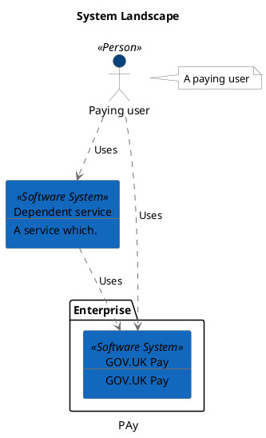
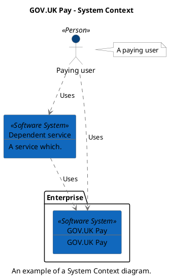
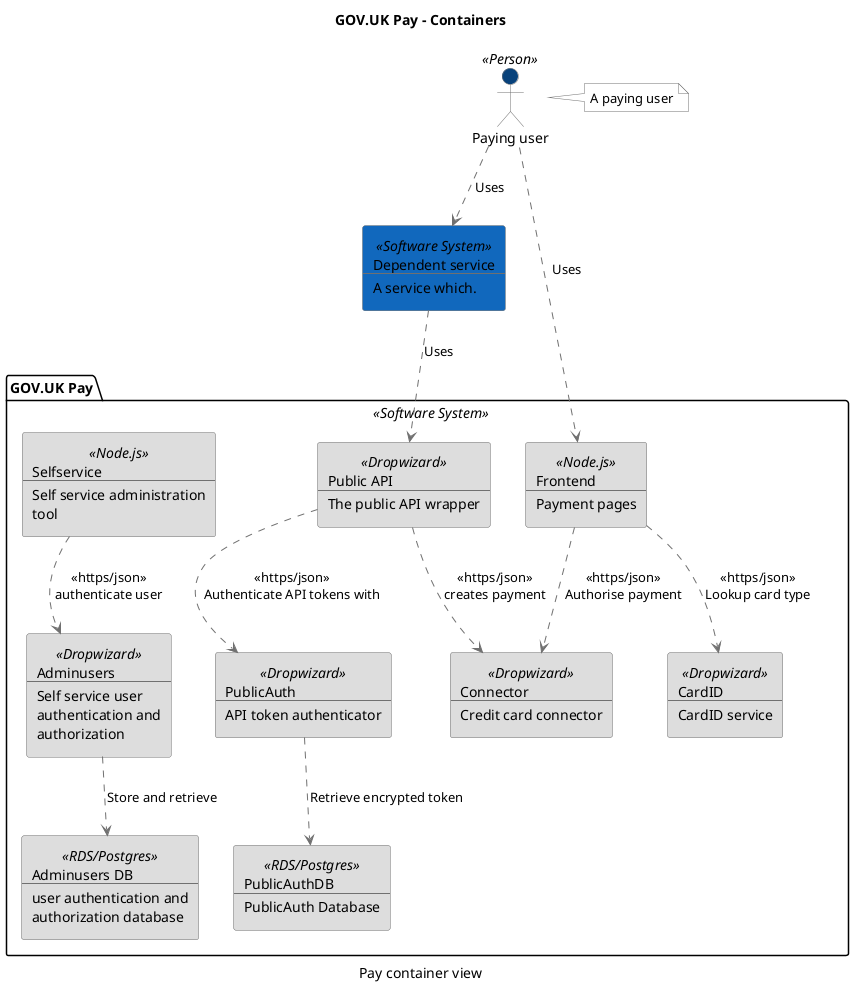

```
@startuml(id=Foo)
scale max 2000x2000
title System Landscape
caption PAy

skinparam {
  shadowing false
  arrowColor #707070
  actorBorderColor #707070
  componentBorderColor #707070
  rectangleBorderColor #707070
  noteBackgroundColor #ffffff
  noteBorderColor #707070
}
actor "Paying user" <<Person>> as 1 #08427b
note right of 1
  A paying user
end note
rectangle 2 <<Software System>> #1168bd [
  Dependent service
  --
  A service which.
]
package "Enterprise" {
  rectangle 3 <<Software System>> #1168bd [
    GOV.UK Pay
    --
    GOV.UK Pay
  ]
}
2 .[#707070].> 3 : Uses
1 .[#707070].> 2 : Uses
1 .[#707070].> 3 : Uses
@enduml

```



--

```
@startuml(id=SystemContext)
scale max 2000x1409
title GOV.UK Pay - System Context
caption An example of a System Context diagram.

skinparam {
  shadowing false
  arrowColor #707070
  actorBorderColor #707070
  componentBorderColor #707070
  rectangleBorderColor #707070
  noteBackgroundColor #ffffff
  noteBorderColor #707070
}
actor "Paying user" <<Person>> as 1 #08427b
note right of 1
  A paying user
end note
rectangle 2 <<Software System>> #1168bd [
  Dependent service
  --
  A service which.
]
package "Enterprise" {
  rectangle 3 <<Software System>> #1168bd [
    GOV.UK Pay
    --
    GOV.UK Pay
  ]
}
2 .[#707070].> 3 : Uses
1 .[#707070].> 2 : Uses
1 .[#707070].> 3 : Uses
@enduml

```



--

```
@startuml(id=Pay_container)
scale max 2000x1414
title GOV.UK Pay - Containers
caption Pay container view

skinparam {
  shadowing false
  arrowColor #707070
  actorBorderColor #707070
  componentBorderColor #707070
  rectangleBorderColor #707070
  noteBackgroundColor #ffffff
  noteBorderColor #707070
}
rectangle 2 <<Software System>> #1168bd [
  Dependent service
  --
  A service which.
]
actor "Paying user" <<Person>> as 1 #08427b
note right of 1
  A paying user
end note
package "GOV.UK Pay" <<Software System>> {
  rectangle 11 <<Dropwizard>> #dddddd [
    Adminusers
    --
    Self service user
    authentication and
    authorization
  ]
  rectangle 12 <<RDS/Postgres>> #dddddd [
    Adminusers DB
    --
    user authentication and
    authorization database
  ]
  rectangle 9 <<Dropwizard>> #dddddd [
    CardID
    --
    CardID service
  ]
  rectangle 6 <<Dropwizard>> #dddddd [
    Connector
    --
    Credit card connector
  ]
  rectangle 5 <<Node.js>> #dddddd [
    Frontend
    --
    Payment pages
  ]
  rectangle 4 <<Dropwizard>> #dddddd [
    Public API
    --
    The public API wrapper
  ]
  rectangle 7 <<Dropwizard>> #dddddd [
    PublicAuth
    --
    API token authenticator
  ]
  rectangle 8 <<RDS/Postgres>> #dddddd [
    PublicAuthDB
    --
    PublicAuth Database
  ]
  rectangle 10 <<Node.js>> #dddddd [
    Selfservice
    --
    Self service administration
    tool
  ]
}
11 .[#707070].> 12 : Store and retrieve
2 .[#707070].> 4 : Uses
5 .[#707070].> 9 : <<https/json>>\nLookup card type
5 .[#707070].> 6 : <<https/json>>\nAuthorise payment
1 .[#707070].> 2 : Uses
1 .[#707070].> 5 : Uses
4 .[#707070].> 6 : <<https/json>>\ncreates payment
4 .[#707070].> 7 : <<https/json>>\nAuthenticate API tokens with
7 .[#707070].> 8 : Retrieve encrypted token
10 .[#707070].> 11 : <<https/json>>\nauthenticate user
@enduml

```


