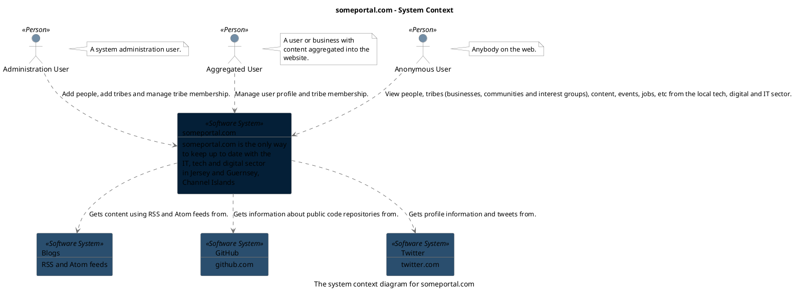

```
@startuml(id=context)
scale max 2000x1500
title someportal.com - System Context
caption The system context diagram for someportal.com

skinparam {
  shadowing false
  arrowColor #707070
  actorBorderColor #707070
  componentBorderColor #707070
  rectangleBorderColor #707070
  noteBackgroundColor #ffffff
  noteBorderColor #707070
}
actor "Administration User" <<Person>> as 6 #728da5
note right of 6
  A system administration user.
end note
actor "Aggregated User" <<Person>> as 4 #728da5
note right of 4
  A user or business with
  content aggregated into the
  website.
end note
actor "Anonymous User" <<Person>> as 2 #728da5
note right of 2
  Anybody on the web.
end note
rectangle 12 <<Software System>> #2a4e6e [
  Blogs
  --
  RSS and Atom feeds
]
rectangle 10 <<Software System>> #2a4e6e [
  GitHub
  --
  github.com
]
rectangle 8 <<Software System>> #2a4e6e [
  Twitter
  --
  twitter.com
]
rectangle 1 <<Software System>> #041f37 [
  someportal.com
  --
  someportal.com is the only way
  to keep up to date with the
  IT, tech and digital sector
  in Jersey and Guernsey,
  Channel Islands
]
6 .[#707070].> 1 : Add people, add tribes and manage tribe membership.
4 .[#707070].> 1 : Manage user profile and tribe membership.
2 .[#707070].> 1 : View people, tribes (businesses, communities and interest groups), content, events, jobs, etc from the local tech, digital and IT sector.
1 .[#707070].> 12 : Gets content using RSS and Atom feeds from.
1 .[#707070].> 10 : Gets information about public code repositories from.
1 .[#707070].> 8 : Gets profile information and tweets from.
@enduml

```



