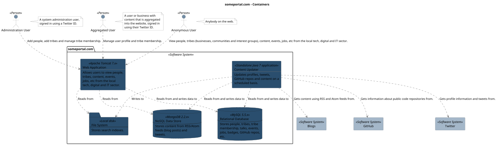
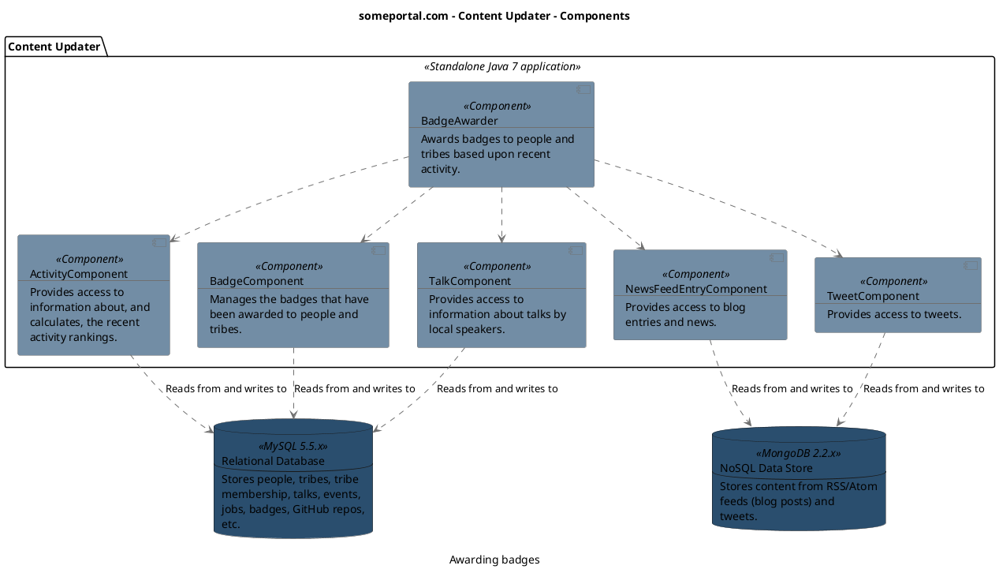
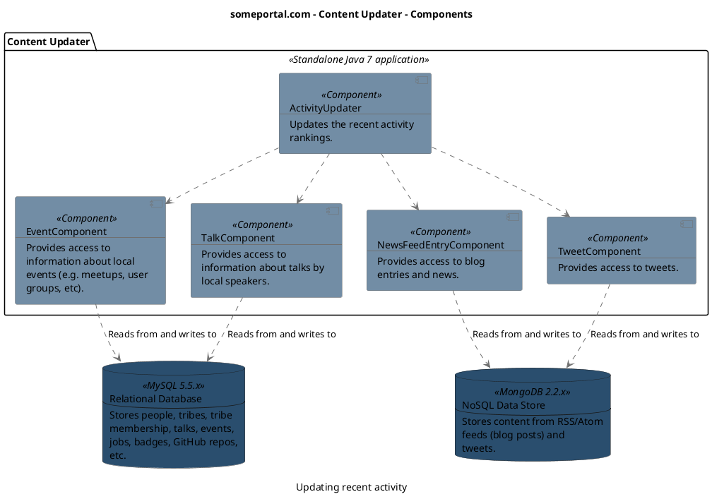
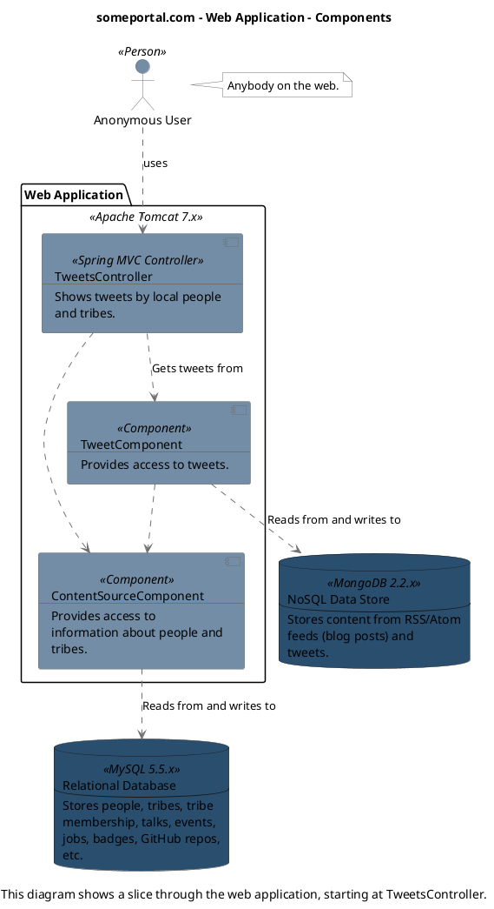
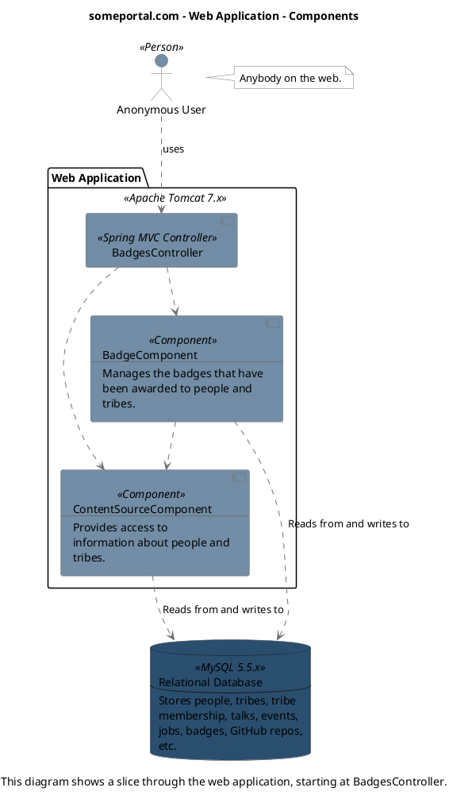

```plantuml format="svg" alt="UpdateInformation" title="UpdateInformation"
@startuml(id=UpdateInformation)
scale max 1413x2000
title someportal.com - Content Updater - Components
caption Updating information from external systems

skinparam {
  shadowing false
  arrowColor #707070
  actorBorderColor #707070
  componentBorderColor #707070
  rectangleBorderColor #707070
  noteBackgroundColor #ffffff
  noteBorderColor #707070
}
rectangle "Blogs" <<Software System>> as 12 #a4b7c9
folder 18 <<Local disk>> #2a4e6e [
  File System
  --
  Stores search indexes.
]
rectangle "GitHub" <<Software System>> as 10 #a4b7c9
database 17 <<MongoDB 2.2.x>> #2a4e6e [
  NoSQL Data Store
  --
  Stores content from RSS/Atom
  feeds (blog posts) and
  tweets.
]
database 16 <<MySQL 5.5.x>> #2a4e6e [
  Relational Database
  --
  Stores people, tribes, tribe
  membership, talks, events,
  jobs, badges, GitHub repos,
  etc.
]
rectangle "Twitter" <<Software System>> as 8 #a4b7c9
package "Content Updater" <<Standalone Java 7 application>> {
  component 239 <<Component>> #728da5 [
    GitHubComponent
    --
    Provides access to the list
    of GitHub repos associated
    with content sources.
  ]
  component 231 <<Component>> #728da5 [
    GitHubConnector
    --
    Gets information about
    repositories from GitHub.
  ]
  component 224 <<Component>> #728da5 [
    NewsFeedConnector
    --
    Retrieves news feed entries
    from RSS and Atom feeds.
  ]
  component 238 <<Component>> #728da5 [
    NewsFeedEntryComponent
    --
    Provides access to blog
    entries and news.
  ]
  component 232 <<Component>> #728da5 [
    ScheduledContentUpdater
    --
    Refreshes the data behind
    someportal.com on a scheduled
    basis.
  ]
  component 230 <<Component>> #728da5 [
    SearchComponent
    --
    Search facilities for news
    feed entries and tweets.
  ]
  component 236 <<Component>> #728da5 [
    TweetComponent
    --
    Provides access to tweets.
  ]
  component 241 <<Component>> #728da5 [
    TwitterConnector
    --
    Pulls profile information and
    tweets from Twitter.
  ]
}
239 .[#707070].> 16 : Reads from and writes to
231 .[#707070].> 10 : Gets the list of public repositories from
224 .[#707070].> 12 : Gets blog/news posts from
238 .[#707070].> 17 : Reads from and writes to
232 .[#707070].> 239 : Updates the list of repositories using
232 .[#707070].> 231 : Gets public repositories using the GitHub API
232 .[#707070].> 224 : Downloads RSS/Atom feeds for blogs
232 .[#707070].> 238 : Stores new and updated news feed entries using
232 .[#707070].> 230 : Updates the search indexes for new tweets/news feed entries using
232 .[#707070].> 236 : Stores new tweets using
232 .[#707070].> 241 : Refreshes profile information and gets new tweets using the REST and streaming APIs
230 .[#707070].> 18 : Reads from and writes to
236 .[#707070].> 17 : Reads from and writes to
241 .[#707070].> 8 : Gets tweets and profile information from
@enduml
```

```plantuml format="svg" alt="AllComponents"
@startuml(id=AllComponents)
scale max 2000x1414
title someportal.com - Web Application - Components
caption All components

skinparam {
  shadowing false
  arrowColor #707070
  actorBorderColor #707070
  componentBorderColor #707070
  rectangleBorderColor #707070
  noteBackgroundColor #ffffff
  noteBorderColor #707070
}
actor "Administration User" <<Person>> as 4 #728da5
note right of 4
  A system administration user,
  signed in using a Twitter ID.
end note
actor "Aggregated User" <<Person>> as 3 #728da5
note right of 3
  A user or business with
  content that is aggregated
  into the website, signed in
  using their Twitter ID.
end note
actor "Anonymous User" <<Person>> as 2 #728da5
note right of 2
  Anybody on the web.
end note
folder 18 <<Local disk>> #2a4e6e [
  File System
  --
  Stores search indexes.
]
database 17 <<MongoDB 2.2.x>> #2a4e6e [
  NoSQL Data Store
  --
  Stores content from RSS/Atom
  feeds (blog posts) and
  tweets.
]
database 16 <<MySQL 5.5.x>> #2a4e6e [
  Relational Database
  --
  Stores people, tribes, tribe
  membership, talks, events,
  jobs, badges, GitHub repos,
  etc.
]
package "Web Application" <<Apache Tomcat 7.x>> {
  component 51 <<Spring MVC Controller>> #728da5 [
    AboutPageController
    --
    Shows the about page, which
    includes a summary of the
    number of people, tribes,
    blog posts, tweets, etc.
  ]
  component 65 <<Component>> #728da5 [
    ActivityComponent
    --
    Provides access to
    information about, and
    calculates, the recent
    activity rankings.
  ]
  component 47 <<Spring MVC Controller>> #728da5 [
    ActivityController
    --
    Shows a summary of the recent
    activity (number of blog
    posts, tweets, events, etc).
  ]
  component 43 <<Spring MVC Controller>> #728da5 [
    AdminController
    --
    Provides some basic
    administration features
    related to adding people,
    tribes, etc.
  ]
  component 55 <<Component>> #728da5 [
    BadgeComponent
    --
    Manages the badges that have
    been awarded to people and
    tribes.
  ]
  component "BadgesController" <<Spring MVC Controller>> as 52 #728da5
  component 67 <<Component>> #728da5 [
    BookComponent
    --
    Provides access to
    information about books by
    local authors.
  ]
  component 50 <<Spring MVC Controller>> #728da5 [
    BooksController
    --
    Allows users to view books by
    local authors.
  ]
  component "CacheComponent" <<Component>> as 70 #728da5
  component 36 <<Spring MVC Controller>> #728da5 [
    CodeController
    --
    Shows GitHub repositories
    owned by local coders.
  ]
  component 39 <<Spring MVC Controller>> #728da5 [
    ContentController
    --
    Show recent content (news and
    blog posts).
  ]
  component 68 <<Component>> #728da5 [
    ContentSourceComponent
    --
    Provides access to
    information about people and
    tribes.
  ]
  component 56 <<Component>> #728da5 [
    CreationComponent
    --
    Provides access to
    information about creations
    by local people/businesses.
  ]
  component 41 <<Spring MVC Controller>> #728da5 [
    CreationsController
    --
    Shows creations (websites,
    apps, etc) by local
    people/businesses.
  ]
  component 38 <<Spring MVC Controller>> #728da5 [
    ErrorPageController
    --
    Handles all error scenarios
    (e.g. page not found,
    internal server error, etc).
  ]
  component 64 <<Component>> #728da5 [
    EventComponent
    --
    Provides access to
    information about local
    events (e.g. meetups, user
    groups, etc).
  ]
  component 45 <<Spring MVC Controller>> #728da5 [
    EventsController
    --
    Shows local business and
    community events (e.g.
    meetups, etc).
  ]
  component 66 <<Component>> #728da5 [
    GitHubComponent
    --
    Provides access to the list
    of GitHub repos associated
    with content sources.
  ]
  component 37 <<Spring MVC Controller>> #728da5 [
    HomePageController
    --
    Shows the home page.
  ]
  component "JobComponent" <<Component>> as 57 #728da5
  component "JobsController" <<Spring MVC Controller>> as 54 #728da5
  component 60 <<Component>> #728da5 [
    LoggingComponent
    --
    Provides logging facilities
    to all other components.
  ]
  component 34 <<Spring MVC Controller>> #728da5 [
    NewsController
    --
    Shows recent news.
  ]
  component 63 <<Component>> #728da5 [
    NewsFeedEntryComponent
    --
    Provides access to blog
    entries and news.
  ]
  component 35 <<Spring MVC Controller>> #728da5 [
    PeopleController
    --
    Shows a summary of a person;
    including contents, tweets,
    talks, etc.
  ]
  component 53 <<Spring MVC Controller>> #728da5 [
    RssController
    --
    Provides an RSS feed of
    recent content.
  ]
  component 58 <<Component>> #728da5 [
    SearchComponent
    --
    Search facilities for news
    feed entries and tweets.
  ]
  component 46 <<Spring MVC Controller>> #728da5 [
    SearchController
    --
    Allows users to search for
    content and tweets.
  ]
  component 40 <<Spring MVC Controller>> #728da5 [
    SignInController
    --
    Allows registered users to
    sign in using their Twitter
    ID.
  ]
  component 42 <<Spring MVC Controller>> #728da5 [
    SignOutController
    --
    Allows the user to sign out.
  ]
  component 49 <<Spring MVC Controller>> #728da5 [
    SummaryController
    --
    Shows the summary page, which
    includes a summary of the
    number of people, tribes,
    blog posts, tweets, etc.
  ]
  component 59 <<Component>> #728da5 [
    TalkComponent
    --
    Provides access to
    information about talks by
    local speakers.
  ]
  component 32 <<Spring MVC Controller>> #728da5 [
    TalksController
    --
    Shows talks by local people.
  ]
  component 44 <<Spring MVC Controller>> #728da5 [
    TribesController
    --
    Shows a summary of a tribe;
    including contents, tweets,
    talks, etc.
  ]
  component 62 <<Component>> #728da5 [
    TweetComponent
    --
    Provides access to tweets.
  ]
  component 31 <<Spring MVC Controller>> #728da5 [
    TweetsController
    --
    Shows tweets by local people
    and tribes.
  ]
  component "TwitterSignInComponent" <<Component>> as 61 #728da5
  component 48 <<Spring MVC Controller>> #728da5 [
    UserProfileController
    --
    Allows the user to view and
    manage their profile (e.g.
    GitHub ID).
  ]
  component 33 <<Spring MVC Controller>> #728da5 [
    ViewByMonthController
    --
    Allows users to view a
    summary of site content by
    month.
  ]
}
51 .[#707070].> 68 
51 .[#707070].> 60 
51 .[#707070].> 63 
51 .[#707070].> 59 
51 .[#707070].> 62 
65 .[#707070].> 68 
65 .[#707070].> 60 : Writes logs messages using
65 .[#707070].> 16 : Reads from and writes to
47 .[#707070].> 65 
47 .[#707070].> 55 
47 .[#707070].> 68 
47 .[#707070].> 60 
43 .[#707070].> 68 
43 .[#707070].> 60 
4 .[#707070].> 43 : uses
3 .[#707070].> 42 : uses
3 .[#707070].> 48 : uses
2 .[#707070].> 51 : uses
2 .[#707070].> 47 : uses
2 .[#707070].> 52 : uses
2 .[#707070].> 50 : uses
2 .[#707070].> 36 : uses
2 .[#707070].> 39 : uses
2 .[#707070].> 41 : uses
2 .[#707070].> 38 : uses
2 .[#707070].> 45 : uses
2 .[#707070].> 37 : uses
2 .[#707070].> 54 : uses
2 .[#707070].> 34 : uses
2 .[#707070].> 35 : uses
2 .[#707070].> 53 : uses
2 .[#707070].> 46 : uses
2 .[#707070].> 40 : uses
2 .[#707070].> 49 : uses
2 .[#707070].> 32 : uses
2 .[#707070].> 44 : uses
2 .[#707070].> 31 : uses
2 .[#707070].> 33 : uses
55 .[#707070].> 68 
55 .[#707070].> 60 : Writes logs messages using
55 .[#707070].> 16 : Reads from and writes to
52 .[#707070].> 55 
52 .[#707070].> 68 
52 .[#707070].> 60 
67 .[#707070].> 68 
67 .[#707070].> 60 : Writes logs messages using
50 .[#707070].> 67 
50 .[#707070].> 68 
50 .[#707070].> 60 
70 .[#707070].> 65 : Refreshes activity information using
70 .[#707070].> 68 : Refreshes content sources using
70 .[#707070].> 60 : Writes logs messages using
36 .[#707070].> 68 
36 .[#707070].> 66 
36 .[#707070].> 60 
39 .[#707070].> 68 
39 .[#707070].> 60 
39 .[#707070].> 63 
68 .[#707070].> 60 : Writes logs messages using
68 .[#707070].> 16 : Reads from and writes to
56 .[#707070].> 68 
56 .[#707070].> 60 : Writes logs messages using
41 .[#707070].> 68 
41 .[#707070].> 56 
41 .[#707070].> 60 
38 .[#707070].> 68 
38 .[#707070].> 60 
64 .[#707070].> 68 
64 .[#707070].> 60 : Writes logs messages using
64 .[#707070].> 16 : Reads from and writes to
45 .[#707070].> 68 
45 .[#707070].> 64 
45 .[#707070].> 60 
66 .[#707070].> 68 
66 .[#707070].> 60 : Writes logs messages using
66 .[#707070].> 16 : Reads from and writes to
37 .[#707070].> 68 
37 .[#707070].> 64 
37 .[#707070].> 57 
37 .[#707070].> 60 
37 .[#707070].> 63 
37 .[#707070].> 59 
37 .[#707070].> 62 
57 .[#707070].> 68 
57 .[#707070].> 60 : Writes logs messages using
57 .[#707070].> 16 : Reads from and writes to
54 .[#707070].> 68 
54 .[#707070].> 57 
54 .[#707070].> 60 
34 .[#707070].> 68 
34 .[#707070].> 60 
34 .[#707070].> 63 
63 .[#707070].> 68 
63 .[#707070].> 60 : Writes logs messages using
63 .[#707070].> 17 : Reads from and writes to
35 .[#707070].> 65 
35 .[#707070].> 55 
35 .[#707070].> 67 
35 .[#707070].> 68 
35 .[#707070].> 56 
35 .[#707070].> 66 
35 .[#707070].> 60 
35 .[#707070].> 63 
35 .[#707070].> 59 
35 .[#707070].> 62 
53 .[#707070].> 68 
53 .[#707070].> 60 
53 .[#707070].> 63 
58 .[#707070].> 68 
58 .[#707070].> 18 : Reads from and writes to
58 .[#707070].> 60 : Writes logs messages using
46 .[#707070].> 68 
46 .[#707070].> 60 
46 .[#707070].> 58 
40 .[#707070].> 68 
40 .[#707070].> 60 
42 .[#707070].> 68 
42 .[#707070].> 60 
49 .[#707070].> 68 
49 .[#707070].> 60 
49 .[#707070].> 63 
49 .[#707070].> 59 
49 .[#707070].> 62 
59 .[#707070].> 68 
59 .[#707070].> 60 : Writes logs messages using
59 .[#707070].> 16 : Reads from and writes to
32 .[#707070].> 68 
32 .[#707070].> 60 
32 .[#707070].> 59 
44 .[#707070].> 65 
44 .[#707070].> 55 
44 .[#707070].> 68 
44 .[#707070].> 64 
44 .[#707070].> 66 
44 .[#707070].> 57 
44 .[#707070].> 60 
44 .[#707070].> 63 
44 .[#707070].> 58 
44 .[#707070].> 62 
62 .[#707070].> 68 
62 .[#707070].> 60 : Writes logs messages using
62 .[#707070].> 17 : Reads from and writes to
31 .[#707070].> 68 
31 .[#707070].> 60 
31 .[#707070].> 62 : Gets tweets from
61 .[#707070].> 60 : Writes logs messages using
48 .[#707070].> 68 
48 .[#707070].> 60 
33 .[#707070].> 68 
33 .[#707070].> 64 
33 .[#707070].> 60 
33 .[#707070].> 63 
33 .[#707070].> 59 
@enduml
```

## System Context

```

@startuml(id=Context)
scale max 2000x1409
title someportal.com - System Context

skinparam {
  shadowing false
  arrowColor #707070
  actorBorderColor #707070
  componentBorderColor #707070
  rectangleBorderColor #707070
  noteBackgroundColor #ffffff
  noteBorderColor #707070
}
actor "Administration User" <<Person>> as 4 #728da5
note right of 4
  A system administration user,
  signed in using a Twitter ID.
end note
actor "Aggregated User" <<Person>> as 3 #728da5
note right of 3
  A user or business with
  content that is aggregated
  into the website, signed in
  using their Twitter ID.
end note
actor "Anonymous User" <<Person>> as 2 #728da5
note right of 2
  Anybody on the web.
end note
rectangle "Blogs" <<Software System>> as 12 #a4b7c9
rectangle "GitHub" <<Software System>> as 10 #a4b7c9
rectangle "Twitter" <<Software System>> as 8 #a4b7c9
rectangle 1 <<Software System>> #041f37 [
  someportal.com
  --
  someportal.com is the only way
  to keep up to date with the
  IT, tech and digital sector
  in Jersey and Guernsey,
  Channel Islands.
]
4 .[#707070].> 1 : Add people, add tribes and manage tribe membership
3 .[#707070].> 1 : Manage user profile and tribe membership
2 .[#707070].> 1 : View people, tribes (businesses, communities and interest groups), content, events, jobs, etc from the local tech, digital and IT sector
1 .[#707070].> 12 : Gets content using RSS and Atom feeds from
1 .[#707070].> 10 : Gets information about public code repositories from
1 .[#707070].> 8 : Gets profile information and tweets from
@enduml


```

```plantuml format="svg" alt="The System Context diagram" title="The System Context diagram"

@startuml(id=Context)
scale max 2000x1409
title someportal.com - System Context

skinparam {
  shadowing false
  arrowColor #707070
  actorBorderColor #707070
  componentBorderColor #707070
  rectangleBorderColor #707070
  noteBackgroundColor #ffffff
  noteBorderColor #707070
}
actor "Administration User" <<Person>> as 4 #728da5
note right of 4
  A system administration user,
  signed in using a Twitter ID.
end note
actor "Aggregated User" <<Person>> as 3 #728da5
note right of 3
  A user or business with
  content that is aggregated
  into the website, signed in
  using their Twitter ID.
end note
actor "Anonymous User" <<Person>> as 2 #728da5
note right of 2
  Anybody on the web.
end note
rectangle "Blogs" <<Software System>> as 12 #a4b7c9
rectangle "GitHub" <<Software System>> as 10 #a4b7c9
rectangle "Twitter" <<Software System>> as 8 #a4b7c9
rectangle 1 <<Software System>> #041f37 [
  someportal.com
  --
  someportal.com is the only way
  to keep up to date with the
  IT, tech and digital sector
  in Jersey and Guernsey,
  Channel Islands.
]
4 .[#707070].> 1 : Add people, add tribes and manage tribe membership
3 .[#707070].> 1 : Manage user profile and tribe membership
2 .[#707070].> 1 : View people, tribes (businesses, communities and interest groups), content, events, jobs, etc from the local tech, digital and IT sector
1 .[#707070].> 12 : Gets content using RSS and Atom feeds from
1 .[#707070].> 10 : Gets information about public code repositories from
1 .[#707070].> 8 : Gets profile information and tweets from
@enduml

```

## Containers

```
@startuml(id=Containers)
scale max 1413x2000
title someportal.com - Containers

skinparam {
  shadowing false
  arrowColor #707070
  actorBorderColor #707070
  componentBorderColor #707070
  rectangleBorderColor #707070
  noteBackgroundColor #ffffff
  noteBorderColor #707070
}
actor "Administration User" <<Person>> as 4 #728da5
note right of 4
  A system administration user,
  signed in using a Twitter ID.
end note
actor "Aggregated User" <<Person>> as 3 #728da5
note right of 3
  A user or business with
  content that is aggregated
  into the website, signed in
  using their Twitter ID.
end note
actor "Anonymous User" <<Person>> as 2 #728da5
note right of 2
  Anybody on the web.
end note
rectangle "Blogs" <<Software System>> as 12 #a4b7c9
rectangle "GitHub" <<Software System>> as 10 #a4b7c9
rectangle "Twitter" <<Software System>> as 8 #a4b7c9
package "someportal.com" <<Software System>> {
  rectangle 15 <<Standalone Java 7 application>> #2a4e6e [
    Content Updater
    --
    Updates profiles, tweets,
    GitHub repos and content on a
    scheduled basis.
  ]
  folder 18 <<Local disk>> #2a4e6e [
    File System
    --
    Stores search indexes.
  ]
  database 17 <<MongoDB 2.2.x>> #2a4e6e [
    NoSQL Data Store
    --
    Stores content from RSS/Atom
    feeds (blog posts) and
    tweets.
  ]
  database 16 <<MySQL 5.5.x>> #2a4e6e [
    Relational Database
    --
    Stores people, tribes, tribe
    membership, talks, events,
    jobs, badges, GitHub repos,
    etc.
  ]
  rectangle 14 <<Apache Tomcat 7.x>> #2a4e6e [
    Web Application
    --
    Allows users to view people,
    tribes, content, events,
    jobs, etc from the local
    tech, digital and IT sector.
  ]
}
4 .[#707070].> 14 : Add people, add tribes and manage tribe membership.
3 .[#707070].> 14 : Manage user profile and tribe membership.
2 .[#707070].> 14 : View people, tribes (businesses, communities and interest groups), content, events, jobs, etc from the local tech, digital and IT sector.
15 .[#707070].> 12 : Gets content using RSS and Atom feeds from.
15 .[#707070].> 18 : Writes to
15 .[#707070].> 10 : Gets information about public code repositories from.
15 .[#707070].> 17 : Reads from and writes data to
15 .[#707070].> 16 : Reads from and writes data to
15 .[#707070].> 8 : Gets profile information and tweets from.
14 .[#707070].> 18 : Reads from
14 .[#707070].> 17 : Reads from
14 .[#707070].> 16 : Reads from and writes data to
@enduml

```



## Components

```
@startuml(id=UpdateInformation)
scale max 1413x2000
title someportal.com - Content Updater - Components
caption Updating information from external systems

skinparam {
  shadowing false
  arrowColor #707070
  actorBorderColor #707070
  componentBorderColor #707070
  rectangleBorderColor #707070
  noteBackgroundColor #ffffff
  noteBorderColor #707070
}
rectangle "Blogs" <<Software System>> as 12 #a4b7c9
folder 18 <<Local disk>> #2a4e6e [
  File System
  --
  Stores search indexes.
]
rectangle "GitHub" <<Software System>> as 10 #a4b7c9
database 17 <<MongoDB 2.2.x>> #2a4e6e [
  NoSQL Data Store
  --
  Stores content from RSS/Atom
  feeds (blog posts) and
  tweets.
]
database 16 <<MySQL 5.5.x>> #2a4e6e [
  Relational Database
  --
  Stores people, tribes, tribe
  membership, talks, events,
  jobs, badges, GitHub repos,
  etc.
]
rectangle "Twitter" <<Software System>> as 8 #a4b7c9
package "Content Updater" <<Standalone Java 7 application>> {
  component 239 <<Component>> #728da5 [
    GitHubComponent
    --
    Provides access to the list
    of GitHub repos associated
    with content sources.
  ]
  component 231 <<Component>> #728da5 [
    GitHubConnector
    --
    Gets information about
    repositories from GitHub.
  ]
  component 224 <<Component>> #728da5 [
    NewsFeedConnector
    --
    Retrieves news feed entries
    from RSS and Atom feeds.
  ]
  component 238 <<Component>> #728da5 [
    NewsFeedEntryComponent
    --
    Provides access to blog
    entries and news.
  ]
  component 232 <<Component>> #728da5 [
    ScheduledContentUpdater
    --
    Refreshes the data behind
    someportal.com on a scheduled
    basis.
  ]
  component 230 <<Component>> #728da5 [
    SearchComponent
    --
    Search facilities for news
    feed entries and tweets.
  ]
  component 236 <<Component>> #728da5 [
    TweetComponent
    --
    Provides access to tweets.
  ]
  component 241 <<Component>> #728da5 [
    TwitterConnector
    --
    Pulls profile information and
    tweets from Twitter.
  ]
}
239 .[#707070].> 16 : Reads from and writes to
231 .[#707070].> 10 : Gets the list of public repositories from
224 .[#707070].> 12 : Gets blog/news posts from
238 .[#707070].> 17 : Reads from and writes to
232 .[#707070].> 239 : Updates the list of repositories using
232 .[#707070].> 231 : Gets public repositories using the GitHub API
232 .[#707070].> 224 : Downloads RSS/Atom feeds for blogs
232 .[#707070].> 238 : Stores new and updated news feed entries using
232 .[#707070].> 230 : Updates the search indexes for new tweets/news feed entries using
232 .[#707070].> 236 : Stores new tweets using
232 .[#707070].> 241 : Refreshes profile information and gets new tweets using the REST and streaming APIs
230 .[#707070].> 18 : Reads from and writes to
236 .[#707070].> 17 : Reads from and writes to
241 .[#707070].> 8 : Gets tweets and profile information from
@enduml


```



--

```
@startuml(id=AwardingBadges)
scale max 1413x2000
title someportal.com - Content Updater - Components
caption Awarding badges

skinparam {
  shadowing false
  arrowColor #707070
  actorBorderColor #707070
  componentBorderColor #707070
  rectangleBorderColor #707070
  noteBackgroundColor #ffffff
  noteBorderColor #707070
}
database 17 <<MongoDB 2.2.x>> #2a4e6e [
  NoSQL Data Store
  --
  Stores content from RSS/Atom
  feeds (blog posts) and
  tweets.
]
database 16 <<MySQL 5.5.x>> #2a4e6e [
  Relational Database
  --
  Stores people, tribes, tribe
  membership, talks, events,
  jobs, badges, GitHub repos,
  etc.
]
package "Content Updater" <<Standalone Java 7 application>> {
  component 234 <<Component>> #728da5 [
    ActivityComponent
    --
    Provides access to
    information about, and
    calculates, the recent
    activity rankings.
  ]
  component 229 <<Component>> #728da5 [
    BadgeAwarder
    --
    Awards badges to people and
    tribes based upon recent
    activity.
  ]
  component 227 <<Component>> #728da5 [
    BadgeComponent
    --
    Manages the badges that have
    been awarded to people and
    tribes.
  ]
  component 238 <<Component>> #728da5 [
    NewsFeedEntryComponent
    --
    Provides access to blog
    entries and news.
  ]
  component 228 <<Component>> #728da5 [
    TalkComponent
    --
    Provides access to
    information about talks by
    local speakers.
  ]
  component 236 <<Component>> #728da5 [
    TweetComponent
    --
    Provides access to tweets.
  ]
}
234 .[#707070].> 16 : Reads from and writes to
229 .[#707070].> 234 
229 .[#707070].> 227 
229 .[#707070].> 238 
229 .[#707070].> 228 
229 .[#707070].> 236 
227 .[#707070].> 16 : Reads from and writes to
238 .[#707070].> 17 : Reads from and writes to
228 .[#707070].> 16 : Reads from and writes to
236 .[#707070].> 17 : Reads from and writes to
@enduml

```



--

```
@startuml(id=RecentActivity)
scale max 1413x2000
title someportal.com - Content Updater - Components
caption Updating recent activity

skinparam {
  shadowing false
  arrowColor #707070
  actorBorderColor #707070
  componentBorderColor #707070
  rectangleBorderColor #707070
  noteBackgroundColor #ffffff
  noteBorderColor #707070
}
database 17 <<MongoDB 2.2.x>> #2a4e6e [
  NoSQL Data Store
  --
  Stores content from RSS/Atom
  feeds (blog posts) and
  tweets.
]
database 16 <<MySQL 5.5.x>> #2a4e6e [
  Relational Database
  --
  Stores people, tribes, tribe
  membership, talks, events,
  jobs, badges, GitHub repos,
  etc.
]
package "Content Updater" <<Standalone Java 7 application>> {
  component 226 <<Component>> #728da5 [
    ActivityUpdater
    --
    Updates the recent activity
    rankings.
  ]
  component 233 <<Component>> #728da5 [
    EventComponent
    --
    Provides access to
    information about local
    events (e.g. meetups, user
    groups, etc).
  ]
  component 238 <<Component>> #728da5 [
    NewsFeedEntryComponent
    --
    Provides access to blog
    entries and news.
  ]
  component 228 <<Component>> #728da5 [
    TalkComponent
    --
    Provides access to
    information about talks by
    local speakers.
  ]
  component 236 <<Component>> #728da5 [
    TweetComponent
    --
    Provides access to tweets.
  ]
}
226 .[#707070].> 233 
226 .[#707070].> 238 
226 .[#707070].> 228 
226 .[#707070].> 236 
233 .[#707070].> 16 : Reads from and writes to
238 .[#707070].> 17 : Reads from and writes to
228 .[#707070].> 16 : Reads from and writes to
236 .[#707070].> 17 : Reads from and writes to
@enduml

```


--

```
scale max 1409x2000
title someportal.com - Web Application - Components
caption This diagram shows a slice through the web application, starting at TweetsController.

skinparam {
  shadowing false
  arrowColor #707070
  actorBorderColor #707070
  componentBorderColor #707070
  rectangleBorderColor #707070
  noteBackgroundColor #ffffff
  noteBorderColor #707070
}
actor "Anonymous User" <<Person>> as 2 #728da5
note right of 2
  Anybody on the web.
end note
database 17 <<MongoDB 2.2.x>> #2a4e6e [
  NoSQL Data Store
  --
  Stores content from RSS/Atom
  feeds (blog posts) and
  tweets.
]
database 16 <<MySQL 5.5.x>> #2a4e6e [
  Relational Database
  --
  Stores people, tribes, tribe
  membership, talks, events,
  jobs, badges, GitHub repos,
  etc.
]
package "Web Application" <<Apache Tomcat 7.x>> {
  component 68 <<Component>> #728da5 [
    ContentSourceComponent
    --
    Provides access to
    information about people and
    tribes.
  ]
  component 62 <<Component>> #728da5 [
    TweetComponent
    --
    Provides access to tweets.
  ]
  component 31 <<Spring MVC Controller>> #728da5 [
    TweetsController
    --
    Shows tweets by local people
    and tribes.
  ]
}
2 .[#707070].> 31 : uses
68 .[#707070].> 16 : Reads from and writes to
62 .[#707070].> 68 
62 .[#707070].> 17 : Reads from and writes to
31 .[#707070].> 68 
31 .[#707070].> 62 : Gets tweets from
@enduml
```



--

```
@startuml(id=BadgesController)
scale max 1409x2000
title someportal.com - Web Application - Components
caption This diagram shows a slice through the web application, starting at BadgesController.

skinparam {
  shadowing false
  arrowColor #707070
  actorBorderColor #707070
  componentBorderColor #707070
  rectangleBorderColor #707070
  noteBackgroundColor #ffffff
  noteBorderColor #707070
}
actor "Anonymous User" <<Person>> as 2 #728da5
note right of 2
  Anybody on the web.
end note
database 16 <<MySQL 5.5.x>> #2a4e6e [
  Relational Database
  --
  Stores people, tribes, tribe
  membership, talks, events,
  jobs, badges, GitHub repos,
  etc.
]
package "Web Application" <<Apache Tomcat 7.x>> {
  component 55 <<Component>> #728da5 [
    BadgeComponent
    --
    Manages the badges that have
    been awarded to people and
    tribes.
  ]
  component "BadgesController" <<Spring MVC Controller>> as 52 #728da5
  component 68 <<Component>> #728da5 [
    ContentSourceComponent
    --
    Provides access to
    information about people and
    tribes.
  ]
}
2 .[#707070].> 52 : uses
55 .[#707070].> 68 
55 .[#707070].> 16 : Reads from and writes to
52 .[#707070].> 55 
52 .[#707070].> 68 
68 .[#707070].> 16 : Reads from and writes to
@enduml

```



--



```
@startuml(id=AllComponents)
scale max 2000x1414
title someportal.com - Web Application - Components
caption All components

skinparam {
  shadowing false
  arrowColor #707070
  actorBorderColor #707070
  componentBorderColor #707070
  rectangleBorderColor #707070
  noteBackgroundColor #ffffff
  noteBorderColor #707070
}
actor "Administration User" <<Person>> as 4 #728da5
note right of 4
  A system administration user,
  signed in using a Twitter ID.
end note
actor "Aggregated User" <<Person>> as 3 #728da5
note right of 3
  A user or business with
  content that is aggregated
  into the website, signed in
  using their Twitter ID.
end note
actor "Anonymous User" <<Person>> as 2 #728da5
note right of 2
  Anybody on the web.
end note
folder 18 <<Local disk>> #2a4e6e [
  File System
  --
  Stores search indexes.
]
database 17 <<MongoDB 2.2.x>> #2a4e6e [
  NoSQL Data Store
  --
  Stores content from RSS/Atom
  feeds (blog posts) and
  tweets.
]
database 16 <<MySQL 5.5.x>> #2a4e6e [
  Relational Database
  --
  Stores people, tribes, tribe
  membership, talks, events,
  jobs, badges, GitHub repos,
  etc.
]
package "Web Application" <<Apache Tomcat 7.x>> {
  component 51 <<Spring MVC Controller>> #728da5 [
    AboutPageController
    --
    Shows the about page, which
    includes a summary of the
    number of people, tribes,
    blog posts, tweets, etc.
  ]
  component 65 <<Component>> #728da5 [
    ActivityComponent
    --
    Provides access to
    information about, and
    calculates, the recent
    activity rankings.
  ]
  component 47 <<Spring MVC Controller>> #728da5 [
    ActivityController
    --
    Shows a summary of the recent
    activity (number of blog
    posts, tweets, events, etc).
  ]
  component 43 <<Spring MVC Controller>> #728da5 [
    AdminController
    --
    Provides some basic
    administration features
    related to adding people,
    tribes, etc.
  ]
  component 55 <<Component>> #728da5 [
    BadgeComponent
    --
    Manages the badges that have
    been awarded to people and
    tribes.
  ]
  component "BadgesController" <<Spring MVC Controller>> as 52 #728da5
  component 67 <<Component>> #728da5 [
    BookComponent
    --
    Provides access to
    information about books by
    local authors.
  ]
  component 50 <<Spring MVC Controller>> #728da5 [
    BooksController
    --
    Allows users to view books by
    local authors.
  ]
  component "CacheComponent" <<Component>> as 70 #728da5
  component 36 <<Spring MVC Controller>> #728da5 [
    CodeController
    --
    Shows GitHub repositories
    owned by local coders.
  ]
  component 39 <<Spring MVC Controller>> #728da5 [
    ContentController
    --
    Show recent content (news and
    blog posts).
  ]
  component 68 <<Component>> #728da5 [
    ContentSourceComponent
    --
    Provides access to
    information about people and
    tribes.
  ]
  component 56 <<Component>> #728da5 [
    CreationComponent
    --
    Provides access to
    information about creations
    by local people/businesses.
  ]
  component 41 <<Spring MVC Controller>> #728da5 [
    CreationsController
    --
    Shows creations (websites,
    apps, etc) by local
    people/businesses.
  ]
  component 38 <<Spring MVC Controller>> #728da5 [
    ErrorPageController
    --
    Handles all error scenarios
    (e.g. page not found,
    internal server error, etc).
  ]
  component 64 <<Component>> #728da5 [
    EventComponent
    --
    Provides access to
    information about local
    events (e.g. meetups, user
    groups, etc).
  ]
  component 45 <<Spring MVC Controller>> #728da5 [
    EventsController
    --
    Shows local business and
    community events (e.g.
    meetups, etc).
  ]
  component 66 <<Component>> #728da5 [
    GitHubComponent
    --
    Provides access to the list
    of GitHub repos associated
    with content sources.
  ]
  component 37 <<Spring MVC Controller>> #728da5 [
    HomePageController
    --
    Shows the home page.
  ]
  component "JobComponent" <<Component>> as 57 #728da5
  component "JobsController" <<Spring MVC Controller>> as 54 #728da5
  component 60 <<Component>> #728da5 [
    LoggingComponent
    --
    Provides logging facilities
    to all other components.
  ]
  component 34 <<Spring MVC Controller>> #728da5 [
    NewsController
    --
    Shows recent news.
  ]
  component 63 <<Component>> #728da5 [
    NewsFeedEntryComponent
    --
    Provides access to blog
    entries and news.
  ]
  component 35 <<Spring MVC Controller>> #728da5 [
    PeopleController
    --
    Shows a summary of a person;
    including contents, tweets,
    talks, etc.
  ]
  component 53 <<Spring MVC Controller>> #728da5 [
    RssController
    --
    Provides an RSS feed of
    recent content.
  ]
  component 58 <<Component>> #728da5 [
    SearchComponent
    --
    Search facilities for news
    feed entries and tweets.
  ]
  component 46 <<Spring MVC Controller>> #728da5 [
    SearchController
    --
    Allows users to search for
    content and tweets.
  ]
  component 40 <<Spring MVC Controller>> #728da5 [
    SignInController
    --
    Allows registered users to
    sign in using their Twitter
    ID.
  ]
  component 42 <<Spring MVC Controller>> #728da5 [
    SignOutController
    --
    Allows the user to sign out.
  ]
  component 49 <<Spring MVC Controller>> #728da5 [
    SummaryController
    --
    Shows the summary page, which
    includes a summary of the
    number of people, tribes,
    blog posts, tweets, etc.
  ]
  component 59 <<Component>> #728da5 [
    TalkComponent
    --
    Provides access to
    information about talks by
    local speakers.
  ]
  component 32 <<Spring MVC Controller>> #728da5 [
    TalksController
    --
    Shows talks by local people.
  ]
  component 44 <<Spring MVC Controller>> #728da5 [
    TribesController
    --
    Shows a summary of a tribe;
    including contents, tweets,
    talks, etc.
  ]
  component 62 <<Component>> #728da5 [
    TweetComponent
    --
    Provides access to tweets.
  ]
  component 31 <<Spring MVC Controller>> #728da5 [
    TweetsController
    --
    Shows tweets by local people
    and tribes.
  ]
  component "TwitterSignInComponent" <<Component>> as 61 #728da5
  component 48 <<Spring MVC Controller>> #728da5 [
    UserProfileController
    --
    Allows the user to view and
    manage their profile (e.g.
    GitHub ID).
  ]
  component 33 <<Spring MVC Controller>> #728da5 [
    ViewByMonthController
    --
    Allows users to view a
    summary of site content by
    month.
  ]
}
51 .[#707070].> 68 
51 .[#707070].> 60 
51 .[#707070].> 63 
51 .[#707070].> 59 
51 .[#707070].> 62 
65 .[#707070].> 68 
65 .[#707070].> 60 : Writes logs messages using
65 .[#707070].> 16 : Reads from and writes to
47 .[#707070].> 65 
47 .[#707070].> 55 
47 .[#707070].> 68 
47 .[#707070].> 60 
43 .[#707070].> 68 
43 .[#707070].> 60 
4 .[#707070].> 43 : uses
3 .[#707070].> 42 : uses
3 .[#707070].> 48 : uses
2 .[#707070].> 51 : uses
2 .[#707070].> 47 : uses
2 .[#707070].> 52 : uses
2 .[#707070].> 50 : uses
2 .[#707070].> 36 : uses
2 .[#707070].> 39 : uses
2 .[#707070].> 41 : uses
2 .[#707070].> 38 : uses
2 .[#707070].> 45 : uses
2 .[#707070].> 37 : uses
2 .[#707070].> 54 : uses
2 .[#707070].> 34 : uses
2 .[#707070].> 35 : uses
2 .[#707070].> 53 : uses
2 .[#707070].> 46 : uses
2 .[#707070].> 40 : uses
2 .[#707070].> 49 : uses
2 .[#707070].> 32 : uses
2 .[#707070].> 44 : uses
2 .[#707070].> 31 : uses
2 .[#707070].> 33 : uses
55 .[#707070].> 68 
55 .[#707070].> 60 : Writes logs messages using
55 .[#707070].> 16 : Reads from and writes to
52 .[#707070].> 55 
52 .[#707070].> 68 
52 .[#707070].> 60 
67 .[#707070].> 68 
67 .[#707070].> 60 : Writes logs messages using
50 .[#707070].> 67 
50 .[#707070].> 68 
50 .[#707070].> 60 
70 .[#707070].> 65 : Refreshes activity information using
70 .[#707070].> 68 : Refreshes content sources using
70 .[#707070].> 60 : Writes logs messages using
36 .[#707070].> 68 
36 .[#707070].> 66 
36 .[#707070].> 60 
39 .[#707070].> 68 
39 .[#707070].> 60 
39 .[#707070].> 63 
68 .[#707070].> 60 : Writes logs messages using
68 .[#707070].> 16 : Reads from and writes to
56 .[#707070].> 68 
56 .[#707070].> 60 : Writes logs messages using
41 .[#707070].> 68 
41 .[#707070].> 56 
41 .[#707070].> 60 
38 .[#707070].> 68 
38 .[#707070].> 60 
64 .[#707070].> 68 
64 .[#707070].> 60 : Writes logs messages using
64 .[#707070].> 16 : Reads from and writes to
45 .[#707070].> 68 
45 .[#707070].> 64 
45 .[#707070].> 60 
66 .[#707070].> 68 
66 .[#707070].> 60 : Writes logs messages using
66 .[#707070].> 16 : Reads from and writes to
37 .[#707070].> 68 
37 .[#707070].> 64 
37 .[#707070].> 57 
37 .[#707070].> 60 
37 .[#707070].> 63 
37 .[#707070].> 59 
37 .[#707070].> 62 
57 .[#707070].> 68 
57 .[#707070].> 60 : Writes logs messages using
57 .[#707070].> 16 : Reads from and writes to
54 .[#707070].> 68 
54 .[#707070].> 57 
54 .[#707070].> 60 
34 .[#707070].> 68 
34 .[#707070].> 60 
34 .[#707070].> 63 
63 .[#707070].> 68 
63 .[#707070].> 60 : Writes logs messages using
63 .[#707070].> 17 : Reads from and writes to
35 .[#707070].> 65 
35 .[#707070].> 55 
35 .[#707070].> 67 
35 .[#707070].> 68 
35 .[#707070].> 56 
35 .[#707070].> 66 
35 .[#707070].> 60 
35 .[#707070].> 63 
35 .[#707070].> 59 
35 .[#707070].> 62 
53 .[#707070].> 68 
53 .[#707070].> 60 
53 .[#707070].> 63 
58 .[#707070].> 68 
58 .[#707070].> 18 : Reads from and writes to
58 .[#707070].> 60 : Writes logs messages using
46 .[#707070].> 68 
46 .[#707070].> 60 
46 .[#707070].> 58 
40 .[#707070].> 68 
40 .[#707070].> 60 
42 .[#707070].> 68 
42 .[#707070].> 60 
49 .[#707070].> 68 
49 .[#707070].> 60 
49 .[#707070].> 63 
49 .[#707070].> 59 
49 .[#707070].> 62 
59 .[#707070].> 68 
59 .[#707070].> 60 : Writes logs messages using
59 .[#707070].> 16 : Reads from and writes to
32 .[#707070].> 68 
32 .[#707070].> 60 
32 .[#707070].> 59 
44 .[#707070].> 65 
44 .[#707070].> 55 
44 .[#707070].> 68 
44 .[#707070].> 64 
44 .[#707070].> 66 
44 .[#707070].> 57 
44 .[#707070].> 60 
44 .[#707070].> 63 
44 .[#707070].> 58 
44 .[#707070].> 62 
62 .[#707070].> 68 
62 .[#707070].> 60 : Writes logs messages using
62 .[#707070].> 17 : Reads from and writes to
31 .[#707070].> 68 
31 .[#707070].> 60 
31 .[#707070].> 62 : Gets tweets from
61 .[#707070].> 60 : Writes logs messages using
48 .[#707070].> 68 
48 .[#707070].> 60 
33 .[#707070].> 68 
33 .[#707070].> 64 
33 .[#707070].> 60 
33 .[#707070].> 63 
33 .[#707070].> 59 
@enduml
```


Credits:  https://structurizr.com/share/21/plantuml
