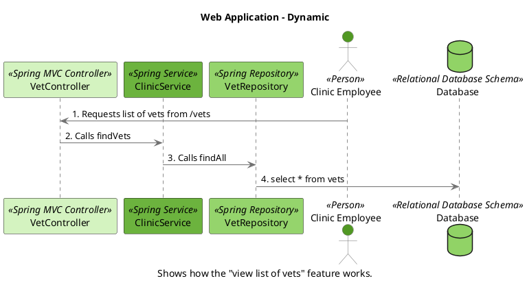
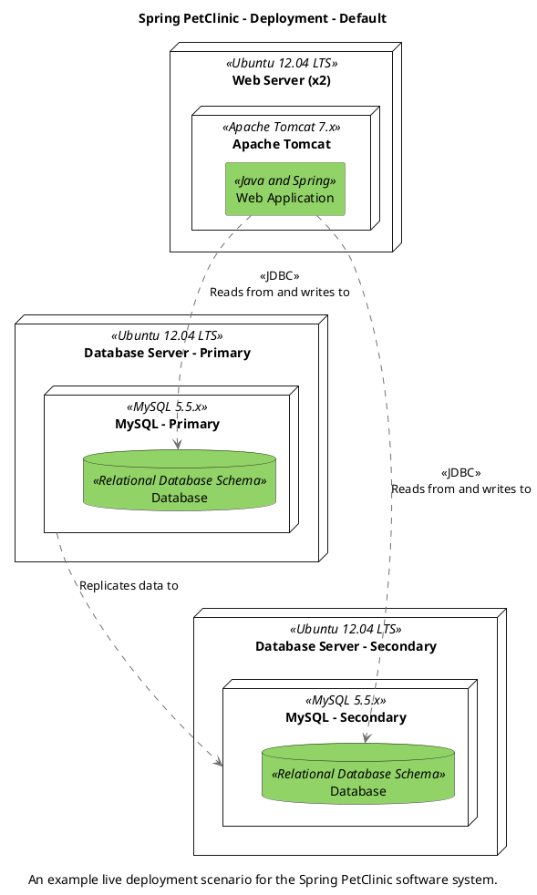
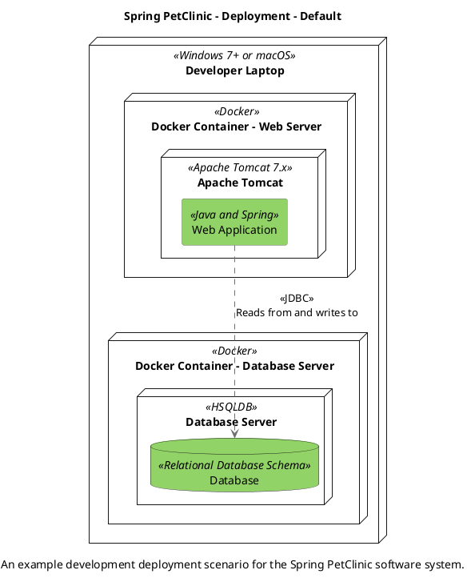
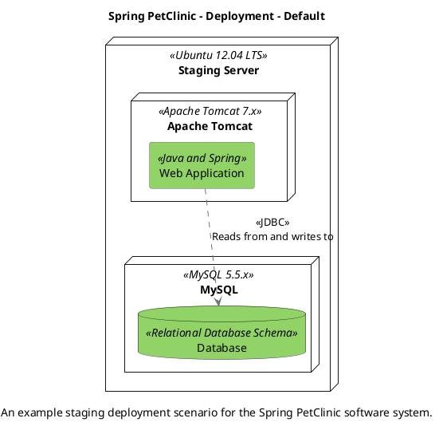

## The System Context diagram for the Spring PetClinic system.

```

@startuml(id=context)
scale max 2000x1409
title Spring PetClinic - System Context
caption The System Context diagram for the Spring PetClinic system.

skinparam {
  shadowing false
  arrowColor #707070
  actorBorderColor #707070
  componentBorderColor #707070
  rectangleBorderColor #707070
  noteBackgroundColor #ffffff
  noteBorderColor #707070
}
actor "Clinic Employee" <<Person>> as 2 #519823
note right of 2
  An employee of the clinic
end note
rectangle 1 <<Software System>> #6cb33e [
  Spring PetClinic
  --
  Allows employees to view and
  manage information regarding
  the veterinarians, the
  clients, and their pets.
]
2 .[#707070].> 1 : Uses
@enduml

```

```plantuml format="svg" alt="The System Context diagram for the Spring PetClinic system" title="The System Context diagram for the Spring PetClinic system"

@startuml(id=context)
scale max 2000x1409
title Spring PetClinic - System Context
caption The System Context diagram for the Spring PetClinic system.

skinparam {
  shadowing false
  arrowColor #707070
  actorBorderColor #707070
  componentBorderColor #707070
  rectangleBorderColor #707070
  noteBackgroundColor #ffffff
  noteBorderColor #707070
}
actor "Clinic Employee" <<Person>> as 2 #519823
note right of 2
  An employee of the clinic
end note
rectangle 1 <<Software System>> #6cb33e [
  Spring PetClinic
  --
  Allows employees to view and
  manage information regarding
  the veterinarians, the
  clients, and their pets.
]
2 .[#707070].> 1 : Uses
@enduml
```

## Spring PetClinic - Containers

```
@startuml(id=containers)
scale max 2000x1409
title Spring PetClinic - Containers
caption The Containers diagram for the Spring PetClinic system.

skinparam {
  shadowing false
  arrowColor #707070
  actorBorderColor #707070
  componentBorderColor #707070
  rectangleBorderColor #707070
  noteBackgroundColor #ffffff
  noteBorderColor #707070
}
actor "Clinic Employee" <<Person>> as 2 #519823
note right of 2
  An employee of the clinic
end note
package "Spring PetClinic" <<Software System>> {
  database 5 <<Relational Database Schema>> #91d366 [
    Database
    --
    Stores information regarding
    the veterinarians, the
    clients, and their pets.
  ]
  rectangle 4 <<Java and Spring>> #91d366 [
    Web Application
    --
    Allows employees to view and
    manage information regarding
    the veterinarians, the
    clients, and their pets.
  ]
}
2 .[#707070].> 4 : <<HTTPS>>\nUses
4 .[#707070].> 5 : <<JDBC>>\nReads from and writes to
@enduml
```

```plantuml format="svg" alt="Spring PetClinic - Containers" title="Spring PetClinic - Containers"
@startuml(id=containers)
scale max 2000x1409
title Spring PetClinic - Containers
caption The Containers diagram for the Spring PetClinic system.

skinparam {
  shadowing false
  arrowColor #707070
  actorBorderColor #707070
  componentBorderColor #707070
  rectangleBorderColor #707070
  noteBackgroundColor #ffffff
  noteBorderColor #707070
}
actor "Clinic Employee" <<Person>> as 2 #519823
note right of 2
  An employee of the clinic
end note
package "Spring PetClinic" <<Software System>> {
  database 5 <<Relational Database Schema>> #91d366 [
    Database
    --
    Stores information regarding
    the veterinarians, the
    clients, and their pets.
  ]
  rectangle 4 <<Java and Spring>> #91d366 [
    Web Application
    --
    Allows employees to view and
    manage information regarding
    the veterinarians, the
    clients, and their pets.
  ]
}
2 .[#707070].> 4 : <<HTTPS>>\nUses
4 .[#707070].> 5 : <<JDBC>>\nReads from and writes to
@enduml
```

## Spring PetClinic - Web Application - Components

```
@startuml(id=components)
scale max 1413x2000
title Spring PetClinic - Web Application - Components
caption The Components diagram for the Spring PetClinic web application.

skinparam {
  shadowing false
  arrowColor #707070
  actorBorderColor #707070
  componentBorderColor #707070
  rectangleBorderColor #707070
  noteBackgroundColor #ffffff
  noteBorderColor #707070
}
actor "Clinic Employee" <<Person>> as 2 #519823
note right of 2
  An employee of the clinic
end note
database 5 <<Relational Database Schema>> #91d366 [
  Database
  --
  Stores information regarding
  the veterinarians, the
  clients, and their pets.
]
package "Web Application" <<Java and Spring>> {
  component 13 <<Spring Service>> #6cb33e [
    ClinicService
    --
    Mostly used as a facade so
    all controllers have a single
    point of entry
  ]
  component 9 <<Spring MVC Controller>> #d4f3c0 [
    CrashController
    --
    Controller used to showcase
    what happens when an
    exception is thrown
  ]
  component "OwnerController" <<Spring MVC Controller>> as 10 #d4f3c0
  component 16 <<Spring Repository>> #95d46c [
    OwnerRepository
    --
    Repository class for Owner
    domain objects All method
    names are compliant with
    Spring Data naming
    conventions so this interface
    can easily be exten...
  ]
  component "PetController" <<Spring MVC Controller>> as 12 #d4f3c0
  component 15 <<Spring Repository>> #95d46c [
    PetRepository
    --
    Repository class for Pet
    domain objects All method
    names are compliant with
    Spring Data naming
    conventions so this interface
    can easily be extende...
  ]
  component "VetController" <<Spring MVC Controller>> as 11 #d4f3c0
  component 17 <<Spring Repository>> #95d46c [
    VetRepository
    --
    Repository class for Vet
    domain objects All method
    names are compliant with
    Spring Data naming
    conventions so this interface
    can easily be extende...
  ]
  component "VisitController" <<Spring MVC Controller>> as 8 #d4f3c0
  component 14 <<Spring Repository>> #95d46c [
    VisitRepository
    --
    Repository class for Visit
    domain objects All method
    names are compliant with
    Spring Data naming
    conventions so this interface
    can easily be exten...
  ]
}
2 .[#707070].> 9 : <<HTTP>>\nUses
2 .[#707070].> 10 : <<HTTP>>\nUses
2 .[#707070].> 12 : <<HTTP>>\nUses
2 .[#707070].> 11 : <<HTTP>>\nUses
2 .[#707070].> 8 : <<HTTP>>\nUses
13 .[#707070].> 16 
13 .[#707070].> 15 
13 .[#707070].> 17 
13 .[#707070].> 14 
10 .[#707070].> 13 
16 .[#707070].> 5 : <<JDBC>>\nReads from and writes to
12 .[#707070].> 13 
15 .[#707070].> 5 : <<JDBC>>\nReads from and writes to
15 .[#707070].> 16 
15 .[#707070].> 14 
11 .[#707070].> 13 
17 .[#707070].> 5 : <<JDBC>>\nReads from and writes to
8 .[#707070].> 13 
14 .[#707070].> 5 : <<JDBC>>\nReads from and writes to
@enduml

```

```plantuml format="svg" alt="Spring PetClinic - Containers" title="Spring PetClinic - Containers"
@startuml(id=components)
scale max 1413x2000
title Spring PetClinic - Web Application - Components
caption The Components diagram for the Spring PetClinic web application.

skinparam {
  shadowing false
  arrowColor #707070
  actorBorderColor #707070
  componentBorderColor #707070
  rectangleBorderColor #707070
  noteBackgroundColor #ffffff
  noteBorderColor #707070
}
actor "Clinic Employee" <<Person>> as 2 #519823
note right of 2
  An employee of the clinic
end note
database 5 <<Relational Database Schema>> #91d366 [
  Database
  --
  Stores information regarding
  the veterinarians, the
  clients, and their pets.
]
package "Web Application" <<Java and Spring>> {
  component 13 <<Spring Service>> #6cb33e [
    ClinicService
    --
    Mostly used as a facade so
    all controllers have a single
    point of entry
  ]
  component 9 <<Spring MVC Controller>> #d4f3c0 [
    CrashController
    --
    Controller used to showcase
    what happens when an
    exception is thrown
  ]
  component "OwnerController" <<Spring MVC Controller>> as 10 #d4f3c0
  component 16 <<Spring Repository>> #95d46c [
    OwnerRepository
    --
    Repository class for Owner
    domain objects All method
    names are compliant with
    Spring Data naming
    conventions so this interface
    can easily be exten...
  ]
  component "PetController" <<Spring MVC Controller>> as 12 #d4f3c0
  component 15 <<Spring Repository>> #95d46c [
    PetRepository
    --
    Repository class for Pet
    domain objects All method
    names are compliant with
    Spring Data naming
    conventions so this interface
    can easily be extende...
  ]
  component "VetController" <<Spring MVC Controller>> as 11 #d4f3c0
  component 17 <<Spring Repository>> #95d46c [
    VetRepository
    --
    Repository class for Vet
    domain objects All method
    names are compliant with
    Spring Data naming
    conventions so this interface
    can easily be extende...
  ]
  component "VisitController" <<Spring MVC Controller>> as 8 #d4f3c0
  component 14 <<Spring Repository>> #95d46c [
    VisitRepository
    --
    Repository class for Visit
    domain objects All method
    names are compliant with
    Spring Data naming
    conventions so this interface
    can easily be exten...
  ]
}
2 .[#707070].> 9 : <<HTTP>>\nUses
2 .[#707070].> 10 : <<HTTP>>\nUses
2 .[#707070].> 12 : <<HTTP>>\nUses
2 .[#707070].> 11 : <<HTTP>>\nUses
2 .[#707070].> 8 : <<HTTP>>\nUses
13 .[#707070].> 16 
13 .[#707070].> 15 
13 .[#707070].> 17 
13 .[#707070].> 14 
10 .[#707070].> 13 
16 .[#707070].> 5 : <<JDBC>>\nReads from and writes to
12 .[#707070].> 13 
15 .[#707070].> 5 : <<JDBC>>\nReads from and writes to
15 .[#707070].> 16 
15 .[#707070].> 14 
11 .[#707070].> 13 
17 .[#707070].> 5 : <<JDBC>>\nReads from and writes to
8 .[#707070].> 13 
14 .[#707070].> 5 : <<JDBC>>\nReads from and writes to
@enduml
```

## Web Application - Dynamic

```
@startuml(id=viewListOfVets)
scale max 2000x1409
title Web Application - Dynamic
caption Shows how the "view list of vets" feature works.

skinparam {
  shadowing false
  arrowColor #707070
  actorBorderColor #707070
  componentBorderColor #707070
  rectangleBorderColor #707070
  noteBackgroundColor #ffffff
  noteBorderColor #707070
}
participant "VetController" as 11 <<Spring MVC Controller>> #d4f3c0
participant "ClinicService" as 13 <<Spring Service>> #6cb33e
participant "VetRepository" as 17 <<Spring Repository>> #95d46c
actor "Clinic Employee" as 2 <<Person>> #519823
database "Database" as 5 <<Relational Database Schema>> #91d366
2 -[#707070]> 11 : 1. Requests list of vets from /vets
11 -[#707070]> 13 : 2. Calls findVets
13 -[#707070]> 17 : 3. Calls findAll
17 -[#707070]> 5 : 4. select * from vets
@enduml

```




## Web Application - Deployment

```
@startuml(id=liveDeployment)
scale max 2000x1409
title Spring PetClinic - Deployment - Default
caption An example live deployment scenario for the Spring PetClinic software system.

skinparam {
  shadowing false
  arrowColor #707070
  actorBorderColor #707070
  componentBorderColor #707070
  rectangleBorderColor #707070
  noteBackgroundColor #ffffff
  noteBorderColor #707070
}
node "Database Server - Primary" <<Ubuntu 12.04 LTS>> as 58 {
  node "MySQL - Primary" <<MySQL 5.5.x>> as 59 {
    database "Database" <<Relational Database Schema>> as 60 #91d366
  }
}
node "Database Server - Secondary" <<Ubuntu 12.04 LTS>> as 64 {
  node "MySQL - Secondary" <<MySQL 5.5.x>> as 65 {
    database "Database" <<Relational Database Schema>> as 66 #91d366
  }
}
node "Web Server (x2)" <<Ubuntu 12.04 LTS>> as 53 {
  node "Apache Tomcat" <<Apache Tomcat 7.x>> as 54 {
    rectangle "Web Application" <<Java and Spring>> as 55 #91d366
  }
}
59 .[#707070].> 65 : Replicates data to
55 .[#707070].> 60 : <<JDBC>>\nReads from and writes to
55 .[#707070].> 66 : <<JDBC>>\nReads from and writes to
@enduml

```



--

```
@startuml(id=developmentDeployment)
scale max 2000x1409
title Spring PetClinic - Deployment - Default
caption An example development deployment scenario for the Spring PetClinic software system.

skinparam {
  shadowing false
  arrowColor #707070
  actorBorderColor #707070
  componentBorderColor #707070
  rectangleBorderColor #707070
  noteBackgroundColor #ffffff
  noteBorderColor #707070
}
node "Developer Laptop" <<Windows 7+ or macOS>> as 37 {
  node "Docker Container - Web Server" <<Docker>> as 38 {
    node "Apache Tomcat" <<Apache Tomcat 7.x>> as 39 {
      rectangle "Web Application" <<Java and Spring>> as 40 #91d366
    }
  }
  node "Docker Container - Database Server" <<Docker>> as 41 {
    node "Database Server" <<HSQLDB>> as 42 {
      database "Database" <<Relational Database Schema>> as 43 #91d366
    }
  }
}
40 .[#707070].> 43 : <<JDBC>>\nReads from and writes to
@enduml

```



--

```
@startuml(id=stagingDeployment)
scale max 2000x1409
title Spring PetClinic - Deployment - Default
caption An example staging deployment scenario for the Spring PetClinic software system.

skinparam {
  shadowing false
  arrowColor #707070
  actorBorderColor #707070
  componentBorderColor #707070
  rectangleBorderColor #707070
  noteBackgroundColor #ffffff
  noteBorderColor #707070
}
node "Staging Server" <<Ubuntu 12.04 LTS>> as 45 {
  node "Apache Tomcat" <<Apache Tomcat 7.x>> as 46 {
    rectangle "Web Application" <<Java and Spring>> as 47 #91d366
  }
  node "MySQL" <<MySQL 5.5.x>> as 49 {
    database "Database" <<Relational Database Schema>> as 50 #91d366
  }
}
47 .[#707070].> 50 : <<JDBC>>\nReads from and writes to
@enduml

```



Credits:  https://structurizr.com/share/1/plantuml
