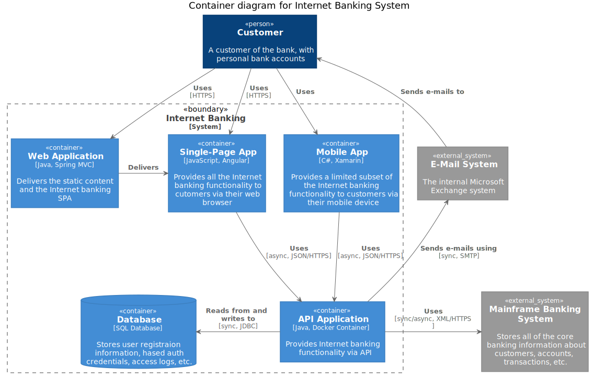
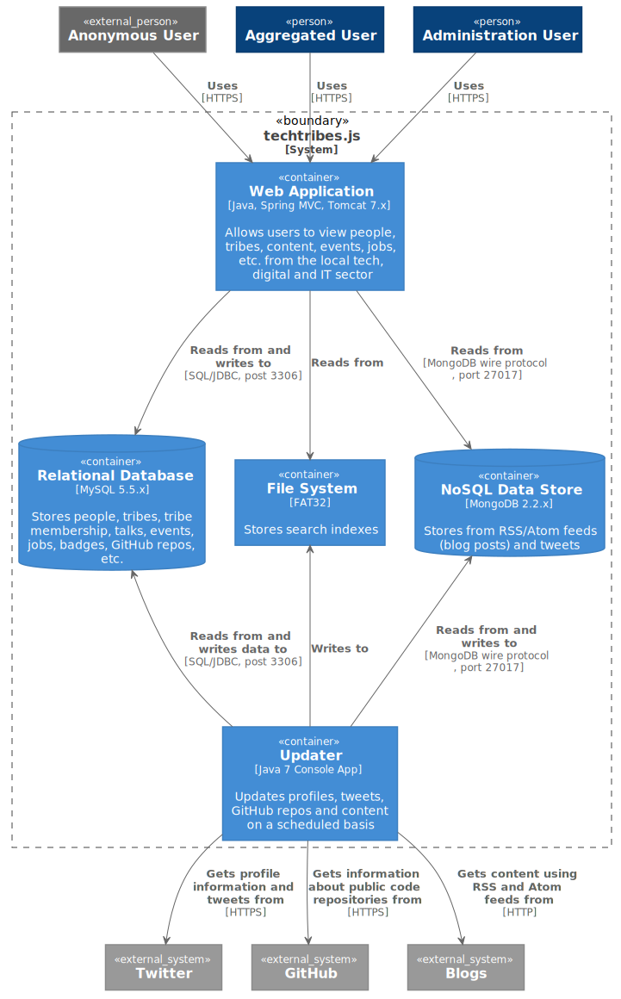
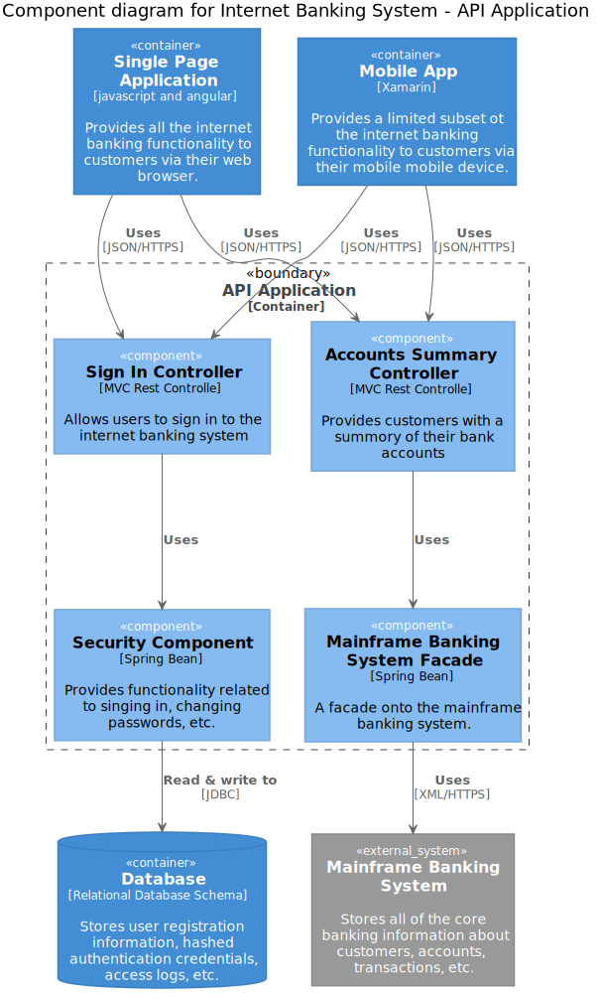

# Diagrams in those runbooks

## Recommended types of the diagram to include (4+1 view)

Diagrams in this runbook repository follow 4+1 architectural view model concept, see https://en.wikipedia.org/wiki/4%2B1_architectural_view_model

4+1 is a view model used for "describing the architecture of software-intensive systems, based on the use of multiple, concurrent views". The views are used to describe the system from the viewpoint of different stakeholders, such as end-users, developers, system engineer, and project managers. The four views of the model are logical, development, process and physical view. In addition, selected use cases or scenarios are used to illustrate the architecture serving as the 'plus one' view. Hence, the model contains 4+1 views:

- *Logical view*: The logical view is concerned with the functionality that the system provides to end-users. UML diagrams are used to represent the logical view, and include class diagrams, and state diagrams.

- *Process view*: The process view deals with the dynamic aspects of the system, explains the system processes and how they communicate, and focuses on the run time behavior of the system. The process view addresses concurrency, distribution, integrator, performance, and scalability, etc. UML diagrams to represent process view include the sequence diagram, communication diagram, activity diagram.

- *Development view*: The development view illustrates a system from a programmer's perspective and is concerned with software management. This view is also known as the implementation view. It uses the UML Component diagram to describe system components. UML Diagrams used to represent the development view include the Package diagram.

- *Deployment/Physical view*: The deployment view depicts the system from a system engineer's point of view. It is concerned with the topology of software components on the physical layer as well as the physical connections between these components. This view is also known as the physical view. UML diagrams used to represent the physical view include the deployment diagram.

- *Scenarios*: The description of an architecture is illustrated using a small set of use cases, or scenarios, which become a fifth view. The scenarios describe sequences of interactions between objects and between processes. They are used to identify architectural elements and to illustrate and validate the architecture design. They also serve as a starting point for tests of an architecture prototype. This view is also known as the use case view.

The 4+1 view model is generic and is not restricted to any notation, tool or design methodology.

## Recommended diagrams organization approach by deep level

From point of view of detalization levels for those diagrams
you are welcome to grab ideas from C4 model

The C4 model was created as a way to help software development teams describe and communicate software architecture, both during up-front design sessions and when retrospectively documenting an existing codebase. It's a way to create maps of your code, at various levels of detail.

Although primarily aimed at software architects and developers, the C4 model provides a way for software development teams to efficiently and effectively communicate their software architecture, at different levels of detail, telling different stories to different types of audience, when doing up front design or retrospectively documenting an existing codebase.

### Level 1: A System Context diagram

A System Context diagram provides a starting point, showing how the software system in scope fits into the world around it.

A System Context diagram is a good starting point for diagramming and documenting a software system, allowing you to step back and see the big picture. Draw a diagram showing your system as a box in the centre, surrounded by its users and the other systems that it interacts with.

Detail isn't important here as this is your zoomed out view showing a big picture of the system landscape. The focus should be on people (actors, roles, personas, etc) and software systems rather than technologies, protocols and other low-level details. It's the sort of diagram that you could show to non-technical people.

|  |  |
|--|--|
| *Scope:* | A single software system. |
| *Primary elements:* | The software system in scope. |
| *Supporting elements:* |  People (e.g. users, actors, roles, or personas) and software systems (external dependencies) that are directly connected to the software system in scope. Typically these other software systems sit outside the scope or boundary of your own software system, and you don’t have responsibility or ownership of them. |
| *Intended audience:*|Everybody, both technical and non-technical people, inside and outside of the software development team.|

Example:

### Level 2: A Container diagram

A Container diagram zooms into the software system in scope, showing the high-level technical building blocks.

Once you understand how your system fits in to the overall IT environment, a really useful next step is to zoom-in to the system boundary with a Container diagram. A "container" is something like a server-side web application, single-page application, desktop application, mobile app, database schema, file system, etc. Essentially, a container is a separately runnable/deployable unit (e.g. a separate process space) that executes code or stores data.

The Container diagram shows the high-level shape of the software architecture and how responsibilities are distributed across it. It also shows the major technology choices and how the containers communicate with one another. It's a simple, high-level technology focussed diagram that is useful for software developers and support/operations staff alike.

|  |  |
|--|--|
| *Scope:* | A single software system. |
| *Primary elements:* | Containers within the software system in scope |
| *Supporting elements:* |  People and software systems directly connected to the containers. |
| *Intended audience:*|Technical people inside and outside of the software development team; including software architects, developers and operations/support staff.|
| *Notes:* | This diagram says nothing about deployment scenarios, clustering, replication, failover, etc. |

Example:

### Level 3: A Component diagram

A Component diagram zooms into an individual container, showing the components inside it.

Example:

### Level 4: A code diagram

A code (in particular good example is UML class) diagram can be used to zoom into an individual component, showing how that component is implemented.

Example: any UML diagram you might find useful

## Naming convention

Thus cumulative naming convention could be

`PROJECTNAME_DEEPLEVEL_DIAGRAMKIND`

like

|Diagram filename| Example | What you would inspect to see there|
|--|--|--|
|PROJECT_CONTEXT.puml|| System level overview for the system |
|--|--|--|
|PROJECT_CNT_CONTAINERNAME_LOGICAL.puml|| Logical overview for some system |
|PROJECT_CNT_CONTAINERNAME_PROCESSNAME.puml|| Process overview for some system |
|PROJECT_CNT_CONTAINERNAME_DEPLOYMENT.puml|| High level deployment overview for some system |
|--|--|--|
|PROJECT_COMPONENT_COMPONENTNAME_LOGICAL.puml|| Logical view for some component |
|PROJECT_COMPONENT_COMPONENTNAME_PROCESSNAME.puml|| What are the processes within specific component |
|PROJECT_COMPONENT_COMPONENTNAME_DEPLOYMENT.puml|| How specific component is deployed |

## Stereotypes consideration

During planning your diagrams, consider following stereotypes:

### Person
A person represents one of the human users of your software system (e.g. actors, roles, personas, etc).

### Software System
A software system is the highest level of abstraction and describes something that delivers value to its users, whether they are human or not. This includes the software system you are modelling, and the other software systems upon which your software system depends (or vice versa). In many cases, a software system is "owned by" a single software development team.

### Container

Not Docker! In the C4 model, a container represents an application or a data store. A container is something that needs to be running in order for the overall software system to work. In real terms, a container is something like:

- *Server-side web application*: A Java EE web application running on Apache Tomcat, an ASP.NET MVC application running on Microsoft IIS, a Ruby on Rails application running on WEBrick, a Node.js application, etc.

- *Client-side web application*: A JavaScript application running in a web browser using Angular, Backbone.JS, jQuery, etc.
Client-side desktop application: A Windows desktop application written using WPF, an OS X desktop application written using Objective-C, a cross-platform desktop application written using JavaFX, etc.

- *Mobile app*: An Apple iOS app, an Android app, a Microsoft Windows Phone app, etc.
Server-side console application: A standalone (e.g. "public static void main") application, a batch process, etc.
Microservice: A single microservice, hosted in anything from a traditional web server to something like Spring Boot, Dropwizard, etc.

- *Serverless function*: A single serverless function (e.g. Amazon Lambda, Azure Function, etc).

- *Database*: A schema or database in a relational database management system, document store, graph database, etc such as MySQL, Microsoft SQL Server, Oracle Database, MongoDB, Riak, Cassandra, Neo4j, etc.

- *Blob or content store*: A blob store (e.g. Amazon S3, Microsoft Azure Blob Storage, etc) or content delivery network (e.g. Akamai, Amazon CloudFront, etc).
File system: A full local file system or a portion of a larger networked file system (e.g. SAN, NAS, etc).

- *Shell script* : A single shell script written in Bash, etc.
etc

A container is essentially a context or boundary inside which some code is executed or some data is stored. And each container is a separately deployable/runnable thing or runtime environment, typically (but not always) running in its own process space. Because of this, communication between containers typically takes the form of an inter-process communication.

### Component

The word "component" is a hugely overloaded term in the software development industry, but in this context a component is a grouping of related functionality encapsulated behind a well-defined interface. If you're using a language like Java or C#, the simplest way to think of a component is that it's a collection of implementation classes behind an interface. Aspects such as how those components are packaged (e.g. one component vs many components per JAR file, DLL, shared library, etc) is a separate and orthogonal concern.

An important point to note here is that all components inside a container typically execute in the same process space. In the C4 model, components are not separately deployable units.
